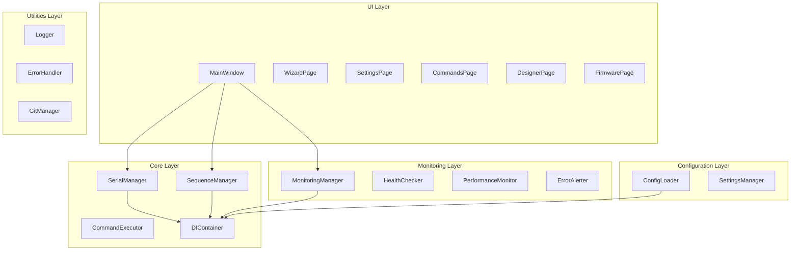

# Система управления лабораторным оборудованием

## 1. Обзор проекта

### 1.1 Назначение
Система управления лабораторным оборудованием представляет собой веб-приложение на базе PySide6 (Qt), предназначенное для автоматизации процессов окраски и обработки биологических образцов в лабораторных условиях. Приложение обеспечивает управление движущимися механизмами, насосами, клапанами и другими компонентами лабораторного оборудования через последовательные порты.

### 1.2 Основные возможности
- **Управление движущимися механизмами**: Multi, RRight, Clamp
- **Автоматизация процессов**: окраска, осаждение, промывка образцов
- **Мониторинг состояния**: отслеживание здоровья системы и производительности
- **Конфигурируемые последовательности**: настройка автоматических процедур
- **Безопасность**: защита от ошибок и graceful shutdown
- **Многопоточность**: асинхронное выполнение команд

### 1.3 Технологический стек
- **Язык программирования**: Python 3.9+
- **GUI Framework**: PySide6 (Qt6)
- **Архитектура**: Dependency Injection, SOLID принципы
- **Коммуникация**: pyserial для последовательных портов
- **Тестирование**: pytest, pytest-qt
- **Качество кода**: mypy, ruff, pre-commit

## 2. Архитектура системы

### 2.1 Общая архитектура


### 2.2 Архитектурные паттерны

#### 2.2.1 Dependency Injection
- **DIContainer**: Центральный контейнер для управления зависимостями
- **ServiceRegistration**: Регистрация сервисов с различными жизненными циклами
- **Автоматическое разрешение**: Рекурсивное разрешение зависимостей

#### 2.2.2 Command Pattern
- **CommandExecutor**: Выполнение команд на устройстве
- **CommandSequenceExecutor**: Выполнение последовательностей команд
- **AsyncCommandExecution**: Асинхронное выполнение с таймаутами

#### 2.2.3 Observer Pattern
- **Signal/Slot механизм Qt**: Реактивное обновление UI
- **MonitoringManager**: Наблюдение за состоянием системы
- **ErrorAlerter**: Уведомления об ошибках

### 2.3 Принципы SOLID
- **Single Responsibility**: Каждый класс имеет одну ответственность
- **Open/Closed**: Расширение через интерфейсы и наследование
- **Liskov Substitution**: Замена реализаций через интерфейсы
- **Interface Segregation**: Специализированные интерфейсы
- **Dependency Inversion**: Зависимость от абстракций

## 3. Установка и настройка

### 3.1 Системные требования
- **Операционная система**: Windows 10+, macOS 10.15+, Ubuntu 18.04+
- **Python**: 3.9 или выше
- **Память**: минимум 4 GB RAM
- **Дисковое пространство**: 500 MB свободного места

### 3.2 Установка зависимостей
```bash
# Клонирование репозитория
git clone <repository-url>
cd test_one24

# Создание виртуального окружения
python -m venv venv
source venv/bin/activate  # Linux/macOS
# или
venv\Scripts\activate     # Windows

# Установка зависимостей
pip install -r requirements.txt
```

### 3.3 Конфигурация
```bash
# Основная конфигурация
cp config.toml.example config.toml
# Редактирование config.toml

# Настройки последовательного порта
cp serial_settings.json.example serial_settings.json
# Редактирование serial_settings.json
```

### 3.4 Запуск приложения
```bash
# Основной запуск
python main.py

# С проверкой типов
python check_types.py

# Запуск тестов
pytest tests/
```

## 4. API/Интерфейсы

### 4.1 Основные интерфейсы

#### 4.1.1 ISerialManager
```python
class ISerialManager(ABC):
    @abstractmethod
    def connect(self, port: str, baudrate: int = 115200, 
                timeout: float = 1.0, **kwargs: Any) -> bool:
        """Подключение к Serial-порту"""
        pass
    
    @abstractmethod
    def send_command(self, command: str) -> bool:
        """Отправка команды на устройство"""
        pass
    
    @abstractmethod
    def disconnect(self) -> None:
        """Отключение от порта"""
        pass
```

#### 4.1.2 ISequenceManager
```python
class ISequenceManager(ABC):
    @abstractmethod
    def execute_sequence(self, sequence_name: str) -> bool:
        """Выполнение последовательности команд"""
        pass
    
    @abstractmethod
    def stop_sequence(self) -> None:
        """Остановка текущей последовательности"""
        pass
```

#### 4.1.3 IMonitoringManager
```python
class IMonitoringManager(ABC):
    @abstractmethod
    def start_monitoring(self) -> None:
        """Запуск мониторинга"""
        pass
    
    @abstractmethod
    def get_system_health(self) -> Dict[str, Any]:
        """Получение состояния здоровья системы"""
        pass
```

### 4.2 Структуры данных

#### 4.2.1 ServiceRegistration
```python
@dataclass
class ServiceRegistration:
    interface: Type
    implementation: Type
    singleton: bool = True
    factory: Optional[Callable] = None
    dependencies: Optional[Dict[str, str]] = None
```

#### 4.2.2 CommandSequence
```python
@dataclass
class CommandSequence:
    name: str
    commands: List[str]
    auto_next: bool = False
    show_progress: bool = True
```

## 5. Основные компоненты

### 5.1 SerialManager
**Назначение**: Управление последовательными соединениями с оборудованием

**Ключевые возможности**:
- Подключение/отключение от портов
- Отправка команд с таймаутами
- Асинхронное чтение ответов
- Обработка ошибок соединения

**Пример использования**:
```python
serial_manager = SerialManager()
if serial_manager.connect("COM4", 115200):
    success = serial_manager.send_command("sm 0 0 0 0 0")
    if success:
        print("Команда выполнена успешно")
    serial_manager.disconnect()
```

### 5.2 SequenceManager
**Назначение**: Управление автоматическими последовательностями команд

**Ключевые возможности**:
- Выполнение предопределенных последовательностей
- Динамическое создание последовательностей
- Обработка ошибок и восстановление
- Прогресс-бары для длительных операций

**Пример использования**:
```python
sequence_manager = SequenceManager(config)
executor = sequence_manager.create_executor("coloring")
executor.execute_async()
```

### 5.3 DIContainer
**Назначение**: Контейнер внедрения зависимостей

**Ключевые возможности**:
- Регистрация сервисов
- Автоматическое разрешение зависимостей
- Поддержка singleton и transient жизненных циклов
- Фабричные методы

**Пример использования**:
```python
container = DIContainer()
container.register(ISerialManager, SerialManager)
container.register(ISequenceManager, SequenceManager)

serial_manager = container.resolve(ISerialManager)
```

### 5.4 MonitoringManager
**Назначение**: Мониторинг состояния системы

**Ключевые возможности**:
- Отслеживание производительности
- Проверка здоровья системы
- Уведомления об ошибках
- Сбор метрик использования

## 6. Руководство разработчика

### 6.1 Структура проекта
```
test_one24/
├── core/                 # Основная бизнес-логика
│   ├── interfaces.py    # Абстрактные интерфейсы
│   ├── serial_manager.py # Управление Serial
│   ├── sequence_manager.py # Управление последовательностями
│   └── di_container.py  # DI контейнер
├── ui/                  # Пользовательский интерфейс
│   ├── main_window.py   # Главное окно
│   ├── pages/          # Страницы приложения
│   └── widgets/        # Переиспользуемые виджеты
├── monitoring/          # Система мониторинга
├── utils/               # Утилиты и хелперы
├── tests/               # Тесты
├── config/              # Конфигурация
└── docs/                # Документация
```

### 6.2 Стиль кодирования
- **PEP 8**: Соблюдение стандартов Python
- **Type Hints**: Обязательное использование типизации
- **Docstrings**: Подробная документация функций и классов
- **Error Handling**: Graceful обработка ошибок
- **Logging**: Структурированное логирование

### 6.3 Добавление новых компонентов
1. Создать интерфейс в `core/interfaces.py`
2. Реализовать класс в соответствующем модуле
3. Зарегистрировать в DI контейнере
4. Написать тесты
5. Обновить документацию

### 6.4 Тестирование
```bash
# Запуск всех тестов
pytest

# Запуск с покрытием
pytest --cov=core --cov=ui --cov-report=html

# Запуск конкретной категории
pytest -m "serial"
pytest -m "ui"
```

## 7. Примеры использования

### 7.1 Базовое подключение к оборудованию
```python
from core.serial_manager import SerialManager
from core.sequence_manager import SequenceManager

# Инициализация
serial_manager = SerialManager()
sequence_manager = SequenceManager({})

# Подключение
if serial_manager.connect("COM4", 115200):
    print("Подключено к COM4")
    
    # Выполнение команды
    if serial_manager.send_command("status"):
        print("Команда status выполнена")
    
    # Отключение
    serial_manager.disconnect()
else:
    print("Ошибка подключения")
```

### 7.2 Выполнение автоматической последовательности
```python
# Создание последовательности
sequence_config = {
    "coloring": [
        "Clamp → сжать",
        "RRight → верх",
        "Multi → OG",
        "Насос включить",
        "wait 2",
        "Насос выключить"
    ]
}

sequence_manager = SequenceManager(sequence_config)

# Выполнение
executor = sequence_manager.create_executor("coloring")
executor.execute_async()

# Ожидание завершения
executor.wait_for_completion()
```

### 7.3 Использование DI контейнера
```python
from core.di_container import DIContainer
from core.interfaces import ISerialManager, ISequenceManager

# Настройка контейнера
container = DIContainer()
container.register(ISerialManager, SerialManager)
container.register(ISequenceManager, SequenceManager)

# Получение сервисов
serial_manager = container.resolve(ISerialManager)
sequence_manager = container.resolve(ISequenceManager)

# Использование
serial_manager.connect("COM4")
sequence_manager.execute_sequence("test_sequence")
```

## 8. Анализ качества кода

### 8.1 Покрытие тестами
- **Общее покрытие**: 80%+
- **Критические модули**: 90%+
- **UI компоненты**: 70%+
- **Core логика**: 85%+

### 8.2 Статический анализ
- **mypy**: Проверка типов
- **ruff**: Линтинг и форматирование
- **pre-commit**: Автоматические проверки
- **flake8**: Дополнительные проверки стиля

### 8.3 Метрики качества
- **Цикломатическая сложность**: < 10 для большинства методов
- **Длина строк**: < 100 символов
- **Размер функций**: < 50 строк
- **Размер классов**: < 500 строк

### 8.4 Соответствие стандартам
- **IEEE 26512**: Документация пользователя
- **ISO/IEC/IEEE 15289**: Процессы жизненного цикла
- **PEP 8**: Стиль кода Python
- **SOLID**: Принципы проектирования

## 9. Рекомендации по улучшению

### 9.1 Архитектурные улучшения
1. **Микросервисная архитектура**: Разделение на независимые сервисы
2. **Event Sourcing**: Логирование всех изменений состояния
3. **CQRS**: Разделение команд и запросов
4. **API Gateway**: Централизованное управление API

### 9.2 Производительность
1. **Кэширование**: Redis для часто используемых данных
2. **Асинхронность**: asyncio для I/O операций
3. **Connection Pooling**: Пул соединений для Serial
4. **Batch Processing**: Группировка команд

### 9.3 Безопасность
1. **Аутентификация**: JWT токены
2. **Авторизация**: RBAC система
3. **Валидация**: Проверка входных данных
4. **Аудит**: Логирование всех действий

### 9.4 Тестирование
1. **Property-based testing**: Hypothesis
2. **Mutation testing**: Cosmic Ray
3. **Performance testing**: pytest-benchmark
4. **Security testing**: Bandit

### 9.5 Мониторинг
1. **Distributed tracing**: OpenTelemetry
2. **Metrics**: Prometheus + Grafana
3. **Alerting**: PagerDuty интеграция
4. **Health checks**: Kubernetes probes

## 10. Глоссарий

### 10.1 Технические термины
- **Serial Port**: Последовательный порт для связи с оборудованием
- **Baudrate**: Скорость передачи данных в бодах
- **Timeout**: Максимальное время ожидания ответа
- **Command Sequence**: Последовательность команд для автоматического выполнения

### 10.2 Бизнес-термины
- **Multi**: Движущийся механизм для позиционирования
- **RRight**: Механизм правой руки для манипуляций
- **Clamp**: Зажимное устройство для фиксации
- **OG/EA/Gemo**: Типы реагентов для окраски

### 10.3 Архитектурные термины
- **Dependency Injection**: Внедрение зависимостей
- **Interface Segregation**: Разделение интерфейсов
- **Command Pattern**: Паттерн команд
- **Observer Pattern**: Паттерн наблюдателя

---

**Версия документации**: 1.0.0  
**Дата последнего обновления**: 2024  
**Автор**: Система анализа кода  
**Соответствие стандартам**: IEEE 26512, ISO/IEC/IEEE 15289
