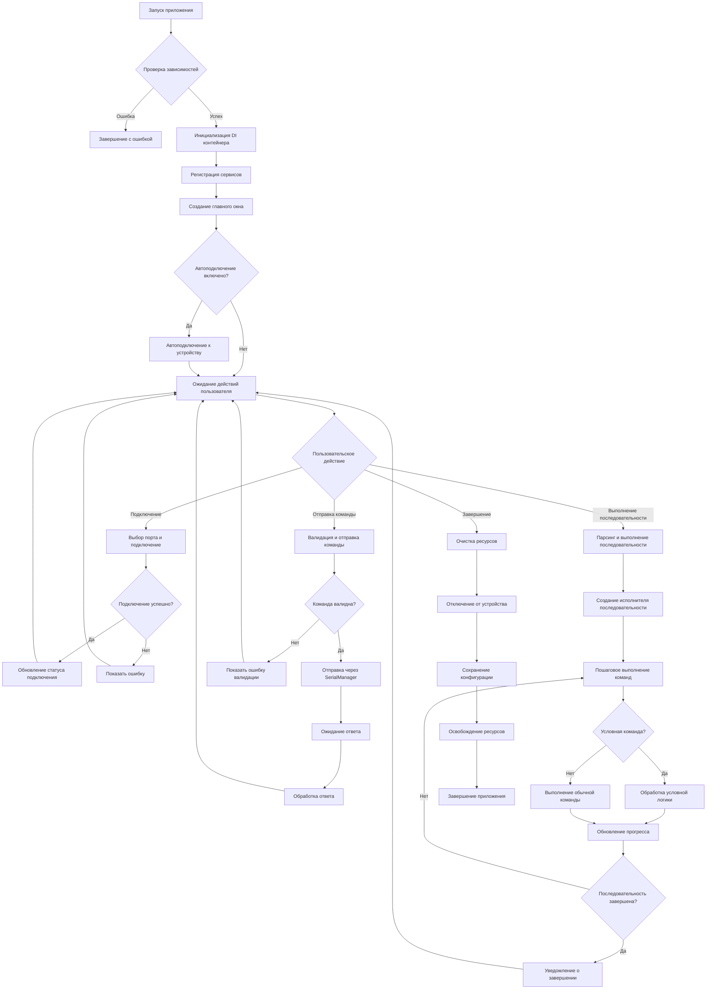

# Назначение и контекст

**PyQt6 Device Control** — это десктопное GUI-приложение для управления устройствами через последовательные порты (COM/UART). Приложение реализует многослойную архитектуру с использованием Dependency Injection для обеспечения модульности, тестируемости и расширяемости.

**Решаемые задачи:**
- Подключение к устройствам через последовательные порты
- Отправка команд и получение ответов
- Выполнение последовательностей команд с условной логикой
- Мультизональное управление устройствами
- Система тегов для организации команд
- Обработка и оптимизация сигналов
- Мониторинг состояния устройств

**Не решает:**
- Управление устройствами через другие интерфейсы (USB, Ethernet, Bluetooth)
- Автоматическое обнаружение устройств
- Удаленное управление через сеть

## Формальная постановка

### Входы
- **Конфигурация:** TOML-файлы с настройками приложения, портов, команд
- **Команды:** Строковые команды для отправки на устройство
- **Последовательности:** Списки команд с условной логикой (if/else/endif)
- **Теги:** Метаданные для организации и поиска команд
- **Сигналы:** Данные от устройства для обработки и анализа

### Выходы
- **Состояние подключения:** Статус соединения с устройством
- **Результаты команд:** Ответы от устройства на отправленные команды
- **Логи выполнения:** Детальные логи всех операций
- **Метрики:** Статистика выполнения команд и последовательностей

### Ограничения
- **Время:** Таймауты на операции чтения/записи (по умолчанию 1.0 сек)
- **Память:** Ограничения на размер буферов и кешей
- **Потоки:** Thread-safe операции с использованием блокировок
- **Рекурсия:** Защита от циклических вызовов последовательностей (максимум 10 уровней)

## Термины и обозначения

- **DI (Dependency Injection):** Паттерн для управления зависимостями между компонентами
- **Serial/COM/UART:** Последовательный интерфейс для связи с устройствами
- **Sequence:** Последовательность команд для выполнения
- **Tag:** Метаданные для категоризации команд
- **Signal:** Данные, получаемые от устройства
- **Multizone:** Управление несколькими зонами устройства
- **Flag:** Булева переменная для условной логики
- **Thread-safe:** Безопасность при работе в многопоточной среде

## Ключевая идея и стратегия

Приложение использует **Layered Architecture** с **Dependency Injection**:

1. **UI Layer** — пользовательский интерфейс на PyQt6
2. **Business Logic Layer** — основная логика приложения
3. **Communication Layer** — работа с последовательными портами
4. **Data Layer** — конфигурация и управление данными

**Стратегия выполнения:**
- Асинхронное выполнение команд в отдельных потоках
- Валидация команд перед отправкой
- Обработка условной логики (if/else/endif)
- Кеширование результатов для оптимизации
- Graceful shutdown при завершении работы

## Структуры данных и состояние

### Основные структуры
- **DIContainer:** Реестр сервисов и их зависимостей
- **SerialManager:** Состояние подключения и буферы данных
- **SequenceManager:** Очередь команд и состояние выполнения
- **TagManager:** Индекс тегов и связанных команд
- **FlagManager:** Словарь флагов и их значений

### Инварианты
- Только один активный SerialManager на приложение
- Все команды валидируются перед отправкой
- Последовательности выполняются атомарно
- Флаги имеют булевы значения
- Теги уникальны в пределах системы

## Инварианты и контракт

### Предусловия
- PyQt6 установлен и доступен
- Доступен хотя бы один последовательный порт
- Конфигурационные файлы корректны и читаемы
- Права доступа к портам

### Постусловия
- Все ресурсы освобождены при завершении
- Логи сохранены
- Состояние подключения корректно обновлено

### Инварианты
- **Безопасность потоков:** Все операции с общими данными защищены блокировками
- **Целостность данных:** Команды не теряются и не дублируются
- **Жизненный цикл:** Сервисы инициализируются и завершаются в правильном порядке

## Пошаговый алгоритм (естественным языком)

### 1. [[docs_algoritm/core/initialization|Инициализация приложения]]
1. Проверка критических зависимостей (PyQt6, pyserial)
2. Настройка логирования
3. Создание Qt приложения
4. Применение темы (Material Design)
5. Создание главного окна

### 2. Инициализация сервисов
1. Создание DI-контейнера
2. Регистрация всех сервисов (SerialManager, SequenceManager, TagManager, etc.)
3. Разрешение зависимостей
4. Валидация конфигурации
5. Инициализация UI компонентов

### 3. Подключение к устройству
1. Получение списка доступных портов
2. Выбор порта пользователем или из конфигурации
3. Настройка параметров соединения (baudrate, parity, stopbits)
4. Установка соединения
5. Проверка статуса подключения

### 4. [[docs_algoritm/core/command_execution|Выполнение команд]]
1. Валидация команды (синтаксис, параметры)
2. Добавление в очередь выполнения
3. Отправка команды через SerialManager
4. Ожидание ответа с таймаутом
5. Обработка ответа и обновление UI

### 5. [[docs_algoritm/core/sequence_processing|Выполнение последовательностей]]
1. Парсинг последовательности команд
2. Валидация всей последовательности
3. Создание исполнителя последовательности
4. Пошаговое выполнение команд
5. Обработка условной логики (if/else/endif)
6. Обновление прогресса выполнения

### 6. Обработка условной логики
1. Парсинг условных команд (if, else, endif)
2. Вычисление условий на основе флагов
3. Выполнение соответствующей ветки
4. Поддержка вложенных условий

### 7. Завершение работы
1. Остановка всех активных последовательностей
2. Отключение от устройства
3. Сохранение конфигурации
4. Освобождение ресурсов
5. Корректное завершение Qt приложения

## Псевдокод (язык-независимый)

```text
procedure MAIN_APPLICATION()
  # Инициализация
  check_dependencies()
  setup_logging()
  create_qt_application()
  apply_theme()
  
  # Создание сервисов
  container = create_di_container()
  register_services(container)
  resolve_dependencies(container)
  
  # Создание UI
  main_window = create_main_window(container)
  setup_ui_connections(main_window)
  
  # Автоподключение (если включено)
  if auto_connect_enabled:
    auto_connect_to_device()
  
  # Главный цикл
  run_application()
  
  # Завершение
  cleanup_resources()
  shutdown_application()

procedure EXECUTE_COMMAND(command: string)
  # Валидация
  validation_result = validate_command(command)
  if not validation_result.is_valid:
    return error(validation_result.error_message)
  
  # Отправка
  if serial_manager.is_connected:
    success = serial_manager.send_command(command)
    if success:
      response = serial_manager.read_response(timeout)
      process_response(response)
    else:
      handle_communication_error()
  else:
    handle_not_connected_error()

procedure EXECUTE_SEQUENCE(sequence: list[string])
  # Инициализация
  executor = create_sequence_executor()
  setup_progress_callbacks(executor)
  
  # Выполнение
  for i = 0 to sequence.length - 1:
    command = sequence[i]
    
    if is_conditional_command(command):
      handle_conditional_command(command)
    else:
      execute_command(command)
      update_progress(i + 1, sequence.length)
    
    if executor.is_cancelled:
      break
  
  # Завершение
  notify_sequence_completed()

procedure HANDLE_CONDITIONAL_COMMAND(command: string)
  if command.starts_with("if "):
    condition = parse_condition(command)
    if evaluate_condition(condition):
      enter_true_branch()
    else:
      enter_false_branch()
  elif command == "else":
    switch_branch()
  elif command == "endif":
    exit_conditional_block()
```

## Диаграмма потока (Mermaid)



## Сложность

### Время
- **Инициализация:** O(n) где n — количество сервисов
- **Подключение к порту:** O(1) — константное время
- **Валидация команды:** O(m) где m — длина команды
- **Выполнение последовательности:** O(k) где k — количество команд
- **Обработка условной логики:** O(d) где d — глубина вложенности

### Память
- **DI контейнер:** O(s) где s — количество сервисов
- **Буферы SerialManager:** O(b) где b — размер буфера
- **Кеш последовательностей:** O(c) где c — количество кешированных последовательностей
- **UI компоненты:** O(u) где u — количество UI элементов

### Узкие места
- **Последовательная отправка команд:** Каждая команда ждет ответа
- **Блокирующие операции:** Чтение из порта может блокировать UI
- **Валидация больших последовательностей:** Линейная сложность по количеству команд

## Корректность (эскиз)

### Доказательство корректности
1. **Инициализация:** Все сервисы создаются в правильном порядке благодаря DI
2. **Подключение:** SerialManager гарантирует единственное активное соединение
3. **Выполнение команд:** Валидация обеспечивает корректность команд
4. **Последовательности:** Атомарность обеспечивается блокировками
5. **Завершение:** Graceful shutdown освобождает все ресурсы

### Индукция по шагам выполнения
- **Базовый случай:** Одна команда выполняется корректно
- **Индукционный шаг:** Если n команд выполняются корректно, то n+1 команда также выполнится корректно

## Крайние случаи и обработка ошибок

### Подключение
- **Порт недоступен:** Показать список доступных портов
- **Порт занят:** Предложить отключить другие приложения
- **Неправильные параметры:** Использовать значения по умолчанию

### Выполнение команд
- **Таймаут ответа:** Повторить команду или показать ошибку
- **Некорректный ответ:** Логировать и продолжить выполнение
- **Ошибка отправки:** Проверить подключение и повторить

### Последовательности
- **Рекурсивный вызов:** Ограничить глубину рекурсии
- **Бесконечный цикл:** Добавить счетчик итераций
- **Ошибка в середине:** Показать прогресс и предложить продолжить

### Системные ошибки
- **Нехватка памяти:** Освободить кеши и повторить
- **Критические ошибки:** Сохранить состояние и завершить работу
- **Сетевые ошибки:** Переподключиться автоматически

## Конкурентность/асинхронность

### Модель памяти
- **Thread-safe операции:** Все общие данные защищены блокировками
- **Атомарные операции:** Команды выполняются атомарно
- **Изоляция потоков:** Каждый поток работает с локальными данными

### Блокировки и синхронизация
- **RLock для DI контейнера:** Позволяет рекурсивные вызовы
- **Event для остановки потоков:** Graceful shutdown
- **Condition для ожидания ответов:** Синхронизация между потоками

### Идемпотентность и дедлок-риски
- **Идемпотентность:** Повторная отправка команды безопасна
- **Дедлок-риски:** Минимизированы через правильный порядок блокировок
- **Timeout механизмы:** Предотвращают бесконечное ожидание

## Численная устойчивость / детерминизм

### Детерминизм
- **Порядок команд:** Гарантирован в последовательностях
- **Валидация:** Детерминированная проверка команд
- **Логирование:** Временные метки для отслеживания

### Источники недетерминизма
- **Ответы устройства:** Могут приходить в разном порядке
- **Таймауты:** Зависят от производительности системы
- **UI события:** Асинхронная природа пользовательского ввода

## Параметры, тюнинг и кэширование

### Ключевые параметры
- **timeout:** Таймаут чтения ответа (по умолчанию 1.0 сек)
- **max_wait_time:** Максимальное время ожидания в wait командах
- **max_recursion_depth:** Максимальная глубина рекурсии (10)
- **buffer_size:** Размер буфера для чтения данных

### Стратегии кэширования
- **Кеш последовательностей:** Избегает повторного парсинга
- **Кеш валидации:** Сохраняет результаты валидации команд
- **Кеш тегов:** Быстрый поиск команд по тегам

### Тюнинг производительности
- **Размер пула потоков:** Настраивается под нагрузку
- **Частота проверки подключения:** Баланс между отзывчивостью и нагрузкой
- **Размер буферов:** Оптимизация под характеристики устройства

## Условия завершения и прогресс

### Критерии остановки
- **Нормальное завершение:** Все команды выполнены успешно
- **Ошибка:** Команда не может быть выполнена
- **Отмена пользователем:** Пользователь прервал выполнение
- **Системная ошибка:** Критическая ошибка системы

### Монотония метрик
- **Прогресс выполнения:** Монотонно возрастает от 0 до 100%
- **Количество выполненных команд:** Монотонно возрастает
- **Количество ошибок:** Монотонно возрастает при ошибках

### Доказательство терминации
- **Конечное количество команд:** Последовательность всегда завершается
- **Ограничение рекурсии:** Предотвращает бесконечную рекурсию
- **Таймауты:** Гарантируют завершение операций

## Варианты алгоритма и trade-offs

### Синхронное vs асинхронное выполнение
- **Синхронное:** Простота реализации, блокирует UI
- **Асинхронное:** Отзывчивый UI, сложность управления состоянием

### Валидация команд
- **Строгая валидация:** Безопасность, но ограниченная гибкость
- **Либеральная валидация:** Гибкость, но потенциальные ошибки

### Кеширование
- **Агрессивное кеширование:** Высокая производительность, больше памяти
- **Минимальное кеширование:** Экономия памяти, повторные вычисления

## Пример трассировки

### Вход
```
Последовательность команд:
1. "connect COM4"
2. "if flag_ready"
3. "send_command A"
4. "wait 1.0"
5. "send_command B"
6. "else"
7. "send_command C"
8. "endif"
9. "disconnect"
```

### Пошаговое выполнение
1. **Парсинг:** Анализ последовательности, выделение условных блоков
2. **Валидация:** Проверка синтаксиса всех команд
3. **Подключение:** Успешное подключение к COM4
4. **Проверка флага:** flag_ready = true
5. **Выполнение true ветки:** Отправка команд A и B
6. **Ожидание:** Пауза 1.0 секунды
7. **Пропуск else ветки:** Не выполняется
8. **Отключение:** Корректное завершение соединения

### Выход
```
Результат: Успешное выполнение
Выполненные команды: 4
Время выполнения: 2.5 секунды
Статус: Завершено успешно
```

## Набор тестов (минимальный)

### Позитивные тесты
- Подключение к доступному порту
- Отправка валидной команды
- Выполнение простой последовательности
- Обработка условной логики (if/else/endif)
- Работа с тегами и флагами

### Негативные тесты
- Подключение к недоступному порту
- Отправка невалидной команды
- Выполнение последовательности с ошибкой
- Превышение лимита рекурсии
- Обработка таймаутов

### Граничные тесты
- Пустая последовательность команд
- Максимальная глубина рекурсии
- Максимальное время ожидания
- Пустые ответы от устройства
- Одновременное выполнение нескольких последовательностей

### Стохастические тесты
- Случайные задержки в ответах устройства
- Прерывание выполнения пользователем
- Системные сбои во время выполнения
- Конкурентный доступ к общим ресурсам

## Источники истины

### Код и строки
- **Точка входа:** `main.py:1-200` — инициализация приложения
- **Интерфейсы:** `core/interfaces.py:1-1045` — контракты сервисов
- **DI контейнер:** `core/di/container.py:1-681` — управление зависимостями
- **Главное окно:** `ui/main_window.py:1-1689` — пользовательский интерфейс
- **Менеджер последовательностей:** `core/sequence_manager.py:1-940` — выполнение команд
- **Serial менеджер:** `core/serial_manager.py:1-940` — работа с портами
- **Менеджер последовательностей:** `core/sequences/manager.py:1-427` — управление последовательностями

### Детальная документация алгоритмов
- **[[docs_algoritm/README|Документация алгоритмов]]** — полное описание всех алгоритмов
- **[[docs_algoritm/core/initialization|Инициализация]]** — детальный алгоритм запуска приложения
- **[[docs_algoritm/core/command_execution|Выполнение команд]]** — алгоритм отправки и обработки команд
- **[[docs_algoritm/core/sequence_processing|Обработка последовательностей]]** — алгоритм выполнения последовательностей

### Тесты и документация
- **Unit тесты:** `tests/unit/` — тестирование отдельных компонентов
- **Integration тесты:** `tests/integration/` — тестирование взаимодействия
- **Performance тесты:** `tests/performance/` — тестирование производительности
- **Архитектурная документация:** `docs/architecture/` — описание архитектуры
- **API документация:** `docs/api/` — описание интерфейсов

### Конфигурация
- **Настройки приложения:** `resources/config.toml` — основные настройки
- **DI конфигурация:** `resources/di_config.toml` — настройки DI контейнера
- **Сериальные настройки:** `serial_settings.json` — настройки портов
