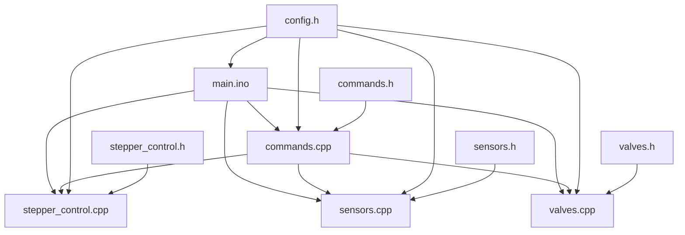

# Документация проекта - Система управления Arduino

## Обзор проекта

Система управления на базе Arduino для управления шаговыми двигателями, клапанами, насосом и датчиками. Проект включает в себя управление 5 шаговыми двигателями (Multi, Multizone, RRight, E0, E1), 2 клапанами, насосом и различными датчиками.

## Архитектура системы

### Структура модулей



### Основные компоненты

#### 1. main.ino
- **Назначение**: Главный модуль системы
- **Функции**: 
  - Инициализация всех подсистем
  - Основной цикл программы
  - Управление автоматическим отчетом о весе (по команде)
  - Неблокирующее обновление шаговых двигателей

#### 2. stepper_control.cpp/h
- **Назначение**: Управление шаговыми двигателями
- **Функции**:
  - Инициализация 5 шаговых двигателей
  - Базовые операции: движение к позиции, хоминг
  - Специальные функции для двигателей E0/E1 (clamp, clamp_zero)
  - Синхронизация двигателей
  - Обработка таймаутов и ошибок

#### 3. commands.cpp/h
- **Назначение**: Обработка команд через последовательный порт
- **Функции**:
  - Регистрация обработчиков команд
  - Парсинг и валидация входных данных
  - Обработка команд движения, хоминга, управления периферией
  - Стандартизированные ответы системы

#### 4. sensors.cpp/h
- **Назначение**: Работа с датчиками
- **Функции**:
  - Чтение состояния ротора
  - Чтение датчика отходов
  - Проверка концевых выключателей

#### 5. valves.cpp/h
- **Назначение**: Управление клапанами и насосом
- **Функции**:
  - Управление клапанами KL1, KL2
  - Управление насосом
  - Открытие клапанов на определенное время

#### 6. config.h
- **Назначение**: Конфигурация системы
- **Содержит**:
  - Назначение пинов
  - Константы скоростей и таймаутов
  - Сообщения системы

## Аппаратная конфигурация

### Шаговые двигатели
- **Multi (X)**: Пины A0 (step), A1 (dir), 38 (enable), концевик 14
- **Multizone (Y)**: Пины A6 (step), A7 (dir), A2 (enable), концевик 2
- **RRight (Z)**: Пины 46 (step), 48 (dir), A8 (enable), концевик 3
- **E0**: Пины 26 (step), 28 (dir), 24 (enable)
- **E1**: Пины 36 (step), 34 (dir), 30 (enable)

### Настройки питания двигателей
Система поддерживает два режима питания для каждого двигателя:

**Постоянное питание** (`POWER_ALWAYS_ON true`):
- **Multi (X)**: постоянное питание для удержания позиции
- **Multizone (Y)**: постоянное питание для удержания позиции  
- **RRight (Z)**: постоянное питание для удержания позиции

**Временное питание** (`POWER_ALWAYS_ON false`):
- **E0**: питание только при движении (энергосбережение)
- **E1**: питание только при движении (энергосбережение)

### Периферия
- **Насос**: Пин 18
- **Клапаны**: KL1 (пин 8), KL2 (пин 10)
- **Датчик веса HX711**: SCK (пин 42), DT (пин 40)
- **Датчик clamp**: Пин 15
- **Датчик отходов**: Пин 19
- **Ротор**: Пины 27, 29, 23, 25

## Протокол команд

### Команды движения
- `move_multi <позиция>` - движение двигателя Multi
- `move_multizone <позиция>` - движение двигателя Multizone
- `move_rright <позиция>` - движение двигателя RRight
- `move_e0 <позиция>` - индивидуальное движение двигателя E0 (с временным питанием)
- `move_e1 <позиция>` - индивидуальное движение двигателя E1 (с временным питанием)

### Команды хоминга
- `zero_multi` - обнуление Multi
- `zero_multizone` - обнуление Multizone
- `zero_rright` - обнуление RRight
- `zero_e0` - индивидуальное обнуление E0 (с временным питанием)
- `zero_e1` - индивидуальное обнуление E1 (с временным питанием)

### Команды clamp (E0/E1 синхронно)
- `clamp <позиция>` - синхронное движение E0 и E1 (с временным питанием)
- `clamp_zero` - обнуление E0 и E1 по датчику (с временным питанием)
- `clamp_stop` - аварийная остановка E0 и E1

### Команды клапанов
- `kl1 <время>`, `kl2 <время>` - открытие на время (сотые доли секунды)
- `kl1_on/off`, `kl2_on/off` - включение/выключение

### Команды насоса
- `pump_on/off` - включение/выключение насоса

### Команды датчиков
- `weight` - получить вес
- `raw_weight` - сырое значение датчика веса
- `calibrate_weight` - тарировать весы (только по команде)
- `calibrate_weight_factor <коэффициент>` - установить калибровку
- `staterotor` - состояние ротора
- `waste` - состояние датчика отходов

### Диагностические команды
- `check_all_endstops` - проверка всех концевиков
- `check_enable_pins` - проверка состояния всех enable пинов
- `test` - тестовая команда

## Система управления питанием двигателей

### Принципы работы

Система поддерживает два режима управления питанием для шаговых двигателей:

#### 1. Постоянное питание (POWER_ALWAYS_ON = true)
- **Применение**: Двигатели Multi, Multizone, RRight
- **Поведение**: 
  - Enable включается при инициализации
  - Остается включенным постоянно
  - Обеспечивает удержание позиции
  - Предотвращает смещение под нагрузкой

#### 2. Временное питание (POWER_ALWAYS_ON = false)  
- **Применение**: Двигатели E0, E1 (clamp)
- **Поведение**:
  - Enable включается только перед движением
  - Выключается после завершения движения
  - Энергосбережение - нет нагрева в простое
  - Снижает потребление энергии

### Настройка в config.h
```cpp
// Для каждого двигателя:
#define MOTOR_POWER_ALWAYS_ON true/false

// Пример текущих настроек:
#define MULTI_POWER_ALWAYS_ON true      // постоянное питание
#define E0_POWER_ALWAYS_ON false        // временное питание
```

### Функции управления питанием
- `enableStepper(stepper, config)` - включение питания с диагностикой
- `disableStepper(stepper, config)` - выключение питания (для временных)
- Автоматическое управление в `setStepperPosition()`

### Алгоритм временного питания
1. **Включение**: `enableStepper()` перед началом движения
2. **Диагностика**: логирование состояния enable пина
3. **Движение**: выполнение команды с активным питанием  
4. **Выключение**: `disableStepper()` после завершения
5. **Безопасность**: автоматическое выключение при ошибках

## Алгоритмы управления

### Хоминг
1. Движение к концевику с постоянной скоростью
2. Остановка при срабатывании концевика
3. Сброс позиции в 0
4. Отъезд от концевика на 100 шагов
5. Установка новой нулевой точки

### Clamp (синхронизация E0/E1)
1. Проверка флага занятости
2. Получение текущих позиций
3. Остановка двигателей
4. Установка параметров движения
5. Синхронное движение к целевой позиции
6. Контроль таймаута
7. Сброс флага занятости

### Clamp Zero
1. Проверка флага занятости
2. Предварительная проверка датчика
3. При необходимости отъезд от датчика
4. Движение к датчику до срабатывания
5. Установка нулевой позиции
6. Отъезд на позицию 100
7. Валидация финальных позиций

### Индивидуальное управление E0/E1
#### Команды move_e0/move_e1:
1. **Включение питания**: автоматическое включение enable пина
2. **Диагностика**: вывод состояния "ВКЛЮЧЕН (режим: временный)"
3. **Движение**: выполнение команды к целевой позиции
4. **Выключение питания**: автоматическое отключение после завершения
5. **Логирование**: "ВЫКЛЮЧЕН (временный режим)"

#### Команды zero_e0/zero_e1:
1. **Включение питания**: активация перед хомингом  
2. **Хоминг**: использование датчика clamp_sensor (пин 15)
3. **Алгоритм**: стандартный хоминг с временным питанием
4. **Выключение питания**: деактивация после завершения

### Обновленные алгоритмы Clamp
#### Команда clamp (синхронная):
1. **Включение питания**: одновременно для E0 и E1
2. **Синхронизация**: параллельное движение к целевой позиции
3. **Мониторинг**: контроль прогресса обоих двигателей
4. **Выключение питания**: одновременно для E0 и E1 после завершения

#### Команда clamp_zero (синхронная):
1. **Включение питания**: активация E0 и E1
2. **Проверка датчика**: начальное состояние clamp_sensor
3. **Отъезд**: при необходимости отъезд от уже сработавшего датчика
4. **Движение к датчику**: синхронное движение до срабатывания
5. **Обнуление**: установка позиции 0 для обоих двигателей
6. **Отъезд**: на позицию 100 для освобождения датчика
7. **Выключение питания**: деактивация обоих двигателей

## Принципы безопасности

1. **Защита от одновременного выполнения**: Флаг `clampInProgress` предотвращает конфликты команд E0/E1
2. **Таймауты**: Все операции движения имеют таймауты для предотвращения зависания
3. **Валидация параметров**: Проверка корректности входных данных перед выполнением
4. **Аварийная остановка**: Команда `clamp_stop` для немедленной остановки
5. **Сброс состояния**: Автоматический сброс при ошибках

## Управление весами

- **Тарирование**: Выполняется только по команде `calibrate_weight`
- **Автоматический отчет**: Включается/выключается командами `weight_report_on/off`
- **Ручные запросы**: Команды `weight` и `raw_weight` для разовых измерений
- **Калибровка**: Команда `calibrate_weight_factor` для установки коэффициента

## Обработка ошибок

Система использует стандартизированные сообщения об ошибках:
- `RECEIVED` - команда получена
- `COMPLETED` - команда выполнена
- `ERROR: <описание>` - ошибка выполнения
- `TIMEOUT` - превышен таймаут
- `MISSING_PARAMETER` - отсутствует параметр
- `INVALID_PARAMETER` - некорректный параметр

## Последние изменения (2024-12-19)

### Система управления питанием двигателей (Декабрь 2024)
- **Добавлена система управления питанием**: настройка POWER_ALWAYS_ON для каждого двигателя
- **Временное питание для E0/E1**: включение только при движении для энергосбережения
- **Функции enableStepper/disableStepper**: автоматическое управление enable пинами
- **Диагностика питания**: подробное логирование состояния enable пинов

### Индивидуальное управление E0/E1 (Декабрь 2024)
- **Новые команды**: move_e0, move_e1, zero_e0, zero_e1
- **Независимое управление**: каждый двигатель clamp работает отдельно
- **Сохранена совместимость**: команды clamp и clamp_zero работают синхронно
- **Временное питание**: автоматическое включение/выключение для индивидуальных команд

### Исправление алгоритма хоминга (Декабрь 2024)
- **Устранено гудение двигателей**: увеличены скорости хоминга
- **Новый алгоритм**: использование setTarget() вместо setSpeed() + tickManual()
- **Подробная диагностика**: прогресс хоминга каждые 3 секунды
- **Улучшенная надежность**: правильная обработка уже сработавших датчиков

### Исправление enable пинов (Декабрь 2024)
- **Настройка pinMode**: добавлена для всех enable пинов
- **Совместимость с GyverStepper2**: библиотека управляет значениями, pinMode настраивается вручную
- **Диагностические команды**: check_enable_pins для проверки состояния

### Рефакторинг системы (Декабрь 2024)
- Улучшена структура кода
- Добавлена документация к файлам
- Оптимизированы алгоритмы управления двигателями
- Улучшена обработка ошибок

### Исправления алгоритмов
- Исправлен алгоритм синхронизации двигателей E0/E1
- Улучшена функция clamp_zero с предварительной проверкой датчика
- Добавлены динамические таймауты
- Оптимизирована обработка концевых выключателей

### Управление через команды
- Убрано автоматическое тарирование при запуске
- Убрана обработка кнопки тарирования
- Тарирование выполняется только по команде `calibrate_weight`
- Автоматический отчет о весе управляется командами 