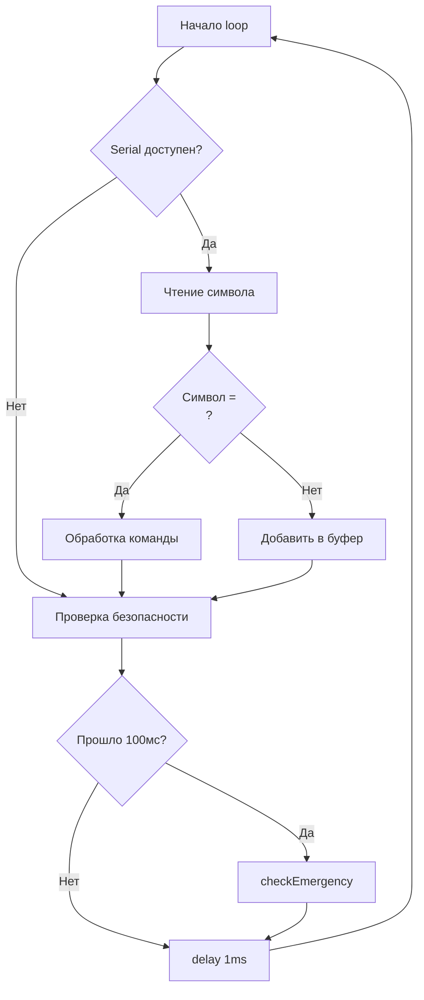
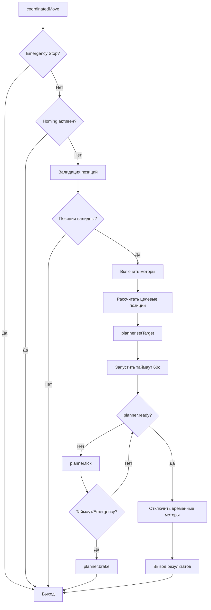
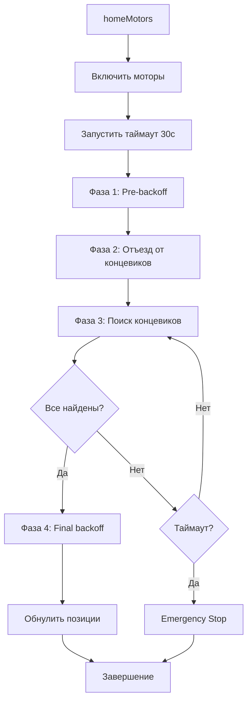

# Документация системы управления 5-моторным контроллером v3.0

## Оглавление
1. [Обзор системы](#обзор-системы)
2. [Архитектура](#архитектура)
3. [Компоненты системы](#компоненты-системы)
4. [Алгоритм работы](#алгоритм-работы)
5. [Система безопасности](#система-безопасности)
6. [Команды управления](#команды-управления)
7. [Анализ кода](#анализ-кода)
8. [Рекомендации по улучшению](#рекомендации-по-улучшению)

---

## Обзор системы

### Назначение
Система предназначена для прецизионного управления 5 шаговыми двигателями с использованием библиотеки GyverPlanner для координированного движения. Система обеспечивает безопасное управление с защитой от ошибок, таймаутами и аварийной остановкой.

### Основные характеристики
- **Количество моторов**: 5 (Multi/X, Multizone/Y, RRight/Z, E0, E1)
- **Дополнительные контрольные пины**: 10 (насосы, клапаны, роторы, HX711)
- **Протокол связи**: UART 115200 бод
- **Платформа**: Arduino/PlatformIO
- **Версия**: 3.0 с улучшенной безопасностью

### Ключевые возможности
- Координированное движение всех осей
- Автоматическое возвращение в исходное положение (homing)
- Система аварийной остановки
- Защита от переполнения буфера
- Валидация позиций и команд
- Таймауты операций
- Watchdog-таймер

---

## Архитектура

### Структурная схема
```
┌─────────────────────────────────────────┐
│           Пользовательский ввод         │
│              (Serial UART)               │
└────────────────┬────────────────────────┘
                 ▼
┌─────────────────────────────────────────┐
│         Буфер команд (64 байта)         │
│     с защитой от переполнения           │
└────────────────┬────────────────────────┘
                 ▼
┌─────────────────────────────────────────┐
│          Парсер и валидатор             │
│            команд                        │
└────────────────┬────────────────────────┘
                 ▼
┌─────────────────────────────────────────┐
│         Система безопасности             │
│  • Проверка лимитов                     │
│  • Таймауты                             │
│  • Emergency Stop                        │
│  • Watchdog                             │
└────────────────┬────────────────────────┘
                 ▼
┌─────────────────────────────────────────┐
│          GyverPlanner                    │
│    (Планировщик движения)               │
└────────────────┬────────────────────────┘
                 ▼
┌─────────────────────────────────────────┐
│         Драйверы моторов                 │
│   (STEP/DIR/ENABLE сигналы)             │
└─────────────────────────────────────────┘
```

### Основные модули

1. **Модуль коммуникации** - обработка Serial-команд с защитой от переполнения
2. **Модуль валидации** - проверка корректности команд и параметров
3. **Модуль безопасности** - контроль лимитов, таймауты, аварийная остановка
4. **Модуль планирования движения** - GyverPlanner для координированного движения
5. **Модуль управления GPIO** - прямое управление пинами моторов и периферии

---

## Компоненты системы

### Конфигурация моторов

| Мотор | Название | STEP | DIR | ENABLE | HOME | Max Speed | Acceleration | Steps/Unit | Лимиты позиции |
|-------|----------|------|-----|---------|------|-----------|--------------|------------|----------------|
| 0 | Multi (X) | A0 | A1 | 38 | 14 | 500 | 500 | 40 | -200 до 200 |
| 1 | Multizone (Y) | A6 | A7 | A2 | 2 | 200 | 300 | 80 | -100 до 100 |
| 2 | RRight (Z) | 46 | 48 | A8 | 2 | 1000 | 200 | 200 | -300 до 0 |
| 3 | E0 | 26 | 28 | 24 | 15 | 2000 | 2000 | 200 | -50 до 50 |
| 4 | E1 | 36 | 34 | 30 | 15 | 2000 | 2000 | 200 | -50 до 50 |

### Контрольные пины

| Индекс | Пин | Назначение |
|--------|-----|------------|
| 0 | 18 | PUMP (Насос) |
| 1 | 8 | KL1 (Клапан 1) |
| 2 | 10 | KL2 (Клапан 2) |
| 3 | 19 | WASTE (Слив) |
| 4-7 | 27,29,23,25 | ROTOR1-4 (Роторы) |
| 8-9 | 42,40 | HX711 (SCK, DT) |

### Структуры данных

#### SystemState - Состояние системы
```cpp
struct SystemState {
    volatile bool motorsEnabled;      // Моторы включены
    volatile bool homingActive;       // Идёт homing
    volatile bool emergencyStop;      // Аварийная остановка
    volatile ErrorCode lastError;     // Последняя ошибка
    volatile bool commandInProgress;  // Команда выполняется
    uint32_t lastActivityTime;        // Время последней активности
    char inputBuffer[64];             // Буфер команд
    uint8_t inputBufferPos;          // Позиция в буфере
    bool commandReady;               // Команда готова к обработке
}
```

#### TimeoutManager - Управление таймаутами
```cpp
struct TimeoutManager {
    uint32_t startTime;       // Время начала операции
    uint32_t timeoutDuration; // Длительность таймаута
    bool active;              // Таймаут активен
}
```

---

## Алгоритм работы

### Основной цикл (loop)



### Алгоритм координированного движения



### Алгоритм возврата в исходное положение (Homing)



### Процесс обработки команд

1. **Получение данных**
   - Символы читаются из Serial по одному
   - Накапливаются в буфере до символа новой строки
   - Защита от переполнения (макс. 64 байта)

2. **Парсинг команды**
   - Разделение на команду и аргументы
   - Приведение команды к нижнему регистру
   - Очистка от лишних пробелов

3. **Валидация**
   - Проверка количества аргументов
   - Проверка диапазонов значений
   - Проверка состояния системы

4. **Выполнение**
   - Запуск соответствующего обработчика
   - Контроль таймаутов
   - Мониторинг аварийных ситуаций

5. **Завершение**
   - Вывод результата
   - Очистка буфера команд
   - Обновление времени активности

---

## Система безопасности

### Уровни защиты

#### 1. Защита от переполнения буфера
- Максимальный размер команды: 64 байта
- Автоматическая очистка при превышении
- Фильтрация непечатаемых символов

#### 2. Валидация позиций
- Проверка минимальных и максимальных лимитов для каждого мотора
- Проверка на NaN и Inf значения
- Валидация перед каждым движением

#### 3. Система таймаутов
- **Homing**: 30 секунд
- **Движение**: 60 секунд
- **Backoff**: 5 секунд
- **Watchdog**: 10 минут неактивности

#### 4. Аварийная остановка
Активируется при:
- Команде `stop`
- Истечении таймаута операции
- Отсутствии активности 10 минут
- Критических ошибках

Действия при аварийной остановке:
1. Немедленная остановка всех моторов
2. Отключение планировщика движения
3. Блокировка новых команд
4. Требуется команда `reset` для восстановления

#### 5. Защита от гонок (Thread Safety)
- Использование `noInterrupts()/interrupts()`
- Volatile переменные для критических флагов
- Атомарные операции с состоянием

### Коды ошибок

| Код | Название | Описание |
|-----|----------|----------|
| 0 | ERROR_NONE | Нет ошибок |
| 1 | ERROR_INVALID_POSITION | Позиция вне допустимых лимитов |
| 2 | ERROR_INVALID_PIN | Неверный индекс пина |
| 3 | ERROR_TIMEOUT | Превышено время операции |
| 4 | ERROR_EMERGENCY_STOP | Активирована аварийная остановка |
| 5 | ERROR_OUT_OF_BOUNDS | Выход за границы массива |
| 6 | ERROR_BUFFER_OVERFLOW | Переполнение буфера команд |
| 7 | ERROR_INVALID_COMMAND | Неизвестная команда |

---

## Команды управления

### Команды движения

#### `sm x y z e0 e1` - Координированное движение
- **Параметры**: 5 чисел или `*` для пропуска оси
- **Пример**: `sm 10.5 * -5 0 0` - движение X на 10.5, Z на -5
- **Валидация**: Проверка лимитов для каждой оси
- **Таймаут**: 60 секунд

#### `sh f1 f2 f3 f4 f5` - Возврат в исходное положение
- **Параметры**: 5 флагов (1 = homing, 0 = пропустить)
- **Пример**: `sh 1 1 0 0 0` - homing для X и Y
- **Таймаут**: 30 секунд
- **Особенности**: 
  - Pre-backoff для безопасного отхода
  - Поиск концевиков
  - Final backoff и обнуление позиции

#### `clamph` - Координированный homing E0+E1
- **Параметры**: нет
- **Особенности**: Синхронное движение E0 и E1
- **Применение**: Для механизмов захвата

### Команды управления пинами

#### `pon N` - Включить пин
- **Параметры**: Индекс пина (0-9)
- **Пример**: `pon 0` - включить насос

#### `poff N` - Выключить пин
- **Параметры**: Индекс пина (0-9)
- **Пример**: `poff 3` - выключить слив

### Системные команды

#### `status` - Состояние системы
Выводит:
- Состояние моторов (включены/выключены)
- Режим homing (активен/неактивен)
- Состояние аварийной остановки
- Последнюю ошибку
- Текущие позиции всех моторов
- Состояние концевиков
- Время работы системы

#### `test` - Тест моторов
- **Длительность**: 10 секунд
- **Действие**: Движение всех моторов вперёд-назад
- **Применение**: Проверка подключения и работоспособности

#### `stop` - Аварийная остановка
- Немедленно останавливает все операции
- Требует команду `reset` для восстановления

#### `reset` - Сброс аварийного состояния
- Очищает флаг emergency stop
- Восстанавливает работоспособность системы

#### `help` - Справка
- Выводит список всех команд
- Показывает параметры команд
- Описывает функции безопасности

---

## Анализ кода

### Сильные стороны

1. **Безопасность**
   - Комплексная система защиты от ошибок
   - Множественные уровни валидации
   - Защита от переполнения буфера
   - Таймауты для всех длительных операций

2. **Надёжность**
   - Thread-safe операции с volatile переменными
   - Атомарные критические секции
   - Watchdog для предотвращения зависаний

3. **Модульность**
   - Четкое разделение на функциональные блоки
   - Конфигурируемые параметры моторов
   - Расширяемая система команд

4. **Диагностика**
   - Подробный вывод состояния
   - Система кодов ошибок
   - Отладочные сообщения

### Потенциальные проблемы

1. **Использование delay() в loop**
   - Может влиять на отзывчивость
   - Рекомендация: использовать неблокирующий подход

2. **Отсутствие проверки на деление на ноль**
   - В функции `toUnits()` при stepsPerUnit = 0
   - Рекомендация: добавить проверку

3. **Жёстко заданные константы**
   - Таймауты и лимиты не настраиваются динамически
   - Рекомендация: возможность настройки через команды

4. **Ограниченная обработка ошибок Serial**
   - Нет проверки на ошибки чтения Serial
   - Рекомендация: добавить обработку Serial.getWriteError()

---

## Рекомендации по улучшению

### Критические улучшения

1. **Добавить проверку деления на ноль**
```cpp
inline float toUnits(uint8_t motor, int32_t steps) {
    if (motors[motor].stepsPerUnit == 0) return 0;
    return (float)steps / motors[motor].stepsPerUnit;
}
```

2. **Улучшить обработку Serial**
```cpp
if (Serial.getWriteError()) {
    Serial.clearWriteError();
    // Логирование ошибки
}
```

3. **Добавить CRC для команд** (опционально для критических применений)
```cpp
// Формат: команда;CRC8
bool validateCRC(const char* command) {
    // Реализация CRC8 проверки
}
```

### Улучшения производительности

1. **Заменить delay(1) на неблокирующий подход**
```cpp
static uint32_t lastLoopTime = 0;
if (millis() - lastLoopTime >= 1) {
    lastLoopTime = millis();
    // Выполнение периодических задач
}
```

2. **Оптимизировать частые операции**
- Кэшировать часто используемые вычисления
- Использовать битовые операции где возможно

### Функциональные улучшения

1. **Добавить команду конфигурации**
```cpp
// setlimit motor min max - установка лимитов
// setspeed motor speed - установка скорости
// settimeout operation seconds - настройка таймаутов
```

2. **Добавить логирование в EEPROM**
- Сохранение последних ошибок
- Счётчик циклов работы
- Статистика использования

3. **Добавить команду калибровки**
- Автоматическое определение steps/unit
- Калибровка концевиков
- Компенсация люфта

### Улучшения безопасности

1. **Добавить контрольные суммы позиций**
- Периодическая проверка соответствия реальных и ожидаемых позиций

2. **Мониторинг температуры драйверов** (при наличии датчиков)
- Автоматическое снижение скорости при перегреве
- Аварийная остановка при критической температуре

3. **Резервное сохранение состояния**
- Сохранение позиций при отключении питания
- Восстановление после сбоя

---

## Заключение

Система управления 5-моторным контроллером v3.0 представляет собой хорошо спроектированное решение с акцентом на безопасность и надёжность. Код демонстрирует профессиональный подход к разработке встраиваемых систем с учётом:

- Защиты от типичных ошибок и сбоев
- Валидации всех входных данных
- Контроля времени выполнения операций
- Возможности аварийного восстановления

Система готова к использованию в производственных условиях с учётом предложенных критических улучшений. Дополнительные улучшения могут быть внедрены постепенно в зависимости от специфических требований применения.

### Область применения
onePap24