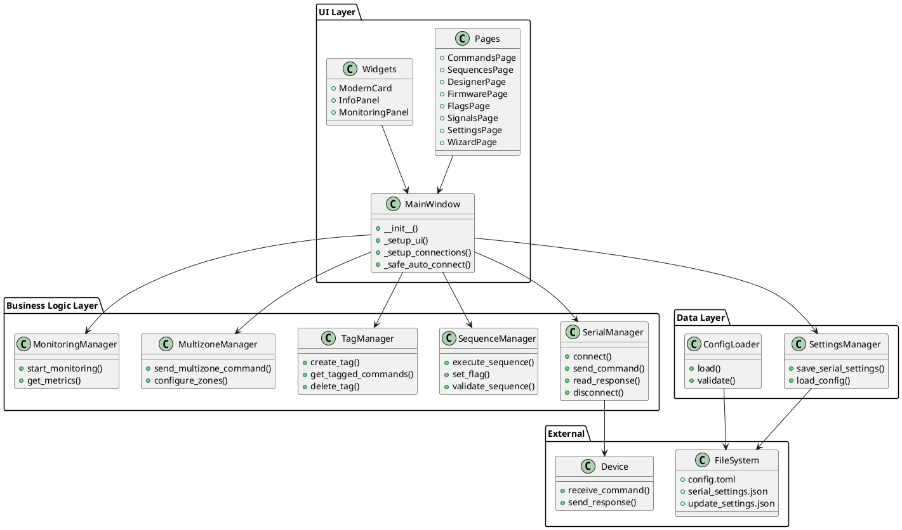
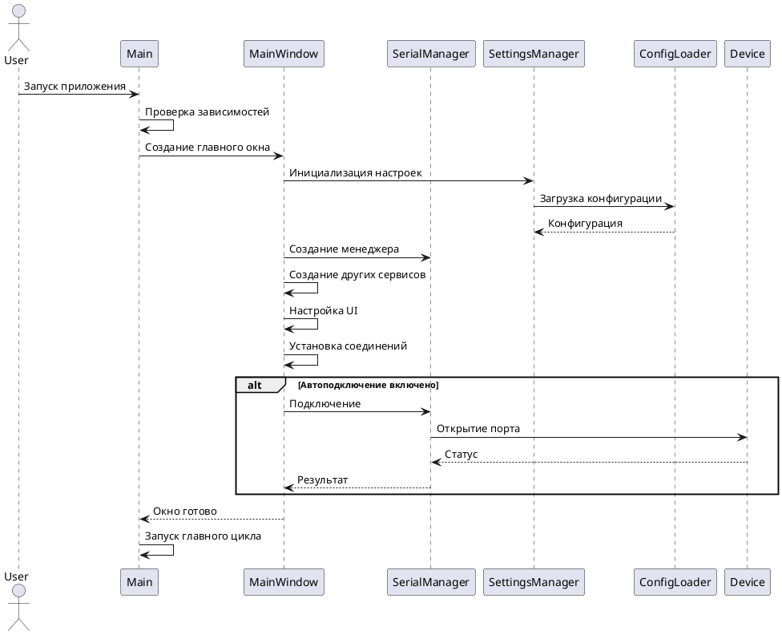
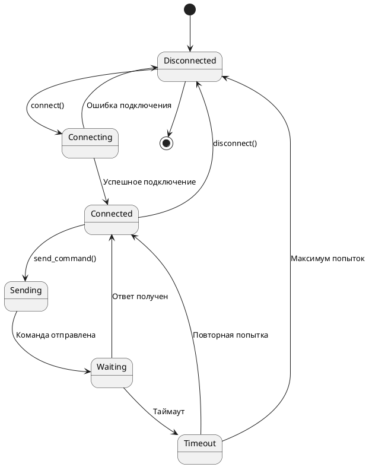
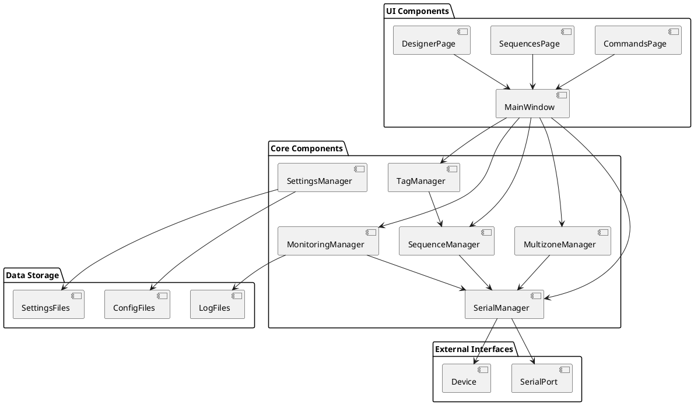
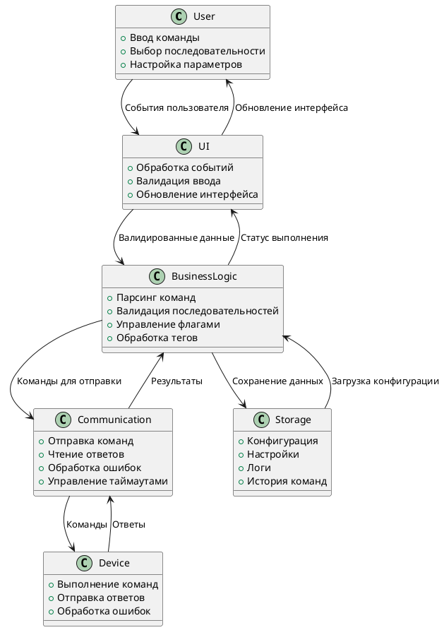
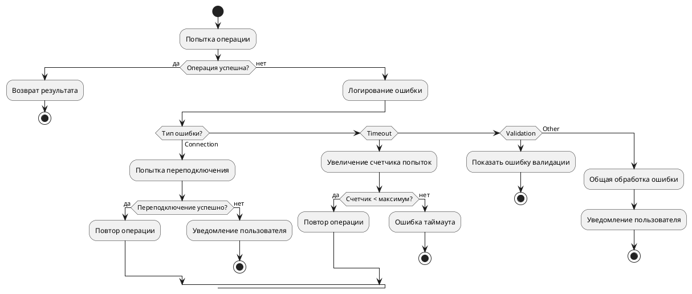

# Диаграммы архитектуры PyQt6 Device Control

## Общая архитектура системы



## Диаграмма последовательности инициализации



## Диаграмма состояний подключения



## Диаграмма компонентов и зависимостей



## Диаграмма потоков данных



## Диаграмма обработки ошибок



## Диаграмма жизненного цикла приложения

```plantuml
@startuml
!define RECTANGLE class

package "Application Lifecycle" {
    RECTANGLE Startup {
        +Проверка зависимостей
        +Инициализация Qt
        +Загрузка конфигурации
        +Создание сервисов
    }
    
    RECTANGLE Running {
        +Главный цикл
        +Обработка событий
        +Мониторинг состояния
        +Периодические задачи
    }
    
    RECTANGLE Shutdown {
        +Graceful shutdown
        +Сохранение настроек
        +Закрытие соединений
        +Очистка ресурсов
    }
}

Startup --> Running : Инициализация завершена
Running --> Running : Обработка событий
Running --> Shutdown : Запрос завершения
Shutdown --> [*] : Приложение завершено
@enduml
```

## Диаграмма модульной структуры

```plantuml
@startuml
package "Core" {
    package "Communication" {
        [SerialManager]
        [Protocol]
        [Connection]
    }
    
    package "Sequences" {
        [SequenceManager]
        [Executor]
        [Validator]
        [Parser]
    }
    
    package "Tags" {
        [TagManager]
        [Processor]
        [Validator]
    }
    
    package "Multizone" {
        [MultizoneManager]
        [Types]
        [Validator]
    }
    
    package "DI" {
        [Container]
        [Resolver]
        [Types]
    }
}

package "UI" {
    package "Pages" {
        [CommandsPage]
        [SequencesPage]
        [DesignerPage]
        [SettingsPage]
    }
    
    package "Widgets" {
        [ModernCard]
        [InfoPanel]
        [MonitoringPanel]
    }
    
    package "Components" {
        [NavigationManager]
        [PageManager]
        [EventBus]
    }
}

package "Config" {
    [SettingsManager]
    [ConfigLoader]
    [SignalConfigParser]
}

package "Utils" {
    [Logger]
    [ErrorHandler]
    [GitManager]
}

package "Monitoring" {
    [MonitoringManager]
    [HealthChecker]
    [PerformanceMonitor]
}

[SerialManager] --> [Protocol]
[SequenceManager] --> [Executor]
[TagManager] --> [Processor]
[MultizoneManager] --> [Types]

[CommandsPage] --> [SerialManager]
[SequencesPage] --> [SequenceManager]
[DesignerPage] --> [TagManager]

[SettingsManager] --> [ConfigLoader]
[MonitoringManager] --> [HealthChecker]
@enduml
```


