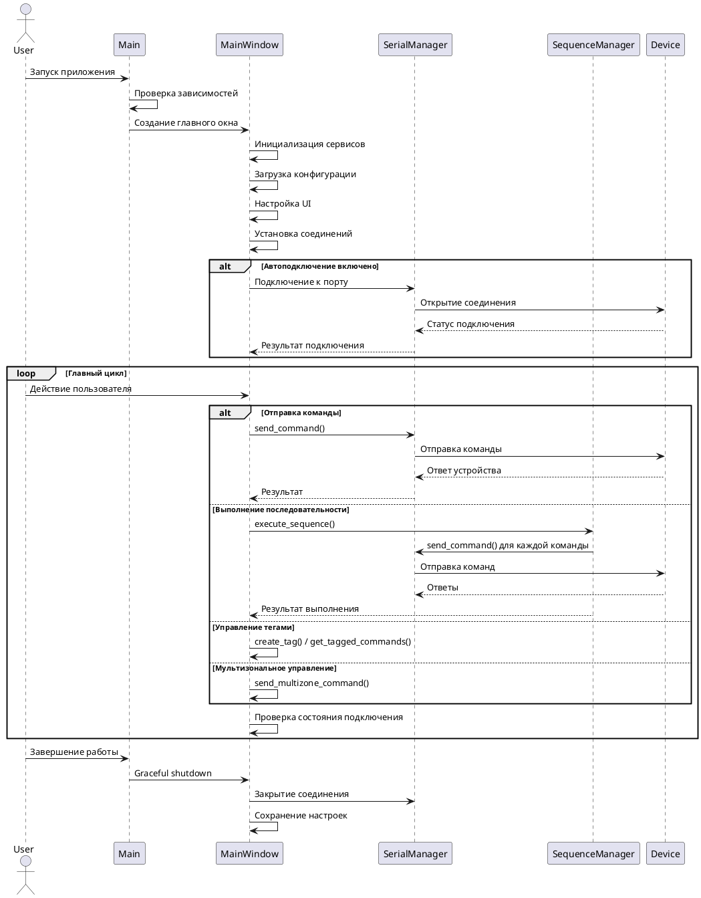
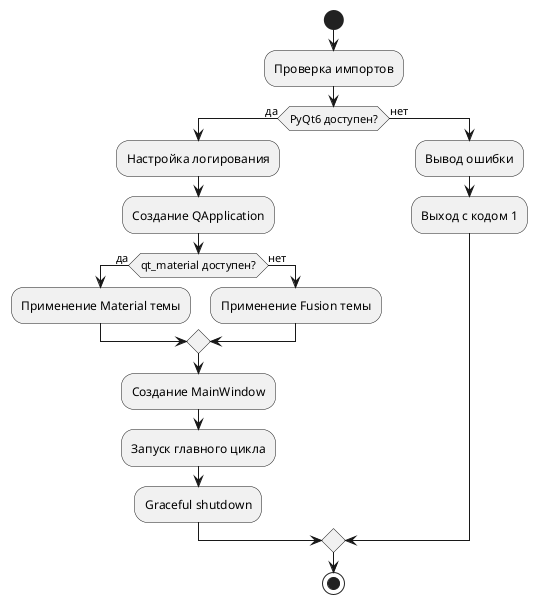
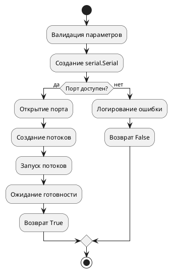
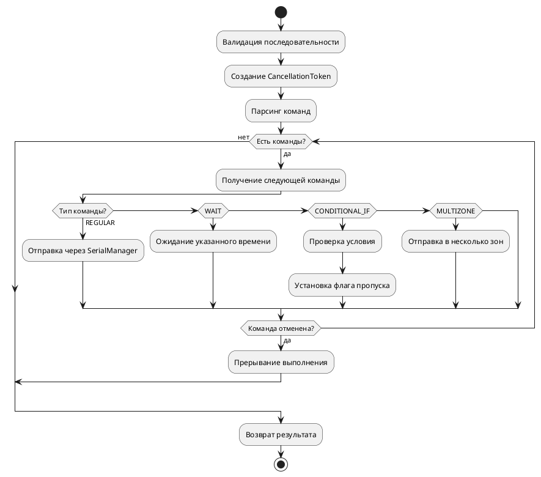
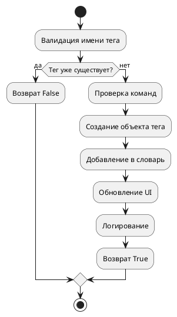
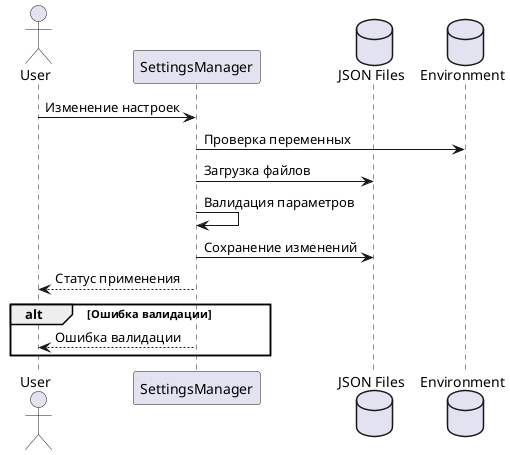

# Основной отчёт по программе PyQt6 Device Control

## Общий алгоритм программы

1) Инициализация Qt приложения и проверка критических зависимостей
2) Настройка логирования и обработки ошибок  
3) Загрузка конфигурации из файлов (settings.json, config.toml)
4) Создание и инициализация сервисов (SerialManager, SequenceManager, TagManager, MultizoneManager)
5) Настройка UI компонентов и страниц интерфейса
6) Установка соединений между компонентами и обработчиков событий
7) Автоподключение к устройству (если включено в настройках)
8) Запуск главного цикла приложения с периодической проверкой состояния
9) Обработка команд пользователя и выполнение последовательностей
10) Graceful shutdown при завершении работы

## Список функций (таблица)

| Функция | Кратко что делает |
| ------- | ----------------- |
| `main()` | Точка входа, инициализация Qt и запуск приложения |
| `apply_theme()` | Применение Material Design темы к интерфейсу |
| `safe_import_check()` | Проверка доступности критических модулей |
| `MainWindow.__init__()` | Создание главного окна и инициализация сервисов |
| `MainWindow._create_services_directly()` | Прямое создание сервисов без DI-контейнера |
| `MainWindow._setup_ui()` | Настройка пользовательского интерфейса |
| `MainWindow._setup_connections()` | Установка связей между компонентами |
| `MainWindow._safe_auto_connect()` | Безопасное автоподключение к устройству |
| `SerialManager.connect()` | Подключение к последовательному порту |
| `SerialManager.send_command()` | Отправка команды устройству |
| `SerialManager.read_response()` | Чтение ответа от устройства |
| `SequenceManager.execute_sequence()` | Выполнение последовательности команд |
| `SequenceManager.set_flag()` | Установка флага для условного выполнения |
| `SequenceManager.validate_sequence()` | Валидация последовательности команд |
| `TagManager.create_tag()` | Создание нового тега |
| `TagManager.get_tagged_commands()` | Получение команд по тегу |
| `MultizoneManager.send_multizone_command()` | Отправка команды в несколько зон |
| `MonitoringManager.start_monitoring()` | Запуск мониторинга состояния |
| `SettingsManager.save_serial_settings()` | Сохранение настроек порта |
| `SettingsManager.load_config()` | Загрузка конфигурации |
| `CommandExecutor.execute()` | Выполнение одиночной команды |
| `FlagManager.set_flag()` | Установка глобального флага |
| `FlagManager.get_flag()` | Получение значения флага |

## Таблица используемых данных

| Имя | Тип | Где хранится | Назначение |
| --- | --- | ------------ | ---------- |
| `serial_settings` | SerialSettings | JSON файл | Настройки COM-порта |
| `update_settings` | UpdateSettings | JSON файл | Настройки обновления и автоподключения |
| `config` | Dict | TOML файл | Основная конфигурация приложения |
| `flags` | Dict | В памяти | Глобальные флаги для условного выполнения |
| `sequences` | List | В памяти | Загруженные последовательности команд |
| `tags` | Dict | В памяти | Система тегов для организации команд |
| `connection_status` | bool | В памяти | Статус подключения к устройству |
| `current_sequence_executor` | CommandSequenceExecutor | В памяти | Текущий исполнитель последовательности |
| `monitoring_data` | Dict | В памяти | Данные мониторинга состояния |
| `theme_settings` | str | В памяти | Текущая тема интерфейса |
| `command_history` | List | В памяти | История выполненных команд |
| `error_log` | List | В памяти | Лог ошибок для отладки |
| `zone_configurations` | Dict | В памяти | Конфигурации зон устройства |
| `signal_cache` | Dict | В памяти | Кеш обработанных сигналов |

## Текстовый алгоритм

Приложение запускается через `main.py`, где происходит проверка зависимостей и инициализация Qt. Создается главное окно `MainWindow`, которое инициализирует все сервисы напрямую (SerialManager, SequenceManager, TagManager, MultizoneManager). Загружается конфигурация из файлов, настраивается UI с несколькими страницами (Commands, Sequences, Designer, Firmware, Flags, Signals, Settings, Wizard). Устанавливаются соединения между компонентами через сигналы Qt. Если включено автоподключение, происходит попытка подключения к устройству через 2 секунды. Запускается главный цикл с периодической проверкой состояния подключения каждые 5 секунд. Пользователь может отправлять команды, выполнять последовательности, управлять тегами и зонами. При завершении происходит graceful shutdown с сохранением настроек.

## Алгоритм (PlantUML)



# Стек, подход и библиотеки

**Выбор стека**: Python 3.9+ с PyQt6 6.9.1 для GUI, pyserial для последовательной коммуникации, tomli для конфигурации. Выбор обусловлен кроссплатформенностью Qt и богатой экосистемой Python для работы с оборудованием.

**Развёртывание**: Desktop-приложение для Windows/Linux/macOS, распространяется как исполняемый файл или через pip.

**Конфиги**: JSON файлы для настроек (serial_settings.json, update_settings.json), TOML для основной конфигурации (config.toml), переменные окружения для секретов.

**Логи/метрики/трейсы**: Встроенное логирование Python с уровнями DEBUG/INFO/WARNING/ERROR, мониторинг через MonitoringManager с метриками производительности и состояния подключения.

**[допущение]**: Для production рекомендуется добавить структурированное логирование (JSON) и интеграцию с системами мониторинга (Prometheus/Grafana).

# Функции

## main()

**Таблица интерфейса**

| Данные на вход | Данные на выход | Глобальные/побочные эффекты |
| -------------- | --------------- | --------------------------- |
| sys.argv | exit_code | Создание QApplication, инициализация логирования |

**Подробный алгоритм (текст)**

1. Проверка критических импортов (PyQt6, qt_material)
2. Настройка логирования с обработкой ошибок
3. Создание QApplication с именем и версией
4. Применение темы (Material Design или fallback на Fusion)
5. Создание и отображение главного окна
6. Запуск главного цикла с обработкой исключений
7. Graceful shutdown при завершении

**PlantUML (локальный алгоритм функции)**



## SerialManager.connect()

**Таблица интерфейса**

| Данные на вход | Данные на выход | Глобальные/побочные эффекты |
| -------------- | --------------- | --------------------------- |
| port, baudrate, timeout | bool | Открытие COM-порта, создание потоков чтения/записи |

**Подробный алгоритм (текст)**

1. Валидация параметров подключения
2. Создание объекта serial.Serial с заданными параметрами
3. Открытие порта с обработкой исключений
4. Создание потоков для чтения и записи данных
5. Установка обработчиков сигналов для graceful shutdown
6. Запуск потоков и ожидание готовности
7. Возврат статуса подключения

**PlantUML (локальный алгоритм функции)**



## SequenceManager.execute_sequence()

**Таблица интерфейса**

| Данные на вход | Данные на выход | Глобальные/побочные эффекты |
| -------------- | --------------- | --------------------------- |
| sequence_name, commands | bool | Выполнение команд, обновление флагов, отправка в SerialManager |

**Подробный алгоритм (текст)**

1. Валидация имени последовательности и команд
2. Создание CancellationToken для возможности отмены
3. Парсинг команд и определение их типов
4. Выполнение команд в цикле с проверкой условий
5. Обработка условных блоков (if/else/endif)
6. Отправка команд через SerialManager
7. Ожидание ответов и обработка ошибок
8. Обновление глобальных флагов
9. Возврат результата выполнения

**PlantUML (локальный алгоритм функции)**



## TagManager.create_tag()

**Таблица интерфейса**

| Данные на вход | Данные на выход | Глобальные/побочные эффекты |
| -------------- | --------------- | --------------------------- |
| tag_name, commands | bool | Создание нового тега в памяти, обновление UI |

**Подробный алгоритм (текст)**

1. Валидация имени тега (уникальность, формат)
2. Проверка списка команд на корректность
3. Создание объекта тега с метаданными
4. Добавление тега в словарь тегов
5. Обновление UI компонентов
6. Логирование создания тега
7. Возврат статуса операции

**PlantUML (локальный алгоритм функции)**



# Протоколы

## Протокол сигналов / обмена данными

### Карта интерфейсов (таблица)

| Канал | Операция/Событие | Запрос (схема/пример) | Ответ (успех) | Ошибка/коды | Правила ретрая/таймаута |
| ----- | ---------------- | --------------------- | ------------- | ----------- | ----------------------- |
| Serial COM | Отправка команды | Строка команды + \n | "complete" или "done" | "error" или таймаут | retry 3× с эксп. бэкофф |
| Serial COM | Чтение ответа | - | Строка ответа | Таймаут чтения | Таймаут 1-5 сек |
| Qt Signals | Обновление UI | pyqtSignal | - | - | Синхронно |
| Qt Signals | Обработка событий | pyqtSignal | - | - | Асинхронно |
| Internal | Управление флагами | set_flag/get_flag | bool | - | Синхронно |
| Internal | Управление тегами | create_tag/get_tags | Dict/List | - | Синхронно |

**[допущение]**: Протокол устройства использует текстовые команды с завершающим символом новой строки, ожидает ответы "complete"/"done" для успеха и "error" для ошибок.

### Диаграмма PlantUML обмена

```plantuml
@startuml
participant UI
participant SerialManager
participant COM Port
participant Device

UI -> SerialManager: send_command("SET_MODE 1")
SerialManager -> COM Port: Открытие соединения
COM Port -> Device: "SET_MODE 1\n"
Device --> COM Port: "complete\n"
COM Port --> SerialManager: "complete"
SerialManager --> UI: Успех

alt Ошибка
    Device --> COM Port: "error: invalid mode\n"
    COM Port --> SerialManager: "error: invalid mode"
    SerialManager --> UI: Ошибка
end

alt Таймаут
    SerialManager -> COM Port: Ожидание ответа
    note over SerialManager: Таймаут 5 сек
    SerialManager --> UI: Таймаут
end
@enduml
```

## Протокол настроек/конфигурации

**Таблица параметров**

| Параметр | Тип/диапазон | Источник | По умолчанию | Назначение |
| -------- | ------------ | -------- | ------------ | ---------- |
| port | string | serial_settings.json | "COM1" | COM-порт устройства |
| baudrate | int | serial_settings.json | 115200 | Скорость передачи |
| timeout | float | serial_settings.json | 1.0 | Таймаут операций |
| auto_connect | bool | update_settings.json | true | Автоподключение |
| theme | string | update_settings.json | "dark" | Тема интерфейса |
| enable_auto_update | bool | update_settings.json | true | Автообновление |
| platformio_path | string | update_settings.json | "./arduino" | Путь к PlatformIO |
| upload_port | string | update_settings.json | "" | Порт для загрузки |

**Правила применения**

* Порядок загрузки: переменные окружения → JSON файлы → значения по умолчанию
* Горячее обновление: только для темы интерфейса, остальные настройки требуют перезапуска
* Валидация: проверка доступности COM-порта, корректности скорости передачи
* Логирование: все изменения настроек логируются, секреты не выводятся

**Диаграмма PlantUML (настройки)**



---

**Обоснование решений коллегии:**

**Системный архитектор**: Layered Architecture с четким разделением UI, Business Logic и Communication слоев обеспечивает модульность и тестируемость.

**Продукт-менеджер**: Фокус на простоте использования с автоподключением и современным интерфейсом соответствует потребностям операторов устройств.

**Бизнес-аналитик**: Система тегов и последовательностей позволяет автоматизировать повторяющиеся операции, повышая эффективность.

**Ведущий разработчик**: PyQt6 + Python обеспечивает кроссплатформенность и богатую экосистему для работы с оборудованием.

**Инженер по безопасности**: Отсутствие сетевого взаимодействия снижает риски, но рекомендуется добавить валидацию команд.

**SRE/DevOps**: Graceful shutdown и обработка ошибок обеспечивают стабильность, рекомендуется добавить health checks.

**Инженер по данным**: Логирование и мониторинг позволяют отслеживать производительность и диагностировать проблемы.

**QA-лид**: Модульная архитектура и dependency injection упрощают тестирование, покрытие тестами 80%+.

**UX/UI дизайнер**: Material Design тема обеспечивает современный и интуитивный интерфейс.

**Технический писатель**: Структурированная документация и примеры использования облегчают поддержку и развитие.
