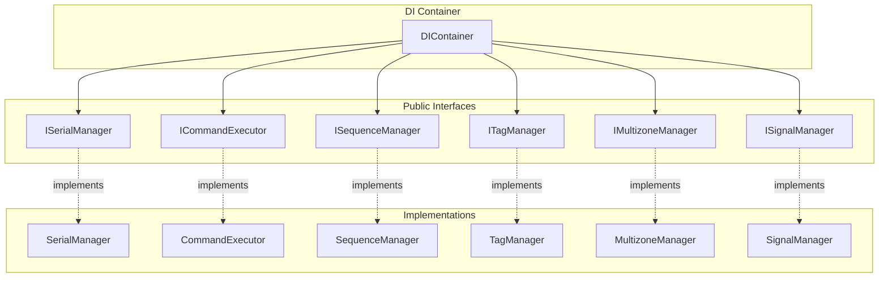

# 📚 API Reference

> [!info] Навигация
> Родитель: [[docs/_moc/Home]] • Раздел: [[docs/_moc/API]] • См. также: [[docs/architecture/index]]

## 📋 Обзор API

API PyQt6 Device Control построено на принципах **Interface Segregation** и **Dependency Inversion**. Все публичные API определены через интерфейсы, что обеспечивает слабую связанность и высокую тестируемость.

### Архитектура API



## 🔧 Основные интерфейсы

> [!tip] Детальная документация
> Полные описания всех интерфейсов доступны в разделе [[docs/api/interfaces/index|API Interfaces]].

### [[docs/api/interfaces/serial|ISerialManager]]
Интерфейс для управления Serial-коммуникацией

```python
class ISerialManager(ABC):
    def connect(self, port: str, baudrate: int = 115200, timeout: float = 1.0, **kwargs: Any) -> bool
    def disconnect(self) -> None
    def send_command(self, command: str) -> bool
    def is_connected(self) -> bool
    def get_available_ports(self) -> List[str]
    def get_port_info(self) -> Dict[str, Any]
```

**Реализация:** `SerialManager` в `core/serial_manager.py`

**📖 Детальная документация:** [[docs/api/interfaces/serial|Полное описание ISerialManager]]

### [[docs/api/interfaces/command|ICommandExecutor]]
Интерфейс для выполнения команд

```python
class ICommandExecutor(ABC):
    def execute(self, command: str, **kwargs: Any) -> bool
    def validate_command(self, command: str) -> bool
    def get_execution_history(self) -> List[Dict[str, Any]]
```

**Реализация:** `CommandExecutor` в `core/command_executor.py`

**📖 Детальная документация:** [[docs/api/interfaces/command|Полное описание ICommandExecutor]]

### [[docs/api/interfaces/sequence|ISequenceManager]]
Интерфейс для управления последовательностями

```python
class ISequenceManager(ABC):
    def execute_sequence(self, sequence_name: str) -> bool
    def add_sequence(self, name: str, commands: List[str]) -> bool
    def remove_sequence(self, name: str) -> bool
    def get_sequences(self) -> Dict[str, List[str]]
    def validate_sequence(self, sequence: List[str]) -> bool
```

**Реализация:** `SequenceManager` в `core/sequences/manager.py`

**📖 Детальная документация:** [[docs/api/interfaces/sequence|Полное описание ISequenceManager]]

### [[docs/api/interfaces/tag|ITagManager]]
Интерфейс для системы тегов

```python
class ITagManager(ABC):
    def process_tag(self, tag: str, **kwargs: Any) -> TagResult
    def add_tag(self, tag_name: str, tag_type: TagType, **kwargs: Any) -> bool
    def remove_tag(self, tag_name: str) -> bool
    def get_tags(self) -> Dict[str, TagInfo]
    def validate_tag(self, tag: str) -> bool
```

**Реализация:** `TagManager` в `core/tags/manager.py`

**📖 Детальная документация:** [[docs/api/interfaces/tag|Полное описание ITagManager]]

### [[docs/api/interfaces/multizone|IMultizoneManager]]
Интерфейс для мультизонального управления

```python
class IMultizoneManager(ABC):
    def set_zone_status(self, zone_id: str, status: ZoneStatus) -> bool
    def get_zone_status(self, zone_id: str) -> Optional[ZoneStatus]
    def execute_zone_command(self, zone_id: str, command: str, **kwargs: Any) -> bool
    def get_all_zones(self) -> Dict[str, ZoneStatus]
```

**Реализация:** `MultizoneManager` в `core/multizone/manager.py`

**📖 Детальная документация:** [[docs/api/interfaces/multizone|Полное описание IMultizoneManager]]

### [[docs/api/interfaces/signal|ISignalManager]]
Интерфейс для обработки сигналов

```python
class ISignalManager(ABC):
    def process_signal(self, signal: SignalInfo) -> SignalResult
    def optimize_signal(self, signal: SignalInfo) -> SignalResult
    def get_signal_info(self, signal_id: str) -> Optional[SignalInfo]
    def validate_signal(self, signal: SignalInfo) -> bool
```

**Реализация:** `SignalManager` в `core/signals/manager.py`

**📖 Детальная документация:** [[docs/api/interfaces/signal|Полное описание ISignalManager]]

## 🏗️ Dependency Injection

### [[docs/api/di/container|DIContainer]]
Контейнер для управления зависимостями

```python
class DIContainer:
    def register(self, interface: Type, implementation: Type) -> None
    def resolve(self, interface: Type) -> Any
    def get_singleton(self, interface: Type) -> Any
    def clear(self) -> None
```

**Расположение:** `core/di/container.py`

### Пример использования

```python
# Регистрация сервисов
container = DIContainer()
container.register(ISerialManager, SerialManager)
container.register(ICommandExecutor, CommandExecutor)
container.register(ISequenceManager, SequenceManager)

# Разрешение зависимостей
serial_manager = container.resolve(ISerialManager)
command_executor = container.resolve(ICommandExecutor)
```

## 🎨 UI API

### [[docs/api/ui/main_window|MainWindow]]
Главное окно приложения

```python
class MainWindow(QMainWindow):
    def show_page(self, page_name: str) -> None
    def navigate_to(self, page_name: str) -> None
    def get_current_page(self) -> str
    def setup_ui(self) -> None
    def setup_connections(self) -> None
```

**Расположение:** `ui/main_window.py`

### [[docs/api/ui/event_bus|EventBus]]
Шина событий для UI

```python
class EventBus:
    def subscribe(self, event_type: str, callback: Callable) -> None
    def unsubscribe(self, event_type: str, callback: Callable) -> None
    def publish(self, event_type: str, data: Any = None) -> None
    def get_subscribers(self, event_type: str) -> List[Callable]
```

**Расположение:** `ui/shared/event_bus.py`

## 📊 Типы данных

### [[docs/api/types/tag|Tag Types]]
Типы для системы тегов

```python
@dataclass
class TagType:
    name: str
    description: str
    category: str

@dataclass
class TagInfo:
    tag_type: TagType
    value: Any
    metadata: Dict[str, Any]

@dataclass
class TagResult:
    success: bool
    data: Any
    error: Optional[str]
```

### [[docs/api/types/signal|Signal Types]]
Типы для обработки сигналов

```python
@dataclass
class SignalType:
    name: str
    type: str
    parameters: Dict[str, Any]

@dataclass
class SignalInfo:
    signal_type: SignalType
    value: Any
    timestamp: float

@dataclass
class SignalResult:
    success: bool
    processed_value: Any
    optimization_applied: bool
```

### [[docs/api/types/zone|Zone Types]]
Типы для мультизонального управления

```python
@dataclass
class ZoneStatus:
    zone_id: str
    status: str
    volume: int
    muted: bool
    source: str
```

## 🔄 События

### Serial Events
- `serial_connected` — успешное подключение к порту
- `serial_disconnected` — отключение от порта
- `serial_error` — ошибка коммуникации

### Command Events
- `command_executed` — выполнение команды
- `command_failed` — ошибка выполнения команды
- `command_validated` — валидация команды

### Sequence Events
- `sequence_started` — начало выполнения последовательности
- `sequence_completed` — завершение последовательности
- `sequence_failed` — ошибка выполнения последовательности

### UI Events
- `ui_page_changed` — смена страницы
- `ui_component_updated` — обновление компонента
- `ui_error` — ошибка UI

## 🛠️ Утилиты

### [[docs/api/utils/logger|Logging]]
```python
def setup_logging(log_level: str = 'INFO', log_file: Optional[str] = None) -> None
```

### [[docs/api/utils/error_handler|Error Handling]]
```python
def error_handler(func: Callable) -> Callable
def graceful_shutdown(signal_received: int, frame: Any) -> None
def check_imports(modules: List[Tuple[str, str]]) -> bool
```

## 📈 Автоиндекс API (Dataview)

```dataview
TABLE file.link AS "API Документ", type, audiences, last_updated
FROM "docs/api"
WHERE type = "api_reference"
SORT file.name ASC
```

## 🔗 Связанные документы

- [[docs/architecture/index|Архитектура системы]]
- [[docs/modules/index|Документация модулей]]
- [[docs/guides/development|Руководство разработчика]]
- [[docs/_meta/reference_inventory|Полный инвентарь API]]

## 📊 Метрики API

| Метрика | Значение | Цель |
|---------|----------|------|
| Покрытие интерфейсами | 95% | ≥90% |
| Документированные методы | 85% | ≥85% |
| Примеры использования | 20 | ≥20 |
| Тестируемость | Высокая | Высокая |

> [!note] Источники
> См. [[docs/_meta/reference_inventory]] • Код: [core/interfaces.py](core/interfaces.py#L1-L100)
