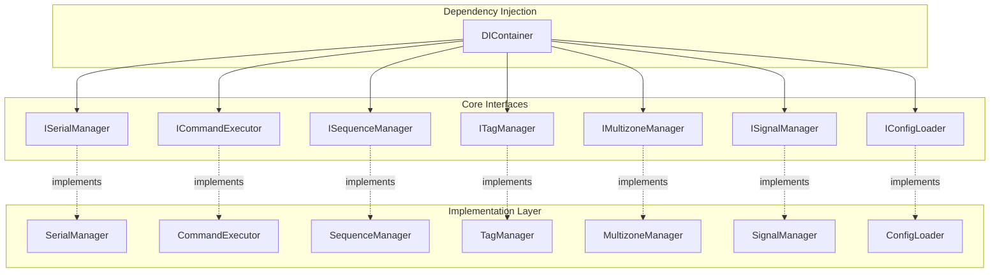
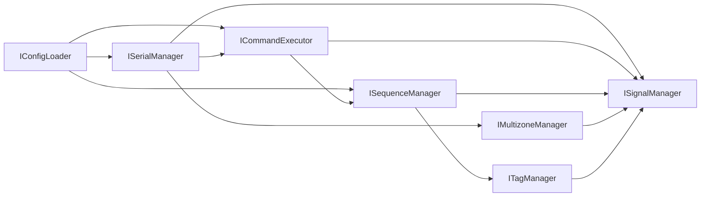

# 🔌 API Interfaces

> [!info] Навигация
> Родитель: [[docs/api/index]] • Раздел: [[docs/api]] • См. также: [[docs/api/examples]]

## 📋 Обзор

API Interfaces предоставляют детальную документацию для всех публичных интерфейсов приложения. Каждый интерфейс определен как абстрактный базовый класс (ABC) и обеспечивает контракт для реализации конкретных сервисов.

## 🏗️ Архитектура интерфейсов

## 📚 Доступные интерфейсы

### 🔌 [[docs/api/interfaces/serial|ISerialManager]]
**Назначение**: Управление Serial-коммуникацией с устройствами

**Основные возможности**:
- Подключение/отключение к последовательным портам
- Отправка команд на устройства
- Получение информации о портах и их статусе
- Управление параметрами соединения

**Ключевые методы**:
- `connect(port, baudrate, timeout, **kwargs) -> bool`
- `send_command(command) -> bool`
- `get_available_ports() -> List[str]`
- `get_port_info() -> Dict[str, Any]`

---

### ⚡ [[docs/api/interfaces/command|ICommandExecutor]]
**Назначение**: Выполнение и валидация команд

**Основные возможности**:
- Выполнение команд с параметрами
- Валидация команд перед выполнением
- Отслеживание истории выполнения
- Обработка ошибок выполнения

**Ключевые методы**:
- `execute(command, **kwargs) -> bool`
- `validate_command(command) -> bool`
- `get_execution_history() -> List[Dict[str, Any]]`

---

### 🔄 [[docs/api/interfaces/sequence|ISequenceManager]]
**Назначение**: Управление последовательностями команд

**Основные возможности**:
- Создание и выполнение последовательностей команд
- Управление зависимостями между командами
- Контроль выполнения с настройкой поведения при ошибках
- Версионирование последовательностей

**Ключевые методы**:
- `execute_sequence(sequence_name) -> bool`
- `add_sequence(name, commands) -> bool`
- `remove_sequence(name) -> bool`

---

### 🏷️ [[docs/api/interfaces/tag|ITagManager]]
**Назначение**: Управление тегами команд и метаданными

**Основные возможности**:
- Создание и управление тегами
- Поиск тегов по различным критериям
- Категоризация команд и последовательностей
- Управление метаданными тегов

**Ключевые методы**:
- `create_tag(tag_info) -> bool`
- `search_tags(query, tag_type=None) -> List[TagInfo]`
- `update_tag(name, updates) -> bool`
- `delete_tag(name) -> bool`

---

### 🌐 [[docs/api/interfaces/multizone|IMultizoneManager]]
**Назначение**: Управление многозонными устройствами

**Основные возможности**:
- Создание и настройка зон
- Синхронизация между зонами
- Управление иерархией зон
- Координация работы устройств в зонах

**Ключевые методы**:
- `create_zone(zone_config) -> bool`
- `configure_zone(zone_name, settings) -> bool`
- `synchronize_zones(zone_names=None) -> bool`
- `get_zone_status(zone_name) -> Dict[str, Any]`

---

### 📡 [[docs/api/interfaces/signal|ISignalManager]]
**Назначение**: Управление сигналами и событиями

**Основные возможности**:
- Регистрация и управление сигналами
- Подписка на сигналы с обработчиками
- Генерация сигналов с данными
- Поддержка паттерна Observer

**Ключевые методы**:
- `register_signal(signal_info) -> bool`
- `subscribe_to_signal(signal_name, handler) -> bool`
- `emit_signal(signal_name, data=None) -> bool`
- `unsubscribe_from_signal(signal_name, handler) -> bool`

---

### ⚙️ [[docs/api/interfaces/config|IConfigLoader]]
**Назначение**: Загрузка и управление конфигурацией

**Основные возможности**:
- Загрузка конфигурации из различных форматов
- Валидация настроек
- Динамическое изменение конфигурации
- Поддержка множественных форматов (JSON, TOML, YAML)

**Ключевые методы**:
- `load_config(config_path) -> bool`
- `get_config_value(key, default=None) -> Any`
- `set_config_value(key, value) -> bool`
- `save_config(config_path=None) -> bool`

## 🔗 Взаимосвязи интерфейсов

## 📖 Структура документации

Каждый интерфейс документирован с включением:

- **Обзор и назначение** - описание роли интерфейса в системе
- **Детальное описание методов** - параметры, возвращаемые значения, исключения
- **Примеры использования** - практические примеры кода
- **Обработка ошибок** - типичные ошибки и стратегии их обработки
- **Связанные интерфейсы** - связи с другими компонентами системы
- **Тестирование** - примеры unit-тестов
- **Примечания реализации** - рекомендации по реализации

## 🧪 Примеры использования

Для каждого интерфейса доступны исполняемые примеры в разделе [[docs/api/examples]]:

- [[docs/api/examples/serial_manager|Примеры ISerialManager]]
- [[docs/api/examples/command_executor|Примеры ICommandExecutor]]
- [[docs/api/examples/sequence_manager|Примеры ISequenceManager]]
- [[docs/api/examples/tag_manager|Примеры ITagManager]]
- [[docs/api/examples/multizone_manager|Примеры IMultizoneManager]]
- [[docs/api/examples/signal_manager|Примеры ISignalManager]]
- [[docs/api/examples/config_loader|Примеры IConfigLoader]]

## 🔍 Поиск и навигация

### По функциональности
- **Коммуникация**: [[docs/api/interfaces/serial|ISerialManager]]
- **Выполнение**: [[docs/api/interfaces/command|ICommandExecutor]], [[docs/api/interfaces/sequence|ISequenceManager]]
- **Организация**: [[docs/api/interfaces/tag|ITagManager]], [[docs/api/interfaces/multizone|IMultizoneManager]]
- **События**: [[docs/api/interfaces/signal|ISignalManager]]
- **Конфигурация**: [[docs/api/interfaces/config|IConfigLoader]]

### По сложности
- **Базовые**: [[docs/api/interfaces/serial|ISerialManager]], [[docs/api/interfaces/command|ICommandExecutor]]
- **Средние**: [[docs/api/interfaces/config|IConfigLoader]], [[docs/api/interfaces/signal|ISignalManager]]
- **Сложные**: [[docs/api/interfaces/sequence|ISequenceManager]], [[docs/api/interfaces/multizone|IMultizoneManager]]

## 📝 Примечания по использованию

1. **Все интерфейсы являются абстрактными** - не создавайте экземпляры напрямую
2. **Используйте DI Container** - для получения реализаций интерфейсов
3. **Обрабатывайте исключения** - все методы могут генерировать ошибки
4. **Следуйте контрактам** - реализуйте все абстрактные методы
5. **Используйте типизацию** - для улучшения читаемости и отладки

## 🔄 Обновления и версионирование

- **Версия интерфейсов**: 1.0.0
- **Последнее обновление**: 2024-12-20
- **Стабильность**: Все интерфейсы стабильны и готовы к использованию
- **Обратная совместимость**: Гарантируется для всех публичных методов
