# Техническая архитектура системы

## 1. Диаграмма компонентов

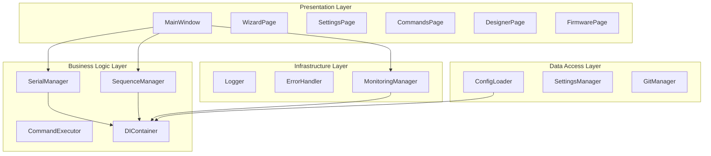

## 2. Диаграмма последовательности

### 2.1 Выполнение команды
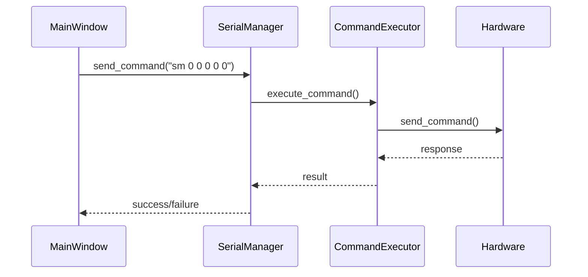

### 2.2 Выполнение последовательности
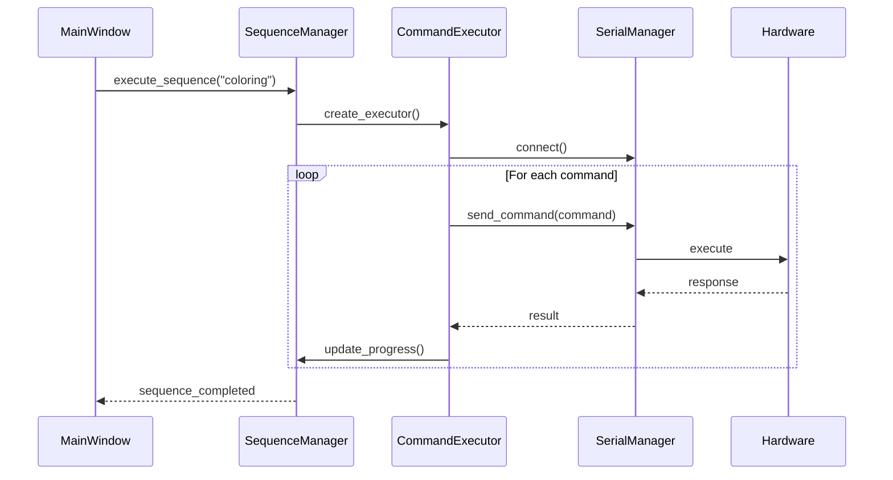

## 3. Диаграмма состояний

### 3.1 Состояние SerialManager
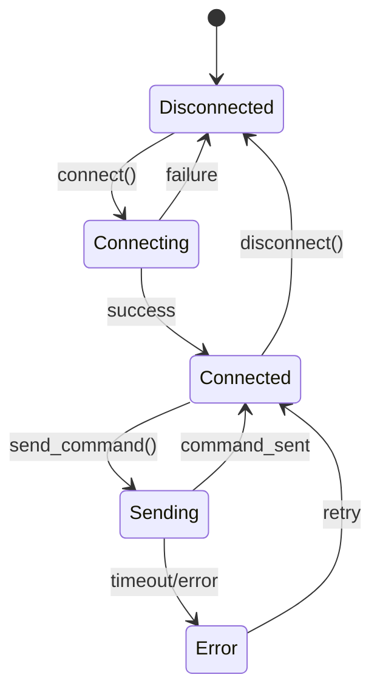

### 3.2 Состояние SequenceExecutor
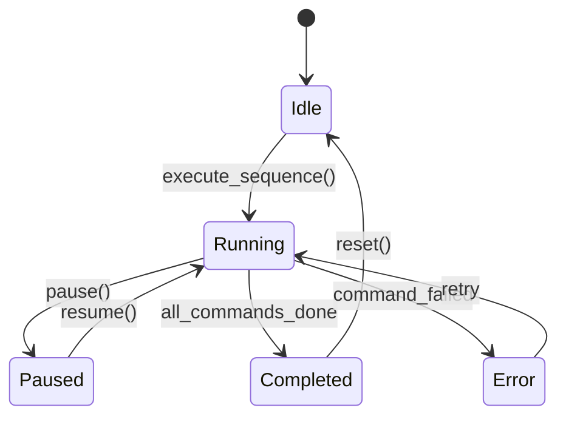

## 4. Диаграмма классов

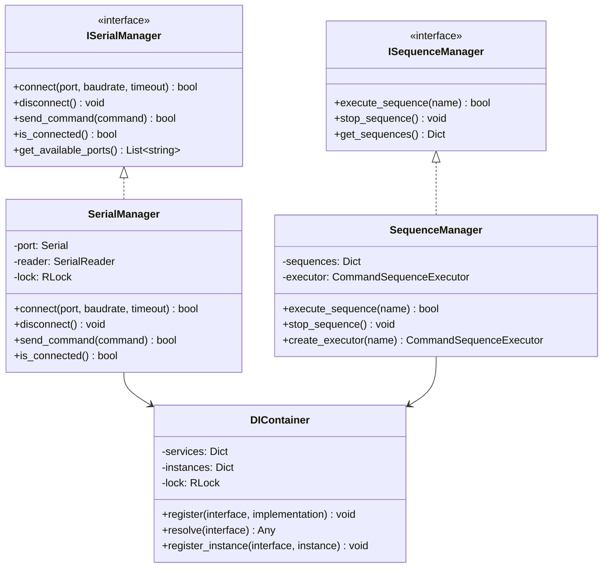

## 5. Диаграмма пакетов

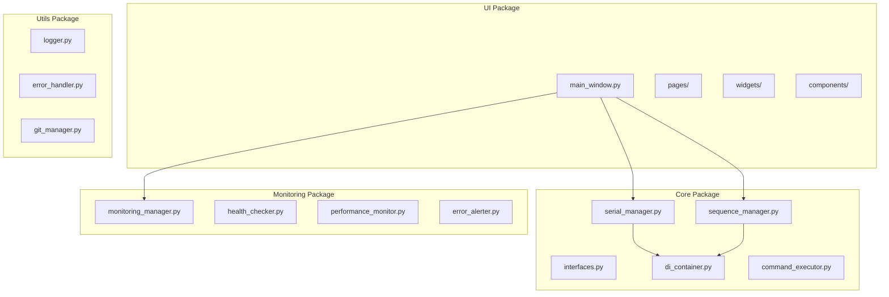

## 6. Диаграмма развертывания

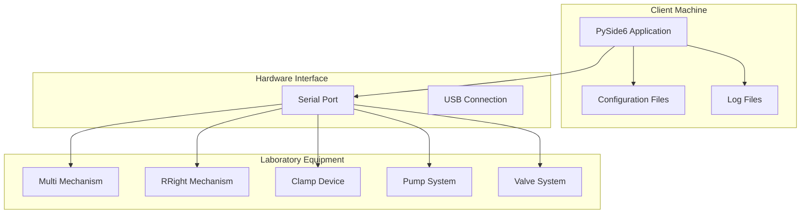

## 7. Диаграмма потоков данных

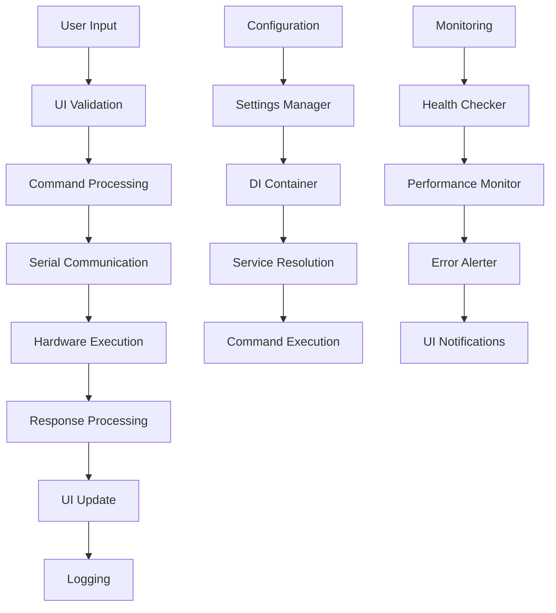

## 8. Диаграмма безопасности

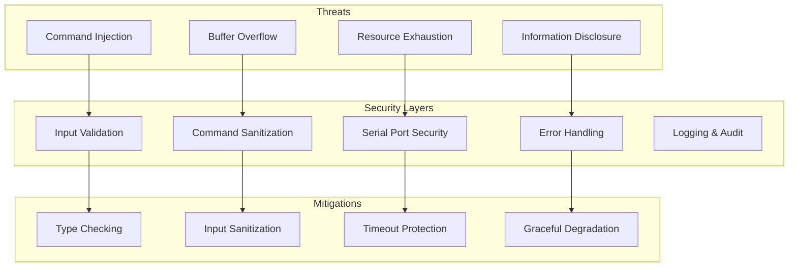

## 9. Диаграмма производительности

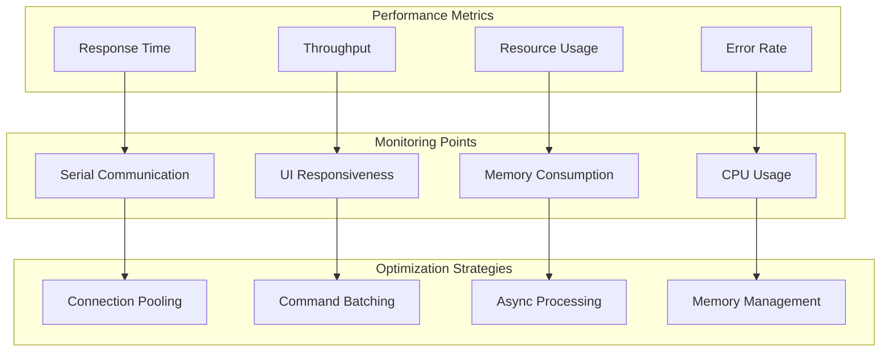

## 10. Диаграмма тестирования

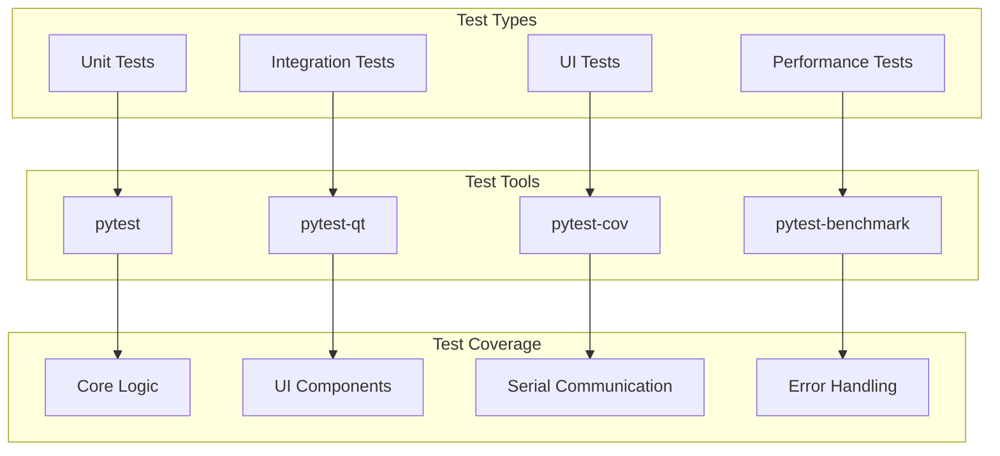

---

**Документ**: Техническая архитектура  
**Версия**: 1.0.0  
**Дата**: 2024  
**Статус**: Утверждено

