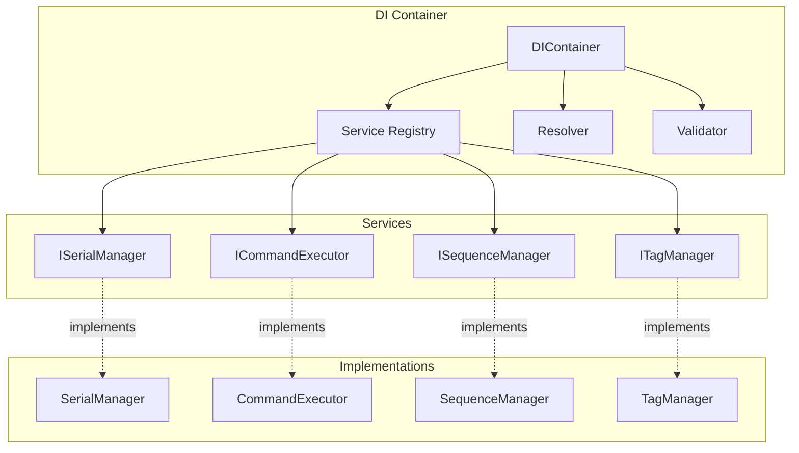

# [ADR-002] Внедрение Dependency Injection

**Дата:** 2024-12-20  
**Статус:** Accepted  
**Автор:** DocArchitect  
**Версия:** 1.0  

## 📋 Контекст

При разработке приложения для управления устройствами возникла необходимость в:

- Слабой связанности компонентов
- Легкости тестирования
- Гибкости конфигурации
- Управлении жизненным циклом сервисов
- Замене реализаций без изменения кода

Традиционный подход с прямым созданием объектов (`new Service()`) приводил к:
- Сильной связанности между компонентами
- Сложности в тестировании
- Затруднениям при изменении конфигурации
- Нарушению принципа инверсии зависимостей

## 🎯 Решение

Внедрена архитектура **Dependency Injection (DI)** с собственным DI-контейнером.

### Обоснование выбора

1. **Слабая связанность** — компоненты зависят от абстракций, а не от конкретных реализаций
2. **Тестируемость** — легко подменять зависимости для unit-тестов
3. **Гибкость** — возможность изменять конфигурацию без изменения кода
4. **Управление жизненным циклом** — централизованное создание и уничтожение объектов
5. **Принципы SOLID** — поддержка принципов инверсии зависимостей и открытости/закрытости

### Альтернативы

| Подход | Преимущества | Недостатки | Причина отклонения |
|--------|--------------|-------------|-------------------|
| **Service Locator** | Простота реализации | Скрытые зависимости, сложность тестирования | Нарушает принцип инверсии зависимостей |
| **Factory Pattern** | Контроль создания объектов | Сложность при множественных зависимостях | Не решает проблему управления жизненным циклом |
| **Singleton** | Глобальный доступ | Сложность тестирования, глобальное состояние | Антипаттерн для тестируемости |
| **Внешние DI фреймворки** | Готовые решения | Дополнительные зависимости, избыточность | Собственный контейнер проще и легче |

## 🔧 Реализация

### Архитектура DI



### Основные компоненты

```python
# core/di/container.py
class DIContainer:
    """DI контейнер для управления зависимостями"""
    
    def __init__(self):
        self._services = {}
        self._singletons = {}
        self._factories = {}
    
    def register(self, interface: Type, implementation: Type, 
                lifecycle: str = "transient") -> None:
        """Регистрация сервиса"""
        self._services[interface] = {
            'implementation': implementation,
            'lifecycle': lifecycle
        }
    
    def resolve(self, interface: Type) -> Any:
        """Разрешение зависимости"""
        if interface not in self._services:
            raise ServiceNotFoundError(f"Service {interface} not registered")
        
        service_info = self._services[interface]
        
        if service_info['lifecycle'] == 'singleton':
            return self._get_singleton(interface)
        else:
            return self._create_instance(interface)
```

### Регистрация сервисов

```python
# core/di_config_loader.py
def configure_services(container: DIContainer) -> None:
    """Конфигурация всех сервисов в DI контейнере"""
    
    # Регистрация основных сервисов
    container.register(ISerialManager, SerialManager, "singleton")
    container.register(ICommandExecutor, CommandExecutor, "singleton")
    container.register(ISequenceManager, SequenceManager, "singleton")
    container.register(ITagManager, TagManager, "singleton")
    container.register(IMultizoneManager, MultizoneManager, "singleton")
    container.register(ISignalManager, SignalManager, "singleton")
    container.register(IConfigLoader, ConfigLoader, "singleton")
    
    # Регистрация UI сервисов
    container.register(EventBus, EventBus, "singleton")
    container.register(NavigationManager, NavigationManager, "singleton")
    container.register(PageManager, PageManager, "singleton")
```

### Использование в коде

```python
# Пример использования DI в UI компонентах
class CommandsPage(BasePage):
    def __init__(self, container: DIContainer):
        super().__init__()
        
        # Получение зависимостей через DI
        self.command_executor = container.resolve(ICommandExecutor)
        self.serial_manager = container.resolve(ISerialManager)
        self.event_bus = container.resolve(EventBus)
        
        self._setup_ui()
        self._connect_signals()
```

## 📊 Последствия

### Положительные

- **Слабая связанность** — компоненты легко заменяются и тестируются
- **Тестируемость** — простое создание mock-объектов для тестов
- **Гибкость** — изменение конфигурации без изменения кода
- **Управление жизненным циклом** — централизованное управление объектами
- **Принципы SOLID** — поддержка архитектурных принципов
- **Конфигурируемость** — легко изменять поведение системы

### Отрицательные

- **Сложность** — дополнительный слой абстракции
- **Производительность** — небольшое снижение производительности из-за рефлексии
- **Отладка** — сложнее отслеживать зависимости при отладке
- **Кривая обучения** — необходимость понимания DI концепций

### Технические аспекты

- **Память** — дополнительное потребление памяти для DI контейнера
- **Время инициализации** — время на настройку DI при запуске
- **Сложность конфигурации** — необходимость правильной настройки зависимостей

## 🔄 Альтернативы

### Краткосрочные альтернативы

1. **Service Locator** — для быстрого прототипирования
2. **Factory Pattern** — для простых случаев

### Долгосрочные альтернативы

1. **Внешние DI фреймворки** — Python Injector, Dependency Injector
2. **Асинхронная DI** — для асинхронных приложений
3. **Конфигурация через файлы** — YAML/JSON конфигурация сервисов

## 📈 Метрики успеха

- [x] Компоненты слабо связаны между собой
- [x] Легко создавать unit-тесты с mock-объектами
- [x] Возможность замены реализаций без изменения кода
- [x] Централизованное управление жизненным циклом
- [x] Поддержка принципов SOLID

## 🔗 Связанные решения

- [[docs/architecture/adr/001-pyqt6-framework|ADR-001: Выбор PyQt6 как GUI фреймворка]] — интеграция UI с DI
- [[docs/architecture/adr/003-layered-architecture|ADR-003: Многослойная архитектура]] — DI как связующее звено между слоями
- [[docs/architecture/adr/007-interface-contracts|ADR-007: Контракты интерфейсов через ABC]] — интерфейсы для DI

## 📝 Заключение

Dependency Injection значительно улучшил архитектуру приложения, обеспечив слабую связанность, тестируемость и гибкость. Несмотря на некоторую сложность, преимущества полностью оправдывают внедрение.

**Рекомендация:** Продолжить использование DI как основного подхода к управлению зависимостями.

---

> [!info] Статус
> **Принято:** 2024-12-20  
> **Следующий пересмотр:** 2025-06-20 (через 6 месяцев)  
> **Ответственный:** Backend Team
