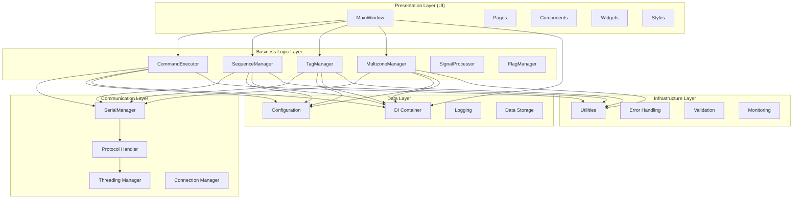

# [ADR-003] Многослойная архитектура

**Дата:** 2024-12-20  
**Статус:** Accepted  
**Автор:** DocArchitect  
**Версия:** 1.0  

## 📋 Контекст

При разработке приложения для управления устройствами возникла необходимость в:

- Четком разделении ответственности между компонентами
- Легкости понимания и поддержки кода
- Возможности независимого развития слоев
- Простоте тестирования отдельных компонентов
- Масштабируемости архитектуры

Монолитная архитектура с перемешанной логикой приводила к:
- Сложности понимания кода
- Затруднениям при тестировании
- Сложности внесения изменений
- Нарушению принципа единственной ответственности

## 🎯 Решение

Принята **многослойная архитектура (Layered Architecture)** с четким разделением на слои.

### Обоснование выбора

1. **Разделение ответственности** — каждый слой имеет четко определенную зону ответственности
2. **Простота понимания** — легко понять, где находится определенная функциональность
3. **Независимость развития** — слои могут развиваться независимо друг от друга
4. **Тестируемость** — каждый слой можно тестировать изолированно
5. **Масштабируемость** — легко добавлять новые функции в соответствующие слои
6. **Принципы SOLID** — поддержка принципа единственной ответственности

### Альтернативы

| Архитектура | Преимущества | Недостатки | Причина отклонения |
|-------------|--------------|-------------|-------------------|
| **Монолитная** | Простота, быстрая разработка | Сложность поддержки, тестирования | Нарушает принципы разделения ответственности |
| **Микросервисная** | Независимость, масштабируемость | Сложность, избыточность | Избыточна для desktop приложения |
| **Event-Driven** | Гибкость, слабая связанность | Сложность отладки, асинхронность | Сложна для понимания и отладки |
| **Domain-Driven** | Бизнес-логика в центре | Сложность, избыточность | Избыточна для технического приложения |

## 🔧 Реализация

### Структура слоев



### Принципы взаимодействия

1. **Строгая иерархия** — верхние слои могут обращаться только к нижним
2. **Инверсия зависимостей** — зависимости направлены к абстракциям
3. **Интерфейсы** — взаимодействие между слоями через интерфейсы
4. **DI контейнер** — управление зависимостями между слоями

### Структура директорий

```
core/
├── interfaces.py           # Интерфейсы для всех слоев
├── di/                    # Dependency Injection
│   ├── container.py       # DI контейнер
│   └── config_loader.py   # Конфигурация DI
├── command_executor.py    # Бизнес-логика команд
├── sequence_manager.py    # Управление последовательностями
├── tag_manager.py         # Управление тегами
├── multizone_manager.py   # Управление зонами
├── signal_manager.py      # Управление сигналами
├── serial_manager.py      # Serial коммуникация
└── config_loader.py       # Конфигурация

ui/
├── main_window.py         # Главное окно
├── pages/                 # Страницы интерфейса
├── components/            # Переиспользуемые компоненты
├── widgets/               # Кастомные виджеты
└── styles/                # Стили и темы

utils/
├── logger.py              # Логирование
├── error_handler.py       # Обработка ошибок
└── validators.py          # Валидация данных
```

## 📊 Последствия

### Положительные

- **Четкая структура** — легко понять, где находится функциональность
- **Простота тестирования** — каждый слой тестируется изолированно
- **Независимость развития** — слои развиваются независимо
- **Масштабируемость** — легко добавлять новые функции
- **Поддержка** — простота внесения изменений и исправлений
- **Принципы SOLID** — поддержка архитектурных принципов

### Отрицательные

- **Сложность** — больше файлов и структуры
- **Производительность** — дополнительные вызовы между слоями
- **Кривая обучения** — необходимость понимания архитектуры
- **Избыточность** — может быть избыточно для простых функций

### Технические аспекты

- **Память** — дополнительное потребление памяти для слоев
- **Производительность** — небольшие накладные расходы на вызовы
- **Сложность отладки** — необходимость понимания потока выполнения

## 🔄 Альтернативы

### Краткосрочные альтернативы

1. **Монолитная архитектура** — для быстрого прототипирования
2. **Простое разделение** — на 2-3 основных модуля

### Долгосрочные альтернативы

1. **Clean Architecture** — для более сложных приложений
2. **Hexagonal Architecture** — для максимальной гибкости
3. **CQRS** — для разделения чтения и записи

## 📈 Метрики успеха

- [x] Четкое разделение ответственности между слоями
- [x] Легкость понимания структуры кода
- [x] Простота тестирования отдельных компонентов
- [x] Возможность независимого развития слоев
- [x] Соблюдение принципов SOLID

## 🔗 Связанные решения

- [[docs/architecture/adr/001-pyqt6-framework|ADR-001: Выбор PyQt6 как GUI фреймворка]] — UI слой архитектуры
- [[docs/architecture/adr/002-dependency-injection|ADR-002: Внедрение Dependency Injection]] — связующее звено между слоями
- [[docs/architecture/adr/004-interface-separation|ADR-004: Разделение интерфейсов и реализаций]] — интерфейсы для взаимодействия слоев

## 📝 Заключение

Многослойная архитектура обеспечила четкое разделение ответственности, простоту понимания и поддержки кода. Несмотря на некоторую сложность, преимущества в долгосрочной перспективе полностью оправдывают выбор.

**Рекомендация:** Продолжить использование многослойной архитектуры как основного подхода к структурированию приложения.

---

> [!info] Статус
> **Принято:** 2024-12-20  
> **Следующий пересмотр:** 2025-06-20 (через 6 месяцев)  
> **Ответственный:** Architecture Team
