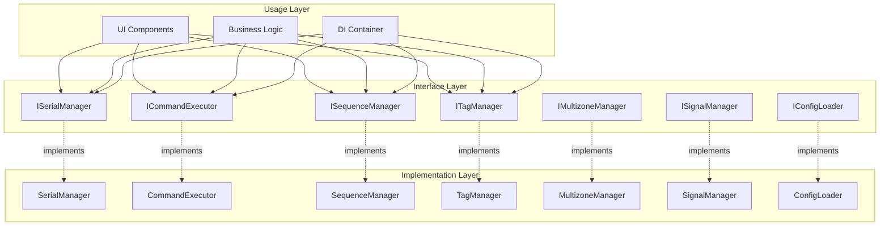

# [ADR-004] Разделение интерфейсов и реализаций

**Дата:** 2024-12-20  
**Статус:** Accepted  
**Автор:** DocArchitect  
**Версия:** 1.0  

## 📋 Контекст

При разработке приложения для управления устройствами возникла необходимость в:

- Слабой связанности между компонентами
- Возможности замены реализаций без изменения кода
- Легкости тестирования с mock-объектами
- Поддержке принципа инверсии зависимостей
- Четких контрактах между компонентами

Прямое использование конкретных классов приводило к:
- Сильной связанности между компонентами
- Сложности в тестировании
- Затруднениям при замене реализаций
- Нарушению принципа инверсии зависимостей
- Сложности понимания взаимодействий

## 🎯 Решение

Принято **разделение интерфейсов и реализаций** с использованием абстрактных базовых классов (ABC).

### Обоснование выбора

1. **Слабая связанность** — компоненты зависят от абстракций, а не от конкретных реализаций
2. **Инверсия зависимостей** — зависимости направлены к абстракциям
3. **Тестируемость** — легко создавать mock-объекты для тестов
4. **Гибкость** — возможность замены реализаций без изменения кода
5. **Четкие контракты** — явное определение API каждого компонента
6. **Принципы SOLID** — поддержка принципа инверсии зависимостей

### Альтернативы

| Подход | Преимущества | Недостатки | Причина отклонения |
|--------|--------------|-------------|-------------------|
| **Прямые зависимости** | Простота, быстрая разработка | Сильная связанность, сложность тестирования | Нарушает принципы SOLID |
| **Duck Typing** | Гибкость, простота | Отсутствие явных контрактов, сложность отладки | Недостаточно строгий контроль |
| **Protocol Classes** | Современный подход, гибкость | Сложность для понимания, Python 3.8+ | Сложнее для понимания и поддержки |
| **Zope Interfaces** | Мощные возможности, валидация | Дополнительные зависимости, избыточность | Избыточен для текущих потребностей |

## 🔧 Реализация

### Архитектура интерфейсов



### Структура интерфейсов

```python
# core/interfaces.py
from abc import ABC, abstractmethod
from typing import Dict, List, Optional, Any

class ISerialManager(ABC):
    """Интерфейс для менеджера Serial соединения"""
    
    @abstractmethod
    def connect(self, port: str, baudrate: int = 115200, 
                timeout: float = 1.0, **kwargs: Any) -> bool:
        """Подключение к Serial-порту"""
        pass
    
    @abstractmethod
    def disconnect(self) -> None:
        """Отключение от порта"""
        pass
    
    @abstractmethod
    def send_command(self, command: str) -> bool:
        """Отправка команды на устройство"""
        pass
    
    @abstractmethod
    def is_connected(self) -> bool:
        """Проверка состояния подключения"""
        pass
    
    @abstractmethod
    def get_available_ports(self) -> List[str]:
        """Получение списка доступных портов"""
        pass
    
    @abstractmethod
    def get_port_info(self) -> Dict[str, Any]:
        """Получение информации о текущем порте"""
        pass
```

### Реализация интерфейса

```python
# core/serial_manager.py
from core.interfaces import ISerialManager
import serial
import logging

class SerialManager(ISerialManager):
    """Реализация менеджера Serial соединения"""
    
    def __init__(self):
        self._connection = None
        self._logger = logging.getLogger(__name__)
    
    def connect(self, port: str, baudrate: int = 115200, 
                timeout: float = 1.0, **kwargs: Any) -> bool:
        """Реализация подключения к Serial-порту"""
        try:
            self._connection = serial.Serial(
                port=port,
                baudrate=baudrate,
                timeout=timeout,
                **kwargs
            )
            self._logger.info(f"Подключение к {port} установлено")
            return True
        except serial.SerialException as e:
            self._logger.error(f"Ошибка подключения к {port}: {e}")
            return False
    
    def disconnect(self) -> None:
        """Реализация отключения от порта"""
        if self._connection and self._connection.is_open:
            self._connection.close()
            self._logger.info("Соединение закрыто")
    
    # ... остальные методы реализации
```

### Использование в DI контейнере

```python
# core/di_config_loader.py
from core.interfaces import ISerialManager, ICommandExecutor
from core.serial_manager import SerialManager
from core.command_executor import CommandExecutor

def configure_services(container: DIContainer) -> None:
    """Конфигурация сервисов с использованием интерфейсов"""
    
    # Регистрация через интерфейсы
    container.register(ISerialManager, SerialManager, "singleton")
    container.register(ICommandExecutor, CommandExecutor, "singleton")
    
    # Теперь компоненты могут зависеть от интерфейсов
    # container.resolve(ISerialManager) вернет экземпляр SerialManager
```

## 📊 Последствия

### Положительные

- **Слабая связанность** — компоненты зависят от абстракций
- **Тестируемость** — легко создавать mock-объекты
- **Гибкость** — возможность замены реализаций
- **Четкие контракты** — явное определение API
- **Принципы SOLID** — поддержка инверсии зависимостей
- **Документированность** — интерфейсы служат документацией

### Отрицательные

- **Сложность** — больше файлов и абстракций
- **Производительность** — небольшие накладные расходы
- **Кривая обучения** — необходимость понимания интерфейсов
- **Избыточность** — может быть избыточно для простых случаев

### Технические аспекты

- **Память** — дополнительное потребление памяти для интерфейсов
- **Производительность** — минимальные накладные расходы на вызовы
- **Сложность отладки** — необходимость понимания иерархии

## 🔄 Альтернативы

### Краткосрочные альтернативы

1. **Duck Typing** — для быстрого прототипирования
2. **Прямые зависимости** — для простых случаев

### Долгосрочные альтернативы

1. **Protocol Classes** — для более гибких интерфейсов
2. **Zope Interfaces** — для сложной валидации
3. **Type Hints** — для статической типизации

## 📈 Метрики успеха

- [x] Компоненты зависят от интерфейсов, а не от реализаций
- [x] Легко создавать mock-объекты для тестов
- [x] Возможность замены реализаций без изменения кода
- [x] Четкие контракты между компонентами
- [x] Соблюдение принципа инверсии зависимостей

## 🔗 Связанные решения

- [[docs/architecture/adr/002-dependency-injection|ADR-002: Внедрение Dependency Injection]] — DI использует интерфейсы
- [[docs/architecture/adr/003-layered-architecture|ADR-003: Многослойная архитектура]] — интерфейсы связывают слои
- [[docs/architecture/adr/007-interface-contracts|ADR-007: Контракты интерфейсов через ABC]] — детали реализации ABC

## 📝 Заключение

Разделение интерфейсов и реализаций значительно улучшило архитектуру приложения, обеспечив слабую связанность, тестируемость и гибкость. Несмотря на некоторую сложность, преимущества полностью оправдывают внедрение.

**Рекомендация:** Продолжить использование интерфейсов как основного подхода к определению контрактов между компонентами.

---

> [!info] Статус
> **Принято:** 2024-12-20  
> **Следующий пересмотр:** 2025-06-20 (через 6 месяцев)  
> **Ответственный:** Backend Team
