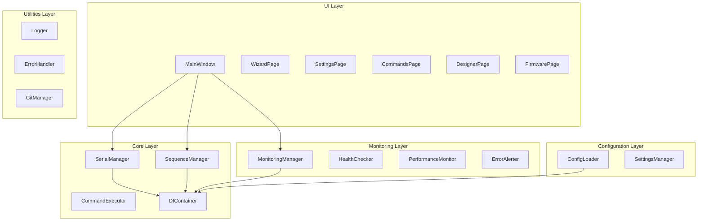

> [!info] Навигация
> Родитель: [[docs/overview]] • Раздел: [[_moc/Architecture]] • См. также: [[docs/api/index]]

# Архитектура системы

## Контекст (C4)

Система управления лабораторным оборудованием представляет собой десктопное приложение, которое взаимодействует с лабораторным оборудованием через последовательные порты и предоставляет пользовательский интерфейс для управления процессами.

### Ключевые стейкхолдеры:
- **Лаборанты**: основные пользователи системы
- **Администраторы**: настройка и обслуживание
- **Разработчики**: поддержка и развитие системы

## Контейнеры

### 1. Desktop Application (PySide6)
- **Технология**: Python + PySide6 (Qt6)
- **Ответственность**: Пользовательский интерфейс, управление жизненным циклом приложения
- **Коммуникация**: Внутренние вызовы методов, сигналы/слоты Qt

### 2. Core Business Logic
- **Технология**: Python
- **Ответственность**: Бизнес-логика, управление оборудованием, последовательности
- **Коммуникация**: Dependency Injection, интерфейсы

### 3. Serial Communication Layer
- **Технология**: pyserial
- **Ответственность**: Коммуникация с лабораторным оборудованием
- **Коммуникация**: Последовательные порты

## Компоненты

### UI Layer
- **MainWindow**: Главное окно приложения
- **WizardPage**: Мастер настройки
- **SettingsPage**: Страница настроек
- **CommandsPage**: Управление командами
- **DesignerPage**: Дизайнер последовательностей
- **FirmwarePage**: Управление прошивкой

### Core Layer
- **SerialManager**: Управление последовательными портами
- **SequenceManager**: Управление последовательностями команд
- **CommandExecutor**: Выполнение команд
- **DIContainer**: Контейнер зависимостей

### Monitoring Layer
- **MonitoringManager**: Мониторинг состояния системы
- **HealthChecker**: Проверка здоровья системы
- **PerformanceMonitor**: Мониторинг производительности
- **ErrorAlerter**: Уведомления об ошибках

### Configuration Layer
- **ConfigLoader**: Загрузка конфигурации
- **SettingsManager**: Управление настройками

### Utilities Layer
- **Logger**: Логирование
- **ErrorHandler**: Обработка ошибок
- **GitManager**: Управление версиями

## Диаграммы

## Нефункциональные требования

### Производительность
- Время отклика UI: < 100ms
- Время выполнения команд: < 5s
- Потребление памяти: < 500MB

### Надежность
- Доступность: 99.9%
- Graceful shutdown при ошибках
- Автоматическое восстановление соединений

### Безопасность
- Валидация всех команд
- Защита от некорректных последовательностей
- Логирование всех операций

### Масштабируемость
- Поддержка множественных устройств
- Модульная архитектура
- Расширяемые интерфейсы

## Архитектурные паттерны

### Dependency Injection
- **DIContainer**: Центральный контейнер для управления зависимостями
- **ServiceRegistration**: Регистрация сервисов с различными жизненными циклами
- **Автоматическое разрешение**: Рекурсивное разрешение зависимостей

### Command Pattern
- **CommandExecutor**: Выполнение команд на устройстве
- **CommandSequenceExecutor**: Выполнение последовательностей команд
- **AsyncCommandExecution**: Асинхронное выполнение с таймаутами

### Observer Pattern
- **Signal/Slot механизм Qt**: Реактивное обновление UI
- **MonitoringManager**: Наблюдение за состоянием системы
- **ErrorAlerter**: Уведомления об ошибках

## Принципы SOLID

- **Single Responsibility**: Каждый класс имеет одну ответственность
- **Open/Closed**: Расширение через интерфейсы и наследование
- **Liskov Substitution**: Замена реализаций через интерфейсы
- **Interface Segregation**: Специализированные интерфейсы
- **Dependency Inversion**: Зависимость от абстракций