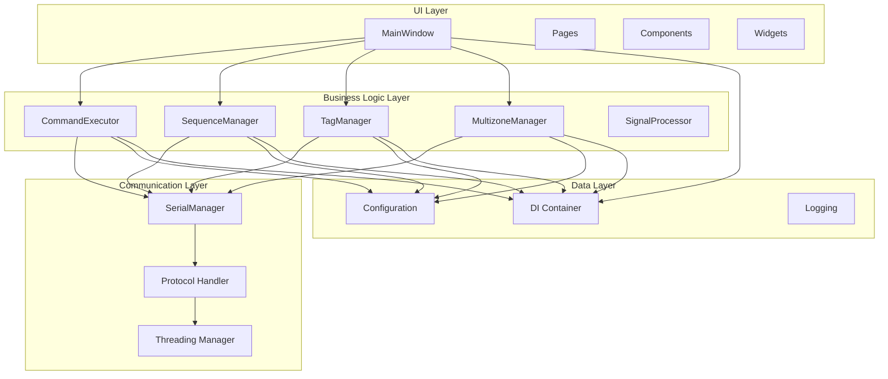
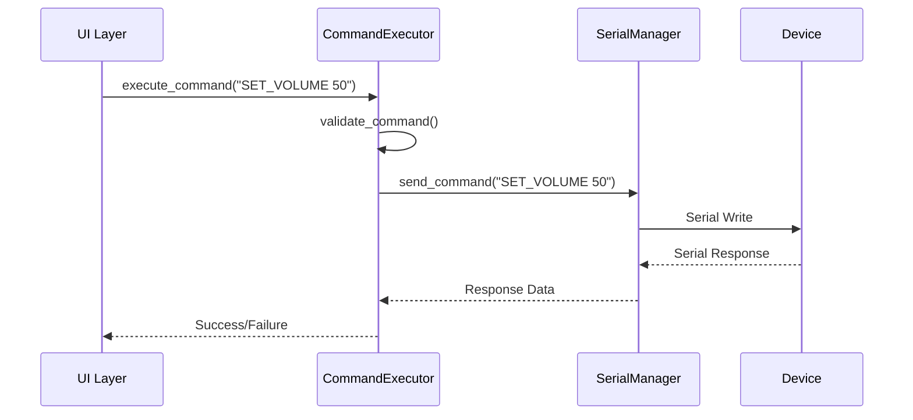
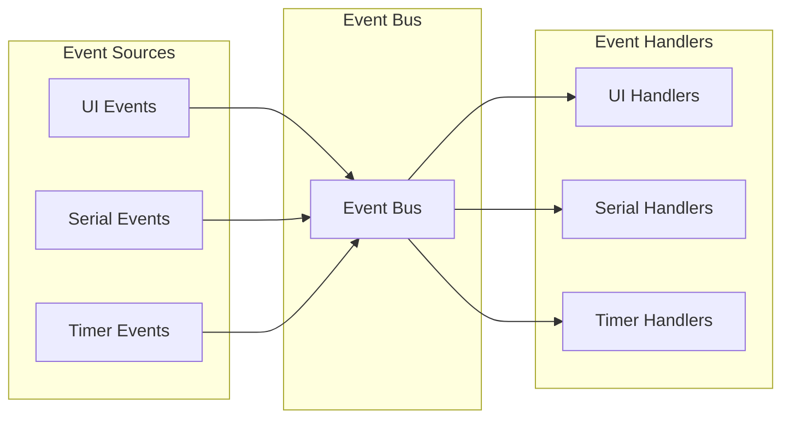

# 🏗️ Архитектура PyQt6 Device Control

> [!info] Навигация
> Родитель: [[docs/_moc/Home]] • Раздел: [[docs/_moc/Architecture]] • См. также: [[docs/api/index]]

## 📋 Обзор архитектуры

Приложение построено по принципу **Layered Architecture** с использованием **Dependency Injection** для обеспечения слабой связанности компонентов и высокой тестируемости.

### Архитектурные принципы

- **Separation of Concerns** — разделение ответственности между слоями
- **Dependency Inversion** — зависимости от абстракций, а не от конкретных реализаций
- **Single Responsibility** — каждый компонент имеет одну ответственность
- **Open/Closed** — открыт для расширения, закрыт для модификации

## 🏛️ Слои архитектуры



## 🔧 Ключевые компоненты

### 1. Dependency Injection Container

**Расположение:** `core/di/container.py`

DI-контейнер управляет жизненным циклом всех сервисов и их зависимостями:

```python
class DIContainer:
    def __init__(self):
        self._services = {}
        self._singletons = {}
    
    def register(self, interface: Type, implementation: Type) -> None:
        """Регистрация сервиса"""
    
    def resolve(self, interface: Type) -> Any:
        """Разрешение зависимости"""
```

### 2. Serial Communication Manager

**Расположение:** `core/serial_manager.py`

Управляет подключением к устройствам через последовательные порты:

```python
class SerialManager(ISerialManager):
    def connect(self, port: str, baudrate: int = 115200) -> bool:
        """Подключение к порту"""
    
    def send_command(self, command: str) -> bool:
        """Отправка команды"""
    
    def get_available_ports(self) -> List[str]:
        """Получение списка портов"""
```

### 3. Command Executor

**Расположение:** `core/command_executor.py`

Выполняет команды на устройстве с валидацией и обработкой ошибок:

```python
class CommandExecutor(ICommandExecutor):
    def execute(self, command: str, **kwargs) -> bool:
        """Выполнение команды"""
    
    def validate_command(self, command: str) -> bool:
        """Валидация команды"""
```

### 4. Sequence Manager

**Расположение:** `core/sequences/manager.py`

Управляет выполнением последовательностей команд:

```python
class SequenceManager(ISequenceManager):
    def execute_sequence(self, sequence_name: str) -> bool:
        """Выполнение последовательности"""
    
    def add_sequence(self, name: str, commands: List[str]) -> bool:
        """Добавление последовательности"""
```

## 🔄 Паттерны проектирования

### 1. Dependency Injection

Используется для управления зависимостями между компонентами:

```python
# Регистрация сервисов
container.register(ISerialManager, SerialManager)
container.register(ICommandExecutor, CommandExecutor)
container.register(ISequenceManager, SequenceManager)

# Разрешение зависимостей
serial_manager = container.resolve(ISerialManager)
command_executor = container.resolve(ICommandExecutor)
```

### 2. Observer Pattern

Реализован через Event Bus для уведомлений между компонентами:

```python
class EventBus:
    def subscribe(self, event_type: str, callback: Callable) -> None:
        """Подписка на событие"""
    
    def publish(self, event_type: str, data: Any = None) -> None:
        """Публикация события"""
```

### 3. Strategy Pattern

Используется для различных стратегий валидации и обработки команд:

```python
class CommandValidator:
    def __init__(self, strategies: List[ValidationStrategy]):
        self.strategies = strategies
    
    def validate(self, command: str) -> bool:
        return all(strategy.validate(command) for strategy in self.strategies)
```

### 4. Factory Pattern

Для создания различных типов команд и последовательностей:

```python
class CommandFactory:
    def create_command(self, command_type: str, **kwargs) -> Command:
        """Создание команды по типу"""
```

## 📡 Коммуникационная архитектура

### Serial Protocol



### Event-Driven Communication



## 🎯 Нефункциональные требования

### Производительность
- **Время отклика UI:** < 100ms
- **Время выполнения команды:** < 500ms
- **Память:** < 100MB в обычном режиме

### Надежность
- **Доступность:** 99.9%
- **Восстановление после сбоев:** автоматическое
- **Логирование:** все критические операции

### Безопасность
- **Валидация входных данных:** обязательная
- **Обработка исключений:** graceful degradation
- **Логирование безопасности:** критичные операции

### Масштабируемость
- **Модульная архитектура:** легкое добавление компонентов
- **DI-контейнер:** гибкая конфигурация
- **Интерфейсы:** возможность замены реализаций

## 🔗 Связанные документы

- [[docs/architecture/components|Детальное описание компонентов]]
- [[docs/architecture/patterns|Архитектурные паттерны]]
- [[docs/api/index|API Reference]]
- [[docs/modules/index|Документация модулей]]
- [[docs/architecture/adr/index|Architecture Decision Records]]

## 📊 Метрики архитектуры

| Метрика | Значение | Цель |
|---------|----------|------|
| Связанность модулей | Низкая | Низкая |
| Связность модулей | Высокая | Высокая |
| Покрытие интерфейсами | 95% | ≥90% |
| Тестируемость | Высокая | Высокая |

> [!note] Источники
> См. [[docs/_meta/project_audit]] • Код: [core/interfaces.py](core/interfaces.py#L1-L50) • DI: [core/di/container.py](core/di/container.py#L1-L50)
