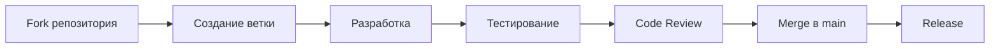

# Руководство по участию в разработке

## 📋 Содержание

- [[#Обзор процесса]]
- [[#Настройка окружения разработки]]
- [[#Стандарты кодирования]]
- [[#Процесс разработки]]
- [[#Code Review]]
- [[#Тестирование]]
- [[#Документация]]
- [[#Шаблоны и инструменты]]

## 🎯 Обзор процесса

### Принципы участия

1. **Открытость**: Приветствуем вклад от всех участников
2. **Качество**: Код должен соответствовать стандартам проекта
3. **Документация**: Все изменения должны быть задокументированы
4. **Тестирование**: Обязательное покрытие тестами новых функций
5. **Безопасность**: Соблюдение принципов безопасности

### Типы вкладов

- 🐛 **Bug fixes**: Исправление ошибок
- ✨ **Features**: Новые функции
- 📚 **Documentation**: Улучшение документации
- 🧪 **Tests**: Добавление тестов
- 🔧 **Refactoring**: Рефакторинг кода
- 🎨 **UI/UX**: Улучшения интерфейса

## 🛠️ Настройка окружения разработки

### Предварительные требования

```bash
# Python 3.8+
python --version

# Git
git --version

# IDE (рекомендуется PyCharm или VS Code)
```

### Клонирование и настройка

```bash
# Клонирование репозитория
git clone https://github.com/your-org/your-project.git
cd your-project

# Создание виртуального окружения
python -m venv venv
source venv/bin/activate  # Linux/Mac
# или
venv\Scripts\activate     # Windows

# Установка зависимостей
pip install -r requirements.txt
pip install -r requirements-dev.txt

# Установка pre-commit hooks
pre-commit install
```

### Проверка окружения

```bash
# Запуск тестов
pytest

# Проверка линтера
ruff check .

# Проверка типов
mypy .

# Запуск приложения
python main.py
```

## 📝 Стандарты кодирования

### Python Style Guide

Следуем [PEP 8](https://peps.python.org/pep-0008/) с дополнительными правилами:

```python
# ✅ Правильно
class SerialManager:
    """Менеджер для работы с последовательным портом."""
    
    def __init__(self, port: str, baudrate: int = 9600):
        self.port = port
        self.baudrate = baudrate
        self._connection = None
    
    def connect(self) -> bool:
        """Установить соединение с портом."""
        try:
            self._connection = serial.Serial(self.port, self.baudrate)
            return True
        except serial.SerialException as e:
            logger.error(f"Ошибка подключения: {e}")
            return False

# ❌ Неправильно
class serialmanager:
    def __init__(self,port,baudrate=9600):
        self.port=port
        self.baudrate=baudrate
        self._connection=None
    def connect(self):
        try:
            self._connection=serial.Serial(self.port,self.baudrate)
            return True
        except serial.SerialException as e:
            logger.error(f"Ошибка подключения: {e}")
            return False
```

### Именование

```python
# Классы: PascalCase
class CommandExecutor:
    pass

# Функции и методы: snake_case
def execute_command():
    pass

# Константы: UPPER_SNAKE_CASE
MAX_RETRY_COUNT = 3

# Приватные атрибуты: _leading_underscore
class Manager:
    def __init__(self):
        self._internal_state = None
```

### Типизация

```python
from typing import Optional, List, Dict, Union, Callable
from abc import ABC, abstractmethod

class ISerialManager(ABC):
    """Интерфейс для менеджера последовательного порта."""
    
    @abstractmethod
    def connect(self) -> bool:
        """Установить соединение."""
        pass
    
    @abstractmethod
    def send_command(self, command: str) -> Optional[str]:
        """Отправить команду."""
        pass
    
    @abstractmethod
    def get_ports(self) -> List[str]:
        """Получить список доступных портов."""
        pass

def process_commands(
    commands: List[str],
    executor: ICommandExecutor,
    timeout: float = 5.0
) -> Dict[str, Union[str, Exception]]:
    """Обработать список команд."""
    results = {}
    for cmd in commands:
        try:
            result = executor.execute(cmd, timeout=timeout)
            results[cmd] = result
        except Exception as e:
            results[cmd] = e
    return results
```

### Документация

```python
def calculate_performance_metrics(
    data: List[float],
    window_size: int = 10
) -> Dict[str, float]:
    """
    Рассчитать метрики производительности для временного ряда.
    
    Args:
        data: Список числовых значений
        window_size: Размер окна для скользящего среднего
        
    Returns:
        Словарь с метриками:
        - mean: среднее значение
        - std: стандартное отклонение
        - min: минимальное значение
        - max: максимальное значение
        - moving_avg: скользящее среднее
        
    Raises:
        ValueError: Если data пустой или window_size <= 0
        
    Example:
        >>> metrics = calculate_performance_metrics([1, 2, 3, 4, 5])
        >>> print(metrics['mean'])
        3.0
    """
    if not data:
        raise ValueError("Data cannot be empty")
    
    if window_size <= 0:
        raise ValueError("Window size must be positive")
    
    # Реализация...
    return {
        'mean': sum(data) / len(data),
        'std': statistics.stdev(data),
        'min': min(data),
        'max': max(data),
        'moving_avg': sum(data[-window_size:]) / min(window_size, len(data))
    }
```

## 🔄 Процесс разработки

### Workflow



### Создание ветки

```bash
# Обновление main
git checkout main
git pull origin main

# Создание feature ветки
git checkout -b feature/your-feature-name

# Или bugfix ветки
git checkout -b bugfix/issue-description

# Или hotfix ветки
git checkout -b hotfix/critical-fix
```

### Коммиты

```bash
# Структура сообщений коммитов
<type>(<scope>): <description>

[optional body]

[optional footer]

# Примеры
feat(serial): add connection retry mechanism
fix(ui): resolve memory leak in command history
docs(api): update interface documentation
test(command): add unit tests for validation
refactor(core): simplify dependency injection
style(lint): fix formatting issues
```

### Типы коммитов

- `feat`: Новая функция
- `fix`: Исправление ошибки
- `docs`: Изменения в документации
- `style`: Форматирование кода
- `refactor`: Рефакторинг
- `test`: Добавление тестов
- `chore`: Обновление зависимостей, конфигурации

### Push и Pull Request

```bash
# Push изменений
git push origin feature/your-feature-name

# Создание Pull Request через GitHub/GitLab
# Заполнение шаблона PR
```

## 👀 Code Review

### Критерии проверки

#### Функциональность
- [ ] Код выполняет заявленную задачу
- [ ] Обработаны edge cases
- [ ] Нет регрессий в существующем функционале

#### Качество кода
- [ ] Соблюдены стандарты кодирования
- [ ] Код читаем и понятен
- [ ] Нет дублирования кода
- [ ] Правильная типизация

#### Производительность
- [ ] Нет утечек памяти
- [ ] Эффективные алгоритмы
- [ ] Оптимальное использование ресурсов

#### Безопасность
- [ ] Валидация входных данных
- [ ] Безопасная обработка ошибок
- [ ] Нет уязвимостей

#### Тестирование
- [ ] Покрытие тестами новых функций
- [ ] Тесты проходят
- [ ] Моки и стабы используются правильно

### Процесс Review

1. **Автоматические проверки**
   - CI/CD pipeline
   - Линтеры и форматтеры
   - Тесты

2. **Ручная проверка**
   - Code review минимум 1 участником
   - Проверка документации
   - Тестирование вручную

3. **Обратная связь**
   - Конструктивные комментарии
   - Предложения по улучшению
   - Объяснение решений

### Шаблон комментария

```markdown
## Обзор

**Что изменилось:**
- Краткое описание изменений

**Почему:**
- Обоснование необходимости изменений

## Проверка

- [ ] Код соответствует стандартам
- [ ] Тесты проходят
- [ ] Документация обновлена
- [ ] Нет регрессий

## Комментарии

### Критические
- [ ] Проблемы безопасности
- [ ] Критические ошибки

### Важные
- [ ] Улучшения производительности
- [ ] Улучшения читаемости

### Незначительные
- [ ] Стилистические замечания
- [ ] Предложения по улучшению
```

## 🧪 Тестирование

### Типы тестов

#### Unit Tests
```python
import pytest
from unittest.mock import Mock, patch
from core.command_executor import CommandExecutor

class TestCommandExecutor:
    """Тесты для CommandExecutor."""
    
    def setup_method(self):
        """Настройка перед каждым тестом."""
        self.executor = CommandExecutor()
    
    def test_execute_valid_command(self):
        """Тест выполнения валидной команды."""
        result = self.executor.execute("TEST")
        assert result.success is True
        assert result.command == "TEST"
    
    def test_execute_invalid_command(self):
        """Тест выполнения невалидной команды."""
        with pytest.raises(ValueError):
            self.executor.execute("")
    
    @patch('core.command_executor.SerialManager')
    def test_execute_with_mock_serial(self, mock_serial):
        """Тест с моком SerialManager."""
        mock_manager = Mock()
        mock_manager.send_command.return_value = "OK"
        mock_serial.return_value = mock_manager
        
        result = self.executor.execute("TEST")
        assert result.response == "OK"
```

#### Integration Tests
```python
import pytest
from core.di.container import DIContainer
from core.interfaces import ISerialManager

class TestIntegration:
    """Интеграционные тесты."""
    
    def test_di_container_registration(self):
        """Тест регистрации в DI контейнере."""
        container = DIContainer()
        container.register(ISerialManager, MockSerialManager)
        
        manager = container.resolve(ISerialManager)
        assert isinstance(manager, MockSerialManager)
    
    def test_full_command_flow(self):
        """Тест полного потока выполнения команды."""
        # Настройка
        container = DIContainer()
        container.register(ISerialManager, MockSerialManager)
        container.register(ICommandExecutor, CommandExecutor)
        
        # Выполнение
        executor = container.resolve(ICommandExecutor)
        result = executor.execute("TEST")
        
        # Проверка
        assert result.success is True
```

#### UI Tests
```python
import pytest
from PyQt6.QtWidgets import QApplication
from PyQt6.QtTest import QTest
from PyQt6.QtCore import Qt
from ui.main_window import MainWindow

class TestMainWindow:
    """Тесты главного окна."""
    
    @pytest.fixture(autouse=True)
    def setup_app(self):
        """Настройка приложения."""
        self.app = QApplication([])
        self.window = MainWindow()
        yield
        self.app.quit()
    
    def test_connect_button_click(self):
        """Тест нажатия кнопки подключения."""
        # Найти кнопку
        connect_button = self.window.findChild(QPushButton, "connectButton")
        
        # Нажать кнопку
        QTest.mouseClick(connect_button, Qt.MouseButton.LeftButton)
        
        # Проверить результат
        assert self.window.is_connected is True
```

### Запуск тестов

```bash
# Все тесты
pytest

# С покрытием
pytest --cov=core --cov=ui

# Создание отчета
pytest --cov=core --cov=ui --cov-report=html

# Конкретный тест
pytest tests/test_command_executor.py::TestCommandExecutor::test_execute_valid_command

# Параллельное выполнение
pytest -n auto
```

### Покрытие кода

```bash
# Минимальное покрытие: 80%
# Целевое покрытие: 90%

# Генерация отчета
coverage run -m pytest
coverage report
coverage html
```

## 📚 Документация

### Обновление документации

При внесении изменений в код обязательно обновляйте:

1. **Docstrings** для новых функций/классов
2. **README.md** если изменяется API
3. **docs/api/** для изменений в интерфейсах
4. **docs/guides/** для новых функций
5. **CHANGELOG.md** для пользователей

### Шаблон документации

```markdown
---
title: "Название документа"
description: "Краткое описание"
type: "guide|api|tutorial"
audience: ["Backend Dev", "Frontend Dev"]
priority: "High|Medium|Low"
status: "active|draft|deprecated"
created: "YYYY-MM-DD"
updated: "YYYY-MM-DD"
tags: ["tag1", "tag2"]
---

# Заголовок

## Описание

Краткое описание функциональности.

## Использование

```python
# Пример кода
from core.interfaces import ISerialManager

manager = SerialManager()
manager.connect()
```

## API Reference

### Методы

#### `method_name(param: type) -> return_type`

Описание метода.

**Параметры:**
- `param`: описание параметра

**Возвращает:**
- `return_type`: описание возвращаемого значения

**Примеры:**
```python
result = manager.method_name("value")
```

## Связанные документы

- [[docs/api/serial-manager]]
- [[docs/guides/getting-started]]
```

## 🛠️ Шаблоны и инструменты

### Шаблон Issue

```markdown
## Описание

Краткое описание проблемы или запроса.

## Тип

- [ ] Bug report
- [ ] Feature request
- [ ] Documentation request
- [ ] Performance issue
- [ ] Security issue

## Шаги для воспроизведения

1. Откройте приложение
2. Выполните действие X
3. Ожидаемый результат: Y
4. Фактический результат: Z

## Окружение

- OS: Windows 10 / Linux / macOS
- Python: 3.8+
- Версия приложения: X.Y.Z

## Дополнительная информация

Логи, скриншоты, контекст.
```

### Шаблон Pull Request

```markdown
## Описание

Краткое описание изменений.

## Тип изменений

- [ ] Bug fix
- [ ] New feature
- [ ] Breaking change
- [ ] Documentation update
- [ ] Performance improvement

## Тестирование

- [ ] Unit tests добавлены/обновлены
- [ ] Integration tests проходят
- [ ] UI tests проходят
- [ ] Ручное тестирование выполнено

## Документация

- [ ] Docstrings обновлены
- [ ] README обновлен
- [ ] API документация обновлена
- [ ] CHANGELOG обновлен

## Чек-лист

- [ ] Код соответствует стандартам
- [ ] Линтер не выдает ошибок
- [ ] Типы проверены mypy
- [ ] Тесты проходят
- [ ] Документация обновлена

## Связанные issues

Closes #123
Relates to #456
```

### Инструменты разработки

#### Pre-commit hooks

```yaml
# .pre-commit-config.yaml
repos:
  - repo: https://github.com/pre-commit/pre-commit-hooks
    rev: v4.4.0
    hooks:
      - id: trailing-whitespace
      - id: end-of-file-fixer
      - id: check-yaml
      - id: check-added-large-files

  - repo: https://github.com/charliermarsh/ruff-pre-commit
    rev: v0.1.6
    hooks:
      - id: ruff
        args: [--fix]
      - id: ruff-format

  - repo: https://github.com/pre-commit/mirrors-mypy
    rev: v1.7.1
    hooks:
      - id: mypy
        additional_dependencies: [types-all]
```

#### VS Code Settings

```json
{
    "python.defaultInterpreterPath": "./venv/bin/python",
    "python.linting.enabled": true,
    "python.linting.ruffEnabled": true,
    "python.formatting.provider": "ruff",
    "python.testing.pytestEnabled": true,
    "python.testing.unittestEnabled": false,
    "python.testing.pytestArgs": [
        "tests"
    ],
    "editor.formatOnSave": true,
    "editor.codeActionsOnSave": {
        "source.organizeImports": true
    }
}
```

#### PyCharm Configuration

1. **Настройка интерпретатора**: File → Settings → Project → Python Interpreter
2. **Настройка линтера**: File → Settings → Tools → External Tools
3. **Настройка тестов**: File → Settings → Tools → Python Integrated Tools

## 🚀 Быстрый старт для новых участников

### Первые шаги

1. **Изучите документацию**
   - [[docs/overview]]
   - [[docs/architecture/index]]
   - [[docs/api/index]]

2. **Настройте окружение**
   ```bash
   git clone <repository>
   cd <project>
   python -m venv venv
   source venv/bin/activate
   pip install -r requirements.txt
   pip install -r requirements-dev.txt
   ```

3. **Запустите тесты**
   ```bash
   pytest
   ```

4. **Выберите задачу**
   - Изучите [[docs/_meta/backlog]]
   - Выберите задачу с меткой "good first issue"
   - Создайте issue если не нашли подходящую

5. **Начните разработку**
   ```bash
   git checkout -b feature/your-feature
   # Разработка...
   git commit -m "feat: add new feature"
   git push origin feature/your-feature
   ```

### Полезные команды

```bash
# Проверка качества кода
ruff check .
ruff format .

# Проверка типов
mypy .

# Запуск тестов
pytest
pytest --cov

# Запуск приложения
python main.py

# Создание документации
mkdocs serve
```

## 📞 Получение помощи

### Каналы связи

- **Issues**: Для багов и feature requests
- **Discussions**: Для вопросов и обсуждений
- **Wiki**: Для документации и руководств

### Полезные ресурсы

- [[docs/tutorials/getting-started]]
- [[docs/api/examples/index]]
- [[docs/runbooks/troubleshooting]]
- [[docs/guides/performance-optimization]]

### Code of Conduct

Мы придерживаемся принципов открытости и уважения. Все участники должны:

- Быть вежливыми и конструктивными
- Помогать новым участникам
- Принимать конструктивную критику
- Соблюдать технические стандарты

---

**Спасибо за ваш вклад в проект!** 🎉

*Последнее обновление: 2024-12-20*
