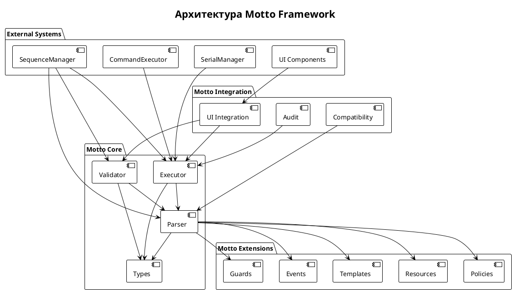
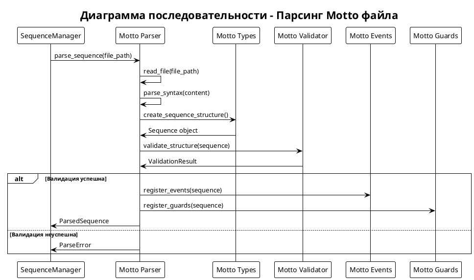
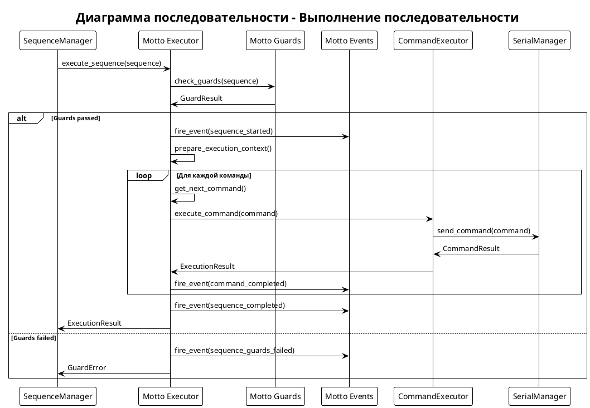
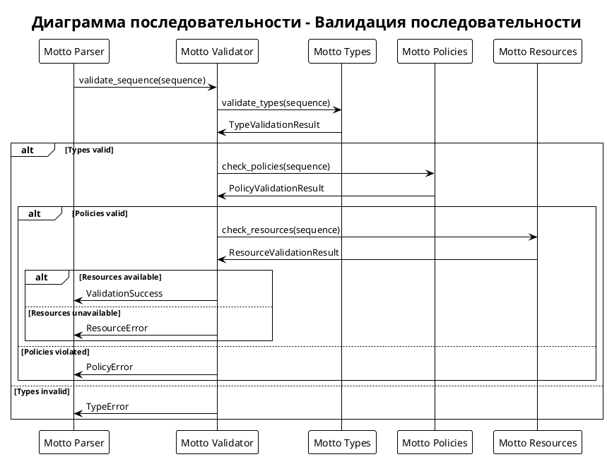
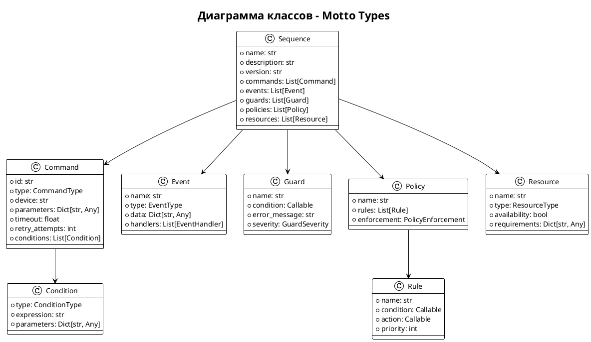
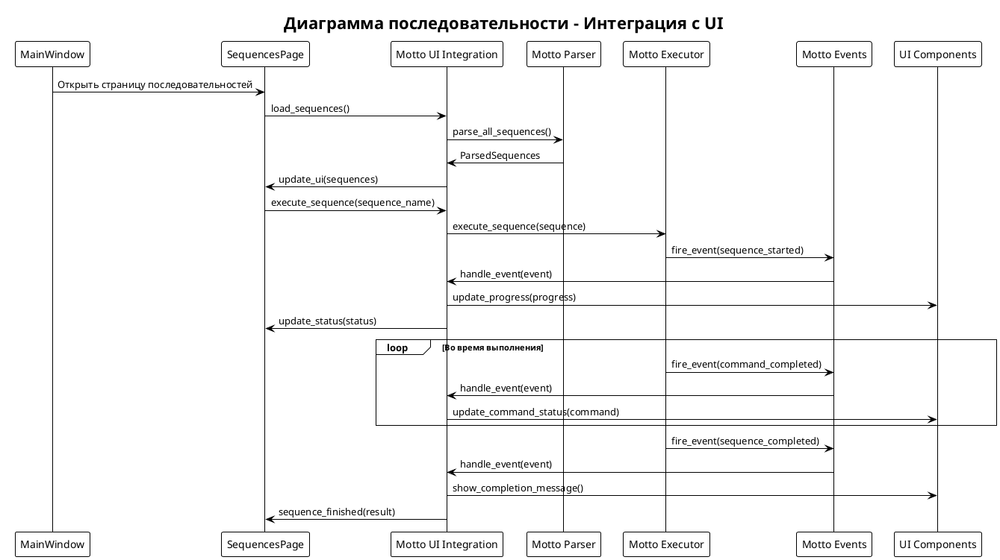
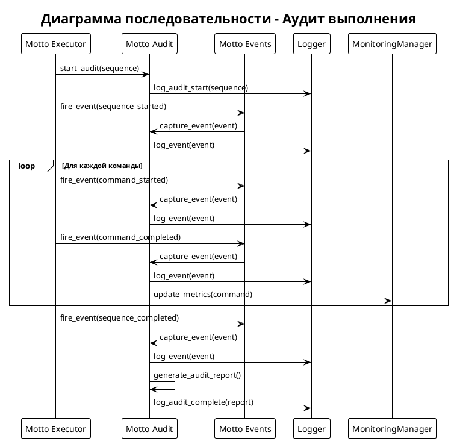
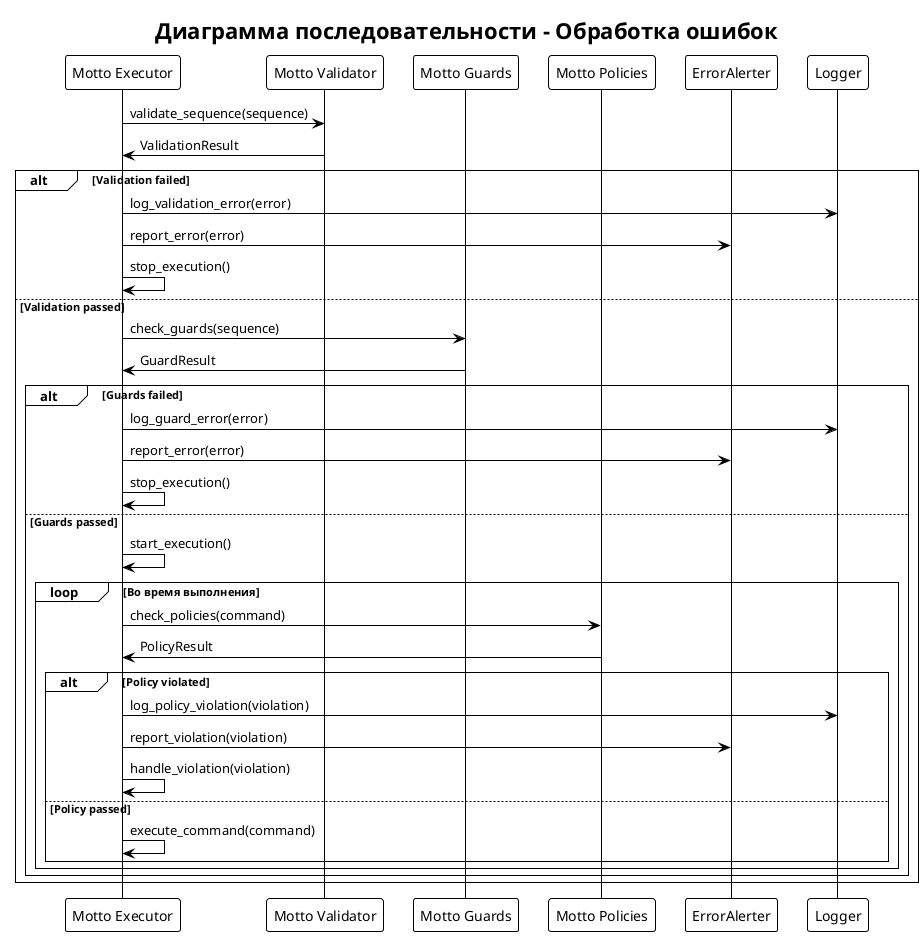

> [!info] Навигация
> Родитель: [[docs/modules/core]] • Раздел: [[_moc/Architecture]] • См. также: [[docs/modules/core/sequence-manager]]

# Motto Framework - Система управления последовательностями

## Обзор

Motto Framework - это специализированная система для управления и выполнения последовательностей команд в лабораторном оборудовании. Framework предоставляет декларативный язык для описания последовательностей, валидацию, выполнение и интеграцию с UI.

## Архитектура Motto Framework



## Основные компоненты

### 1. Parser (Парсер)

Парсер отвечает за разбор Motto-файлов и преобразование их в исполняемые структуры данных.



### 2. Executor (Исполнитель)

Исполнитель отвечает за выполнение последовательностей команд с поддержкой условной логики и циклов.



### 3. Validator (Валидатор)

Валидатор проверяет корректность последовательностей перед выполнением.



## Структуры данных

### Основные типы



## Язык Motto

### Синтаксис

Motto использует декларативный синтаксис для описания последовательностей:

```yaml
sequence:
  name: "Sample Processing"
  description: "Обработка биологического образца"
  version: "1.0"
  
  events:
    - name: "sequence_started"
      type: "info"
      message: "Начало обработки образца"
    
    - name: "sequence_completed"
      type: "success"
      message: "Обработка завершена"
  
  guards:
    - name: "equipment_ready"
      condition: "check_equipment_status()"
      error_message: "Оборудование не готово"
      severity: "error"
  
  policies:
    - name: "safety_policy"
      rules:
        - name: "temperature_check"
          condition: "temperature < 50"
          action: "stop_sequence"
          priority: 1
  
  resources:
    - name: "multi_device"
      type: "device"
      availability: true
      requirements:
        position: "ready"
        status: "idle"
  
  commands:
    - id: "move_to_start"
      type: "MOVE"
      device: "Multi"
      parameters:
        position: 0
        speed: 50
      timeout: 10.0
      retry_attempts: 3
      conditions:
        - type: "device_ready"
          expression: "multi.status == 'idle'"
    
    - id: "start_processing"
      type: "PROCESS"
      device: "Multi"
      parameters:
        mode: "staining"
        duration: 300
      timeout: 600.0
      conditions:
        - type: "position_reached"
          expression: "multi.position == 0"
    
    - id: "wait_completion"
      type: "WAIT"
      parameters:
        duration: 300
        check_interval: 10
      conditions:
        - type: "processing_active"
          expression: "multi.status == 'processing'"
```

## Интеграция с UI

### UI Integration Flow



## Мониторинг и аудит

### Audit Flow



## Обработка ошибок

### Error Handling Flow



## Производительность

### Метрики производительности

- **Время парсинга**: < 100ms для последовательности из 100 команд
- **Время валидации**: < 50ms для стандартной последовательности
- **Время выполнения**: Зависит от команд, но < 1ms на команду
- **Память**: < 10MB для 1000 последовательностей

### Оптимизации

1. **Кэширование парсера**: Парсинг выполняется только при изменении файлов
2. **Ленивая загрузка**: Последовательности загружаются по требованию
3. **Пул исполнителей**: Переиспользование контекстов выполнения
4. **Буферизация событий**: Группировка событий для снижения нагрузки

## Тестирование

### Unit тесты

```python
def test_motto_parser():
    parser = MottoParser()
    sequence = parser.parse("test_sequence.motto")
    assert sequence.name == "Test Sequence"
    assert len(sequence.commands) > 0

def test_motto_executor():
    executor = MottoExecutor()
    result = executor.execute(test_sequence)
    assert result.success == True
    assert result.execution_time > 0

def test_motto_validator():
    validator = MottoValidator()
    result = validator.validate(test_sequence)
    assert result.is_valid == True
    assert len(result.errors) == 0
```

## Будущие улучшения

1. **Визуальный редактор**: Drag-and-drop интерфейс для создания последовательностей
2. **Отладчик**: Пошаговое выполнение с возможностью остановки
3. **Профилирование**: Детальная статистика производительности
4. **Версионирование**: Автоматическое управление версиями последовательностей
5. **Шаблоны**: Библиотека готовых шаблонов последовательностей