> [!info] Навигация
> Родитель: [[docs/modules/monitoring]] • Раздел: [[_moc/Architecture]] • См. также: [[docs/modules/core/serial-manager]]

# Monitoring System - Система мониторинга

## Обзор

Система мониторинга обеспечивает непрерывное наблюдение за состоянием лабораторного оборудования, производительностью системы и обработку ошибок. Система построена на принципах модульности, расширяемости и реального времени.

## Архитектура системы мониторинга

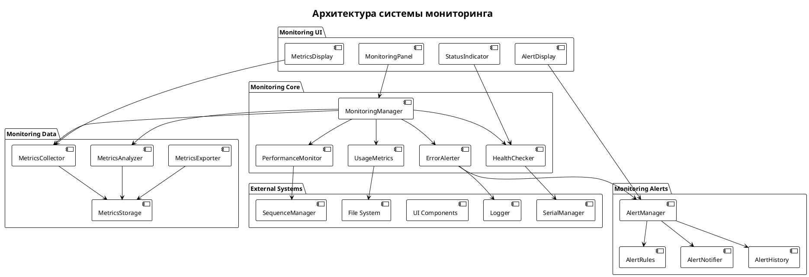

## Основные компоненты

### 1. MonitoringManager - Центральный менеджер

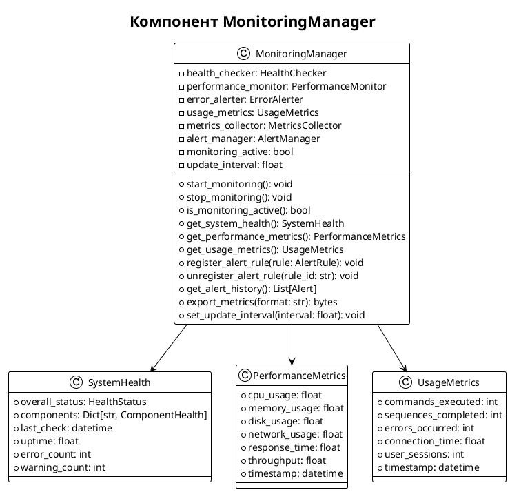

### 2. HealthChecker - Проверка здоровья системы

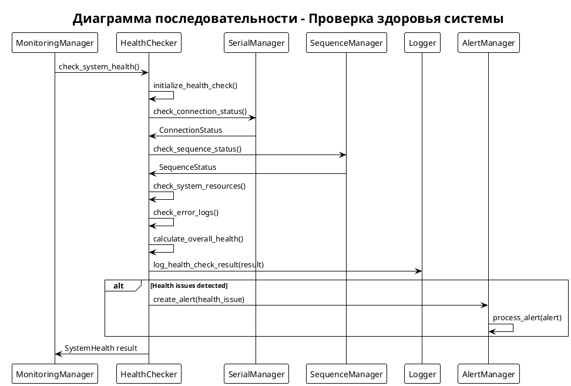

### 3. PerformanceMonitor - Мониторинг производительности

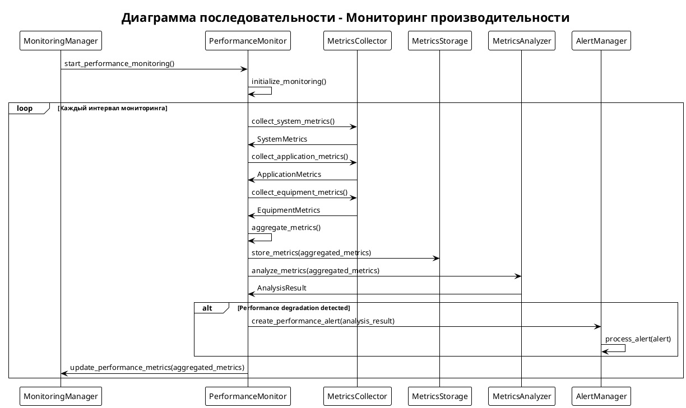

### 4. ErrorAlerter - Система оповещений об ошибках

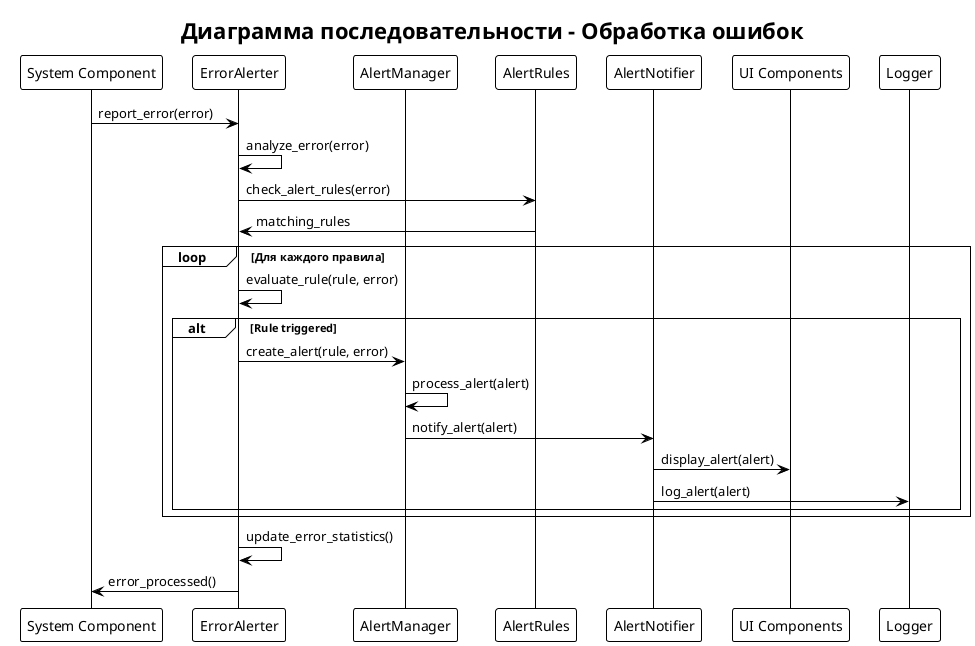

## Система метрик

### Структура метрик

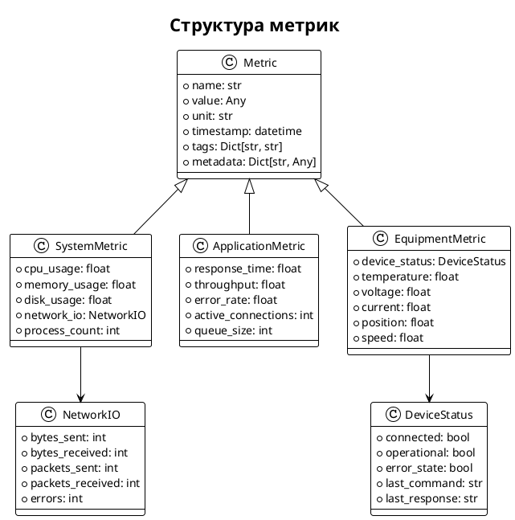

### Сбор и хранение метрик

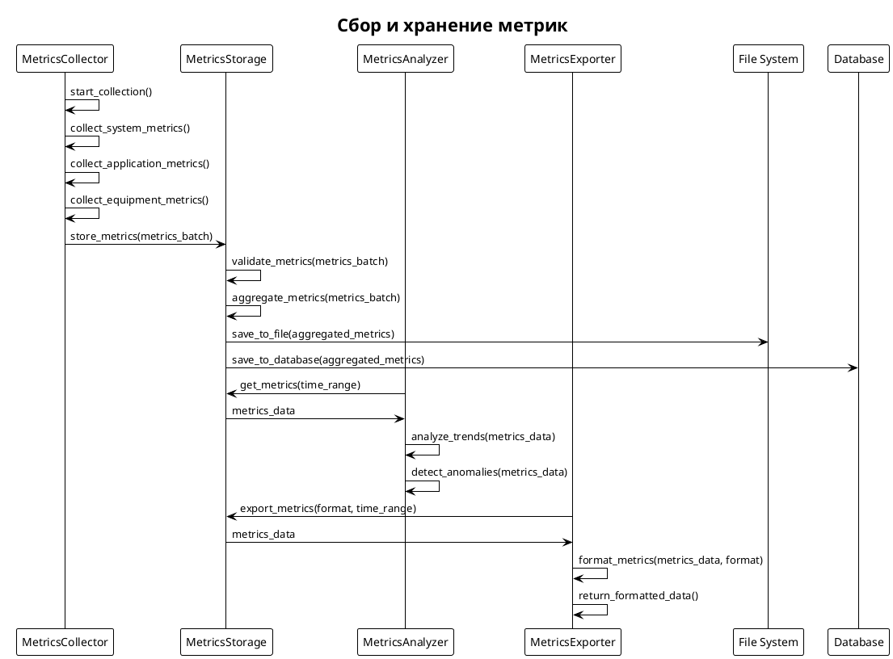

## Система оповещений

### Alert System Architecture

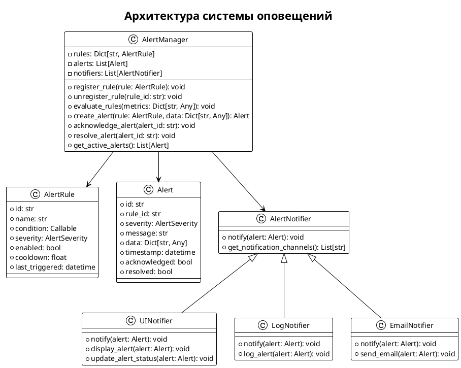

### Alert Processing Flow

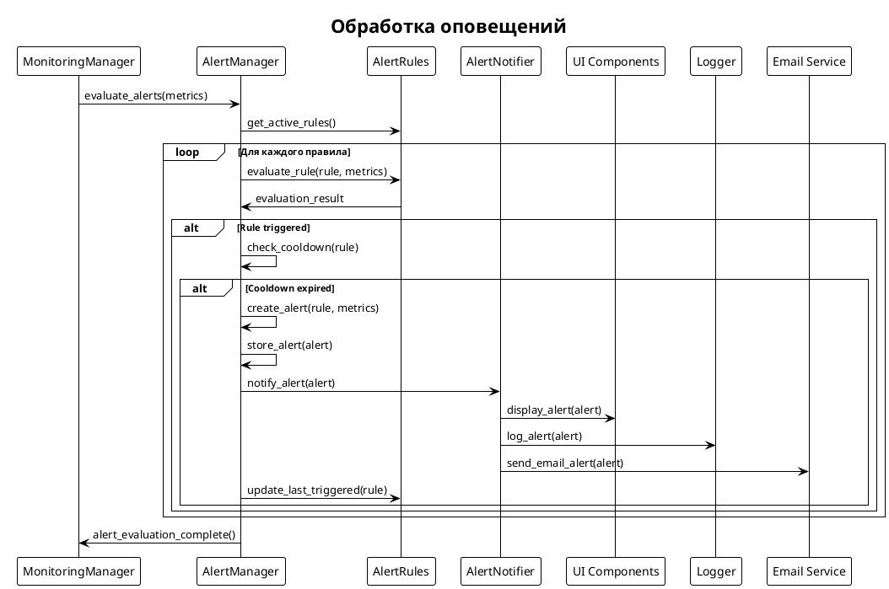

## Мониторинг оборудования

### Equipment Monitoring

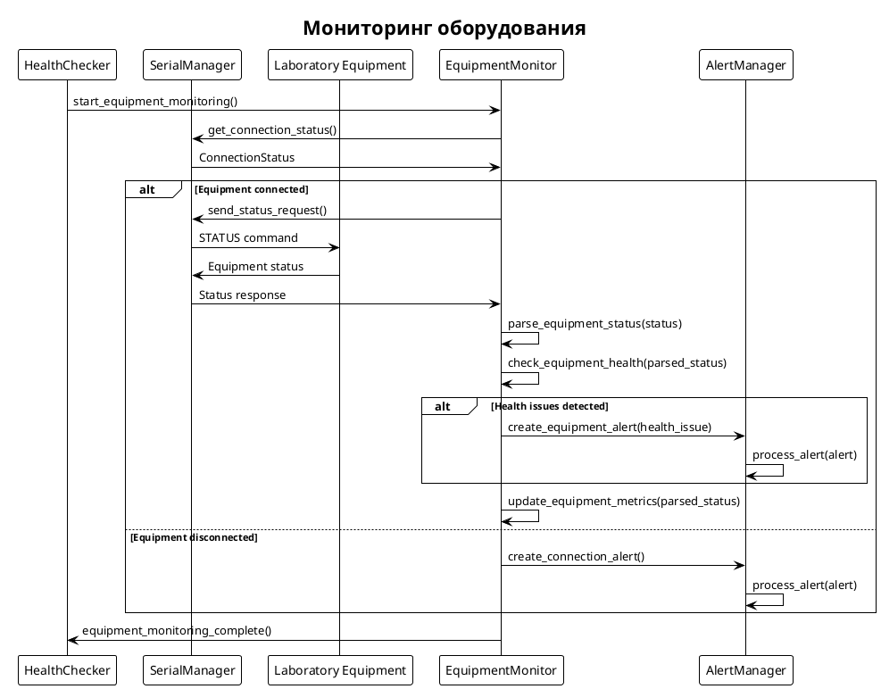

## Производительность мониторинга

### Performance Optimization

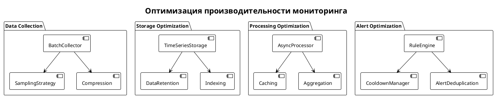

## Интеграция с UI

### UI Integration

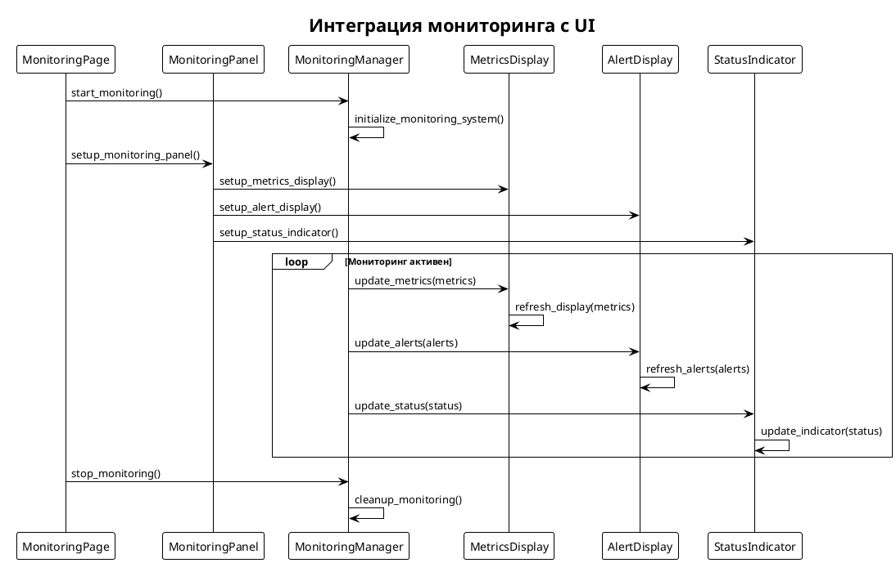

## Конфигурация мониторинга

### Configuration Structure

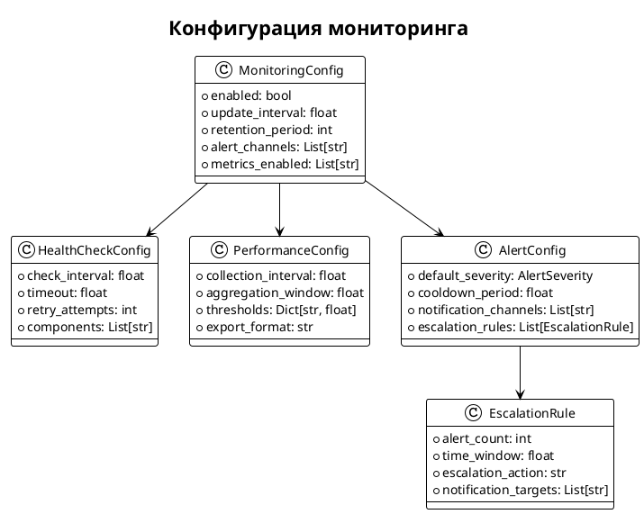

## Тестирование системы мониторинга

### Testing Strategy

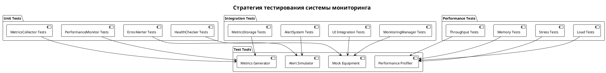

## Будущие улучшения

1. **Machine Learning**: Использование ML для предсказания сбоев
2. **Distributed Monitoring**: Распределенный мониторинг для кластеров
3. **Real-time Analytics**: Аналитика в реальном времени
4. **Predictive Maintenance**: Предиктивное обслуживание
5. **Advanced Visualization**: Продвинутые визуализации метрик
6. **Mobile Alerts**: Мобильные уведомления
7. **Integration APIs**: API для интеграции с внешними системами
8. **Custom Dashboards**: Настраиваемые дашборды