> [!info] Навигация
> Родитель: [[docs/modules/ui]] • Раздел: [[_moc/Architecture]] • См. также: [[docs/modules/ui/pages]]

# UI Architecture - Архитектура пользовательского интерфейса

## Обзор

UI архитектура системы управления лабораторным оборудованием построена на основе PySide6 (Qt6) с использованием паттернов MVC, Observer и Dependency Injection. Архитектура обеспечивает модульность, расширяемость и тестируемость интерфейса.

## Общая архитектура UI

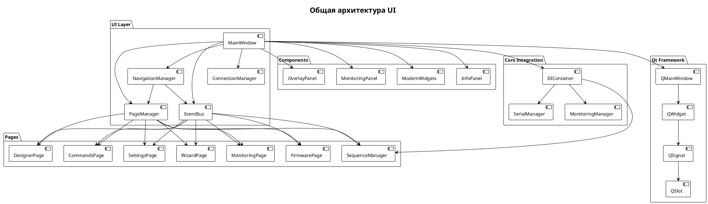

## Компонентная архитектура

### MainWindow - Главное окно

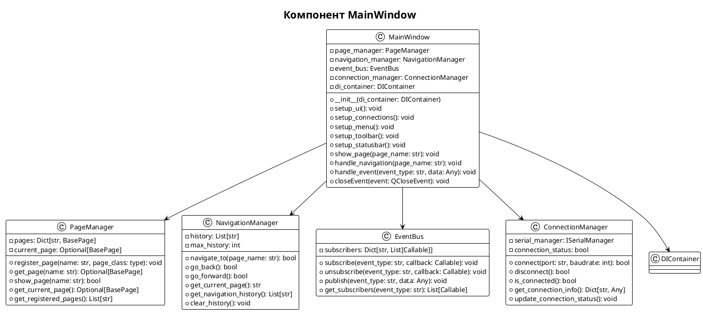

## Система страниц

### Иерархия страниц

```plantuml
@startuml Pages Hierarchy
!theme plain
skinparam backgroundColor #FFFFFF

title Иерархия страниц

abstract class BasePage {
    + setup_ui(): void
    + setup_connections(): void
    + on_show(): void
    + on_hide(): void
    + handle_event(event_type: str, data: Any): void
}

class WizardPage {
    - steps: List[WizardStep]
    - current_step: int
    
    + setup_ui(): void
    + next_step(): void
    + previous_step(): void
    + validate_current_step(): bool
    + complete_wizard(): void
}

class SettingsPage {
    - settings_manager: ISettingsManager
    - settings_widgets: Dict[str, QWidget]
    
    + setup_ui(): void
    + load_settings(): void
    + save_settings(): void
    + apply_settings(): void
    + reset_settings(): void
}

class CommandsPage {
    - command_executor: ICommandExecutor
    - command_history: List[Command]
    
    + setup_ui(): void
    + execute_command(command: str): void
    + show_command_history(): void
    + clear_history(): void
}

class DesignerPage {
    - sequence_manager: ISequenceManager
    - sequence_editor: SequenceEditor
    
    + setup_ui(): void
    + create_sequence(): void
    + edit_sequence(sequence_name: str): void
    + save_sequence(): void
    + test_sequence(): void
}

class FirmwarePage {
    - platformio_manager: PlatformIOManager
    - firmware_info: Dict[str, Any]
    
    + setup_ui(): void
    + upload_firmware(): void
    + download_firmware(): void
    + check_firmware_version(): void
}

class MonitoringPage {
    - monitoring_manager: IMonitoringManager
    - monitoring_panel: MonitoringPanel
    
    + setup_ui(): void
    + start_monitoring(): void
    + stop_monitoring(): void
    + update_metrics(): void
    + show_alerts(): void
}

class SequencesPage {
    - sequence_manager: ISequenceManager
    - motto_integration: MottoUIIntegration
    
    + setup_ui(): void
    + load_sequences(): void
    + execute_sequence(sequence_name: str): void
    + edit_sequence(sequence_name: str): void
    + delete_sequence(sequence_name: str): void
}

BasePage <|-- WizardPage
BasePage <|-- SettingsPage
BasePage <|-- CommandsPage
BasePage <|-- DesignerPage
BasePage <|-- FirmwarePage
BasePage <|-- MonitoringPage
BasePage <|-- SequencesPage

@enduml
```

## Система компонентов

### UI Components

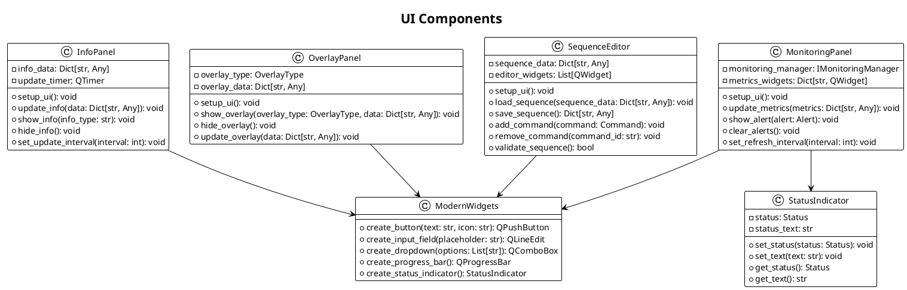

## Система событий

### Event Flow

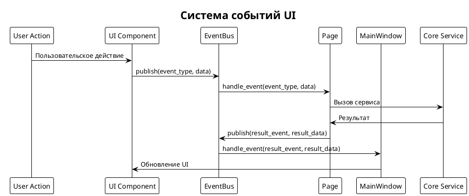

### Типы событий

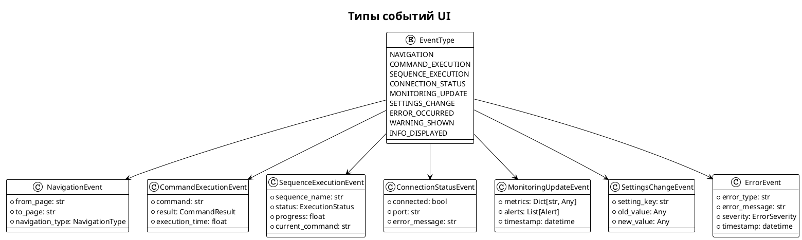

## Навигация

### Navigation Flow

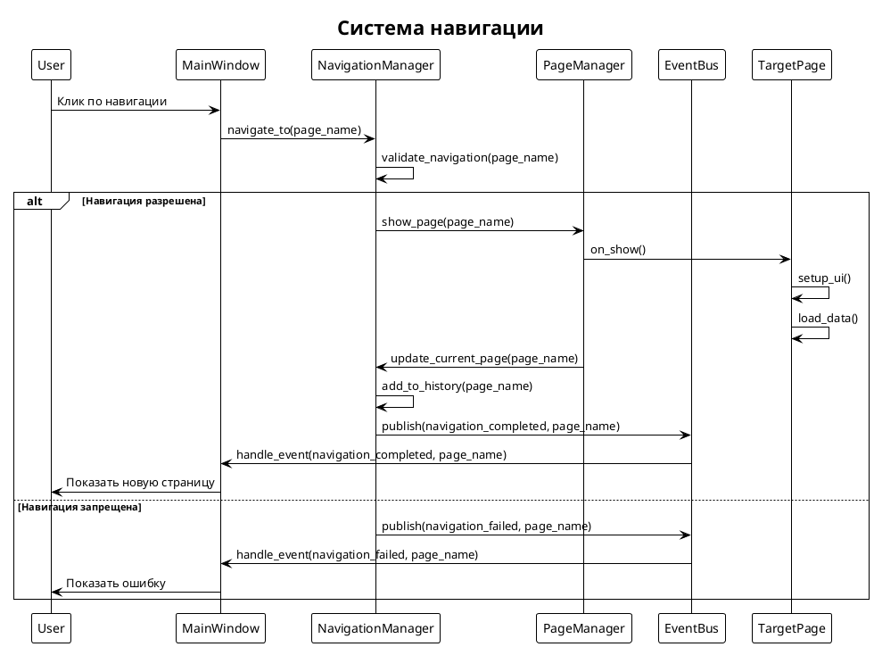

## Управление состоянием

### State Management

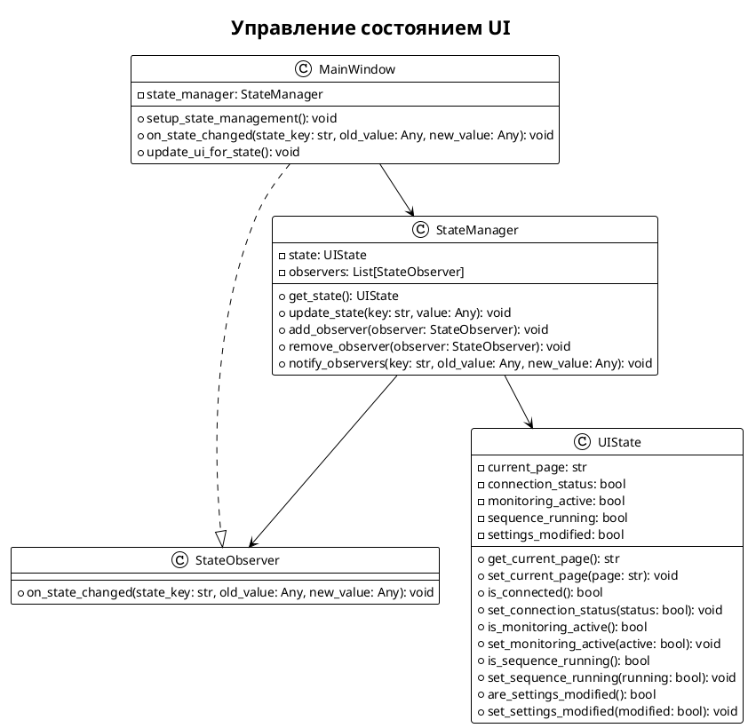

## Интеграция с Core

### Core Integration Flow

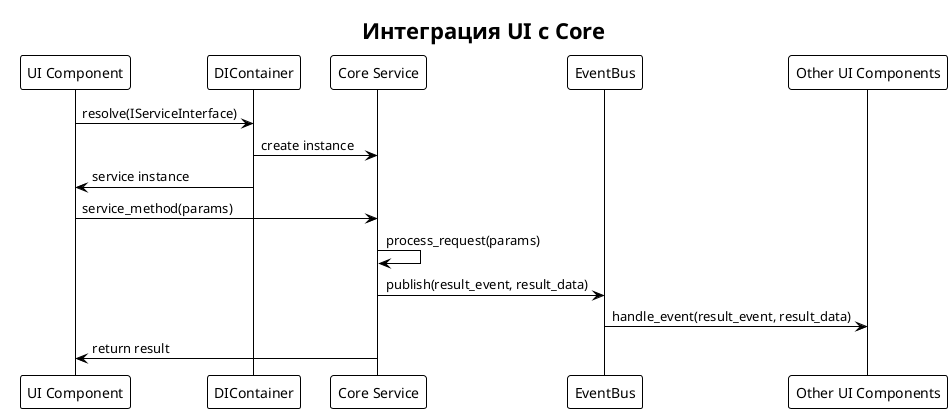

## Производительность

### Оптимизации UI

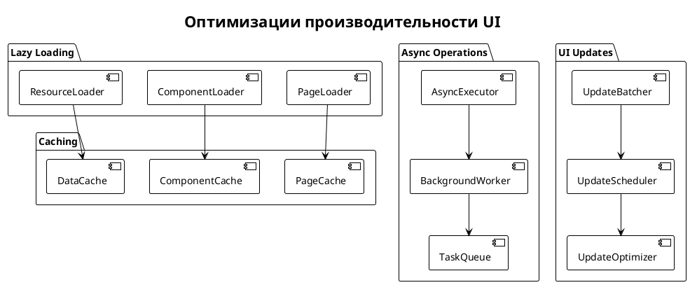

## Тестирование UI

### UI Testing Strategy

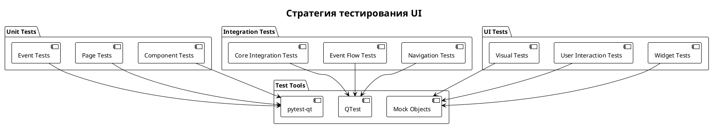

## Будущие улучшения

1. **Responsive Design**: Адаптивный дизайн для разных разрешений
2. **Theming System**: Система тем и стилей
3. **Accessibility**: Улучшение доступности для пользователей с ограниченными возможностями
4. **Internationalization**: Поддержка множественных языков
5. **Plugin System**: Система плагинов для расширения функциональности
6. **Real-time Collaboration**: Возможность совместной работы
7. **Advanced Visualizations**: Продвинутые визуализации данных
8. **Mobile Support**: Поддержка мобильных устройств