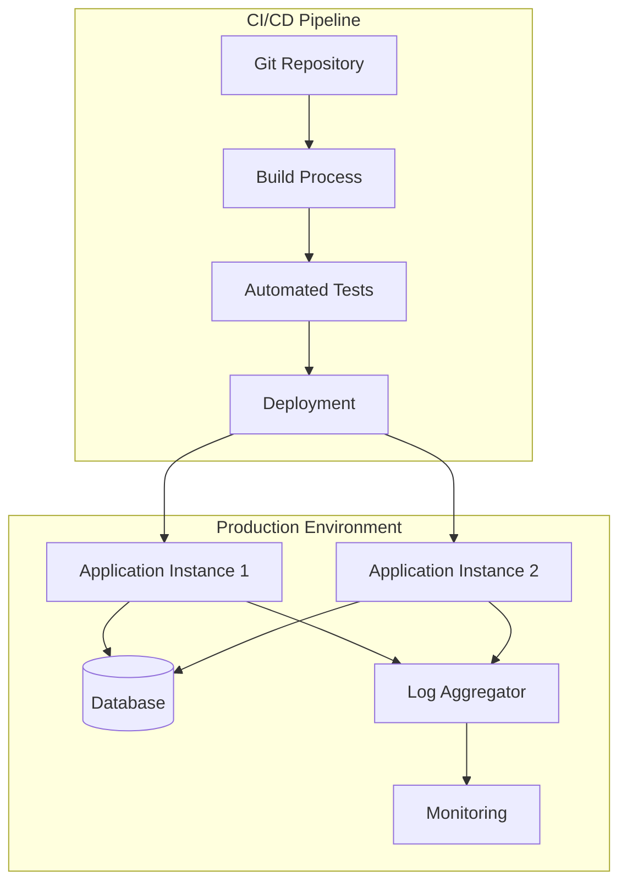

# Руководство по развертыванию и эксплуатации

## 📋 Содержание

- [[#Обзор развертывания]]
- [[#Подготовка окружения]]
- [[#Развертывание приложения]]
- [[#Мониторинг и логирование]]
- [[#Процедуры обновления]]

## 🎯 Обзор развертывания

### Архитектура развертывания



### Компоненты системы

- **Приложение**: PyQt6 GUI приложение
- **База данных**: SQLite (локальная) или PostgreSQL (серверная)
- **Логирование**: Structured logging с ротацией
- **Мониторинг**: Prometheus + Grafana
- **Резервное копирование**: Автоматические бэкапы

## 🛠️ Подготовка окружения

### Системные требования

```bash
# Минимальные требования
- Python 3.8+
- RAM: 4 GB
- CPU: 2 cores
- Disk: 10 GB

# Рекомендуемые требования
- RAM: 8 GB
- CPU: 4 cores
- Disk: 50 GB SSD
- Network: 100 Mbps
```

### Установка зависимостей

```bash
# Создание виртуального окружения
python -m venv /opt/app/venv
source /opt/app/venv/bin/activate

# Установка зависимостей
pip install -r requirements.txt
pip install gunicorn prometheus-client structlog
```

## 🚀 Развертывание приложения

### Методы развертывания

#### 1. Прямая установка

```bash
#!/bin/bash
# deploy.sh

set -e

APP_DIR="/opt/app"
VENV_DIR="$APP_DIR/venv"

# Создание директорий
mkdir -p $APP_DIR/{config,logs,data}

# Клонирование репозитория
git clone https://github.com/your-org/your-project.git $APP_DIR/source

# Установка зависимостей
python3 -m venv $VENV_DIR
source $VENV_DIR/bin/activate
pip install -r requirements.txt

# Копирование конфигурации
cp config/config.toml $APP_DIR/config/

echo "Развертывание завершено успешно"
```

#### 2. Docker развертывание

```dockerfile
FROM python:3.11-slim

RUN apt-get update && apt-get install -y \
    gcc libssl-dev libffi-dev sqlite3

WORKDIR /app
COPY requirements.txt .
RUN pip install -r requirements.txt

COPY . .
RUN mkdir -p /app/{data,logs,config}

EXPOSE 8080
CMD ["python", "main.py"]
```

```yaml
# docker-compose.yml
version: '3.8'

services:
  app:
    build: .
    ports:
      - "8080:8080"
    volumes:
      - ./data:/app/data
      - ./logs:/app/logs
    restart: unless-stopped

  prometheus:
    image: prom/prometheus:latest
    ports:
      - "9090:9090"
    volumes:
      - ./monitoring/prometheus.yml:/etc/prometheus/prometheus.yml
```

### Системные сервисы

```ini
# /etc/systemd/system/pyqt6-app.service
[Unit]
Description=PyQt6 Application
After=network.target

[Service]
Type=simple
User=appuser
WorkingDirectory=/opt/app/source
Environment=PATH=/opt/app/venv/bin
ExecStart=/opt/app/venv/bin/python main.py
Restart=always

[Install]
WantedBy=multi-user.target
```

## 📊 Мониторинг и логирование

### Настройка логирования

```python
# logging_config.py
import logging
import structlog
from logging.handlers import RotatingFileHandler

def setup_logging():
    structlog.configure(
        processors=[
            structlog.stdlib.add_log_level,
            structlog.processors.TimeStamper(fmt="iso"),
            structlog.processors.JSONRenderer()
        ]
    )
    
    handler = RotatingFileHandler(
        '/opt/app/logs/app.log',
        maxBytes=10*1024*1024,
        backupCount=5
    )
    
    logging.basicConfig(
        level=logging.INFO,
        handlers=[handler]
    )
```

### Метрики Prometheus

```python
# metrics.py
from prometheus_client import Counter, Histogram, Gauge

REQUEST_COUNT = Counter('app_requests_total', 'Total requests')
REQUEST_DURATION = Histogram('app_request_duration_seconds', 'Request duration')
ACTIVE_CONNECTIONS = Gauge('app_active_connections', 'Active connections')

class MetricsMiddleware:
    def __init__(self, app):
        self.app = app
    
    def __call__(self, environ, start_response):
        start_time = time.time()
        
        def custom_start_response(status, headers, exc_info=None):
            duration = time.time() - start_time
            REQUEST_DURATION.observe(duration)
            REQUEST_COUNT.inc()
            return start_response(status, headers, exc_info)
        
        return self.app(environ, custom_start_response)
```

## 🔄 Процедуры обновления

### Скрипт обновления

```bash
#!/bin/bash
# update.sh

set -e

APP_DIR="/opt/app"
BACKUP_DIR="/opt/backups"

echo "Starting application update"

# Создание резервной копии
BACKUP_NAME="backup-$(date +%Y%m%d-%H%M%S).tar.gz"
tar -czf "$BACKUP_DIR/$BACKUP_NAME" -C "$APP_DIR" .

# Остановка приложения
sudo systemctl stop pyqt6-app

# Обновление кода
cd "$APP_DIR/source"
git pull origin main

# Обновление зависимостей
source "$APP_DIR/venv/bin/activate"
pip install --upgrade -r requirements.txt

# Запуск приложения
sudo systemctl start pyqt6-app

# Проверка здоровья
sleep 10
if curl -s http://localhost:8080/health | grep -q "healthy"; then
    echo "Update completed successfully"
else
    echo "Update failed - rolling back"
    sudo systemctl stop pyqt6-app
    tar -xzf "$BACKUP_DIR/$BACKUP_NAME" -C "$APP_DIR"
    sudo systemctl start pyqt6-app
    exit 1
fi
```

### Автоматические бэкапы

```bash
#!/bin/bash
# backup.sh

BACKUP_DIR="/opt/backups"
APP_DIR="/opt/app"
RETENTION_DAYS=30

# Создание бэкапа
BACKUP_NAME="backup-$(date +%Y%m%d-%H%M%S).tar.gz"
tar -czf "$BACKUP_DIR/$BACKUP_NAME" -C "$APP_DIR" .

# Удаление старых бэкапов
find "$BACKUP_DIR" -name "backup-*.tar.gz" -mtime +$RETENTION_DAYS -delete

echo "Backup completed: $BACKUP_NAME"
```

## 🔧 Troubleshooting

### Диагностический скрипт

```bash
#!/bin/bash
# diagnose.sh

echo "=== PyQt6 Application Diagnostics ==="
echo "Date: $(date)"

# Статус сервиса
echo "=== Service Status ==="
sudo systemctl status pyqt6-app --no-pager

# Логи приложения
echo "=== Recent Logs ==="
tail -20 /opt/app/logs/app.log

# Сетевые соединения
echo "=== Network Connections ==="
netstat -tlnp | grep :8080

# Дисковое пространство
echo "=== Disk Usage ==="
df -h /opt/app

echo "=== Diagnostics Complete ==="
```

### Частые проблемы

#### Приложение не запускается
```bash
# Проверка статуса
sudo systemctl status pyqt6-app
sudo journalctl -u pyqt6-app -f

# Проверка прав доступа
sudo chown -R appuser:appuser /opt/app
sudo chmod +x /opt/app/source/main.py
```

#### Высокое потребление памяти
```bash
# Диагностика
ps aux | grep python
free -h

# Решение
sudo systemctl restart pyqt6-app
```

---

**Связанные документы:**
- [[docs/runbooks/troubleshooting]]
- [[docs/guides/performance-optimization]]

*Последнее обновление: 2024-12-20*
